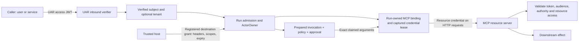
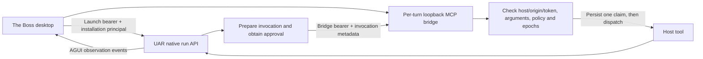
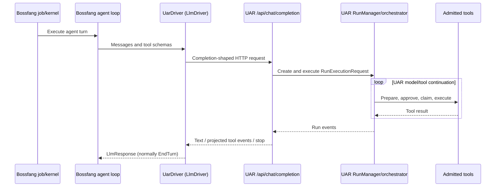
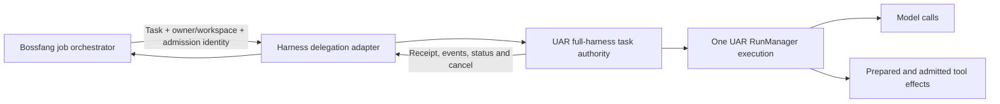

# Bossfang–UAR authorization and execution ownership

## 1. Executive verdict

**The authorization design has useful isolation and approval mechanisms, but the inspected implementation is not ready to be treated as a complete remote multi-user security boundary. The Bossfang UAR LLM-driver path also assigns agent execution to two layers through the wrong interface.** These are source-level conclusions; only the focused The Boss admission scenario described below was executed.

| Question | Local desktop verdict | Remote multi-user verdict |
|---|---|---|
| UAR → MCP authorization | **Conditionally sound foundation.** The Boss uses a launch credential for UAR and a separate per-turn bridge credential plus exact invocation admission for tools. UAR supports owner-bound MCP connections and resource-specific grants. These controls deserve retention. They do not establish that every server or installed binary enforces the intended policy. | **Not sufficient for approval.** Resolve role issuance/trusted-host provenance, tenant-preserving key authority and strict identity configuration; then demonstrate receiving-server token and transport-session enforcement. Do not solve this by forwarding the original UAR JWT everywhere. |
| Bossfang/UAR loop ownership | **Incorrect abstraction on the current Bossfang `uar` provider path.** A Bossfang agent loop calls UAR's full agent loop as if it were a model completion. The Boss's separate native UAR adapter has the more appropriate shape: submit a run, observe it, cancel that run. | **Same ownership defect, with greater operational consequences.** Use explicit full-run delegation and one execution authority per job attempt. UAR already implements a delegation API, but the inspected Bossfang consumer is not wired to it. Process restart recovery remains explicitly unsupported on that API. |

**Decision:** retain the prepared-invocation and run-owned MCP architecture; correct the identity-minting boundary before remote exposure; replace Bossfang's completion-shaped UAR integration with explicit harness delegation if UAR is meant to execute jobs. If Bossfang must own the loop, use a true model-only API that cannot execute tools.

Terminology matters:

- A **model provider** accepts model input and returns text/tool proposals; it does not execute the agent's tools or own the job.
- An **agent execution harness** owns one model/tool/continuation loop, execution policy, approval coordination, cancellation and execution checkpoints.
- A **job orchestrator** owns schedules, dependencies, routing and attempt lifecycle. It can delegate to different harnesses without becoming a second inner agent loop.

These definitions are the review's architectural model. Claude's SDK explicitly supplies the agent loop, while Codex app-server exposes threads, turns, items, approvals and interrupts rather than only model completions. [Claude SDK][S9] [Codex app-server][S8]

## 2. Baseline, method and evidence labels

The review covers these local checkouts, not a release certification or an audit of deployed infrastructure.

| Repository | HEAD inspected | Relevant pre-existing workspace state |
|---|---|---|
| Bossfang, `references/librefang` | `16beef0fcf3053970a901990df4fedbdf86bd87d` | Tracked source clean; untracked investigation, agent and knowledge artifacts. |
| Universal Agent Runtime | `a7cb972992d4f83db6585449ea81af0fe4a1c990` | Dirty frontend/configuration/static files, KBD/knowledge files and skill-system/Liter submodules. Reviewed core `src`, `tests`, Cargo manifests/lockfile and `versions.toml` were unchanged. |
| The Boss | `e2ae2ce21245030293c0bea96ed02ae853b820a7` | Dirty knowledge files and bundled mini submodule; untracked research/manifests. Reviewed runtime TypeScript was unchanged. |
| Report repository, prometheus-skills-mini | `6044ecdeb5c8c957646fef422d886a4568212888` | Pre-existing skill/command changes and untracked delivery evidence. This review adds only this Markdown artifact. |

UAR pins `jsonwebtoken =11.0.0`, `rmcp =3.1.2` and the MCP-facing `reqwest =0.13.4`. These were inspected, not upgraded. The installed rmcp model declares both 2025-11-25 and 2026-07-28, but `LATEST` is still 2025-11-25; library presence does not prove what a particular live connection negotiated. [UAR manifest][U-manifest] [rmcp protocol constants][D-protocol]

**Evidence labels used throughout:**

- **Static:** implementation or test source inspected; behavior not executed in this review.
- **Reproduced:** a named existing scenario actually ran, with its fixture limitations stated.
- **Inference / test candidate:** consequence supported by a call chain, or an unresolved boundary requiring a targeted runtime check.
- **Intent:** design/spec/task text, which is not proof of working implementation.

Confidence is qualitative: **high** means direct, mutually consistent call-site evidence; **medium** means a consequence depends on deployment or transport behavior not reproduced. Severity is architectural priority, not a CVSS score.

The deep-research workflow was adapted to source inspection, two independent source investigations, primary-document comparison, a contradiction ledger, bounded runtime verification and a final artifact review. Research provenance and the approved plan are embedded in this single requested document. No automated research-package certification is claimed.

## 3. Current authorization flows

### 3.1 Remote/resource-specific MCP access



The UAR access JWT authenticates admission to UAR. **It is not automatically the right credential for the target MCP resource.** The host grant carries a separately supplied credential; UAR checks destination registration, host trust, declared scopes and expiry. UAR does not cryptographically establish the downstream bearer token's subject/audience/scopes. That remains a receiving-server responsibility. [Grant validation][U-grants] [HTTP runtime snapshot][U-mcp-runtime]

Verified owner is constructed from user and tenant context, and the MCP binding key includes that owner, server, configuration and captured execution environment. Run-supplied MCP resources additionally use a fresh run-owned cache. This separates connections, but a configured service credential is still a service credential even when each user gets a separate connection. [Actor owner][U-owner] [Binding cache][U-cache] [Run registry][U-run-registry]

### 3.2 The Boss desktop path



The Boss's principal is derived from the application's user-data location and ignores the session ID: it identifies a local installation context, not a remote tenant. Its authenticated fetch uses the launch token; the bridge uses another random per-turn token, loopback address/Host/Origin checks and exact invocation metadata. [Principal][B-principal] [Launch fetch][B-sidecar] [Bridge][B-bridge]

The host admission checks runtime/host epochs, invocation identity, server/tool and argument digest, re-evaluates policy, requires authorized state, and persists the claim before tool dispatch. Teardown distinguishes an already claimed invocation with unknown outcome from one interrupted before dispatch. This is materially stronger than simply attaching a JWT to a tool request. [Admission claim][B-admission] [Teardown][B-teardown]

### 3.3 Credential classes must remain distinct

| Material | Authority / purpose | Boundary assessment |
|---|---|---|
| Inbound UAR JWT | UAR subject, roles, optional verified tenant | Fixed HS256 shared-secret or RS256/JWKS verification. Issuer/audience conditional; see F2–F3. |
| UAR opaque API key | Internal stored key, optionally exchanged for JWT | Not generic OAuth introspection. Role and tenant handling need correction; see F2. |
| Sidecar launch credential | Authenticate the trusted local host to UAR | Must retain typed launch provenance; a user-mintable role must not confer equivalent authority. |
| Provider key / run credential | Authenticate model-provider requests | Separate from MCP authorization and human approval. |
| MCP grant/header credential | Authenticate to a particular resource server | May be a JWT or opaque resource token; receiver enforces its meaning. |
| Prepared invocation / approval receipt | Authorize one exact effect within one execution | Bound to payload, owner, run, policy/grant revisions, lease and claim state; not a reusable login token. |

For HTTP, the inspected client disables redirects and environment proxies and uses captured headers; credential leases are checked before connection/dispatch. For stdio, UAR clears the child environment and rebuilds it from an allowlist plus explicit configuration. HTTP OAuth rules should not be mechanically applied as JWT forwarding to stdin or process arguments. Stdio remains an OS-process trust boundary; requested sandboxing currently fails explicitly because the backend is unavailable. [HTTP client][U-http] [Stdio setup][U-stdio] [Sandbox config][U-sandbox]

## 4. Current execution flows and ownership

### 4.1 Bossfang's current UAR provider



This path has **two reachable agent-loop implementations**, not one model provider beneath one loop. Bossfang owns its outer iteration and UAR independently executes its inner tools and continuation. This does **not** mean two loops always execute the same side effect: the normal terminal `stop` maps to Bossfang `EndTurn`. The defect is the execution contract and authority split, with duplicate effects a failure/retry hypothesis requiring reproduction. [Bossfang loop][F-loop] [UAR driver][F-uar] [UAR run creation][U-chat-run] [Inner loop][U-loop] [Stop mapping][F-stop]

### 4.2 The appropriate full-run shape, partly present already



This is the **recommended target**, not a claim that Bossfang is wired this way today. UAR implements `/api/uar/full-harness/v1/tasks`: admission reservation returns an existing receipt on an exact repeated admission, or creates the reserved run through the same executor. The descriptor explicitly advertises process-ephemeral retention, unsupported restart recovery and no steer. Its observation stream avoids the native subscriber-drop cancellation behavior. [Task handlers][U-full-handlers] [Descriptor][U-full] [Observation][U-full-observe]

The Boss currently uses native `/api/uar/runs`, saves the run ID, reconnects its event stream with a cursor, and cancels that exact run. Its AGUI adapter observes tool events instead of executing a second model/tool loop. This is a sound ownership shape, though it does not yet use C05's admission/reconciliation contract. [Native adapter][B-run] [Cancel][B-cancel] [AGUI][B-agui]

### 4.3 Ownership matrix

| Concern | Bossfang → current UAR LLM driver | The Boss → native UAR | Recommended Bossfang → UAR harness |
|---|---|---|---|
| Scheduling and job dependencies | Bossfang | The Boss product | Bossfang |
| Model/tool continuation | Bossfang outer loop **and** UAR inner loop | UAR | UAR only |
| Tool catalog | Bossfang submits schemas; UAR chooses its own effective registry/policy | UAR plus supplied host bridge | Explicit negotiated UAR/host catalog |
| Tool effects and approvals | Independent Bossfang and UAR admission paths; no UAR approval forwarding in driver | UAR admission plus host exact claim | UAR coordinates; trusted host/resource enforces effects |
| Retry authority | Outer driver retry machinery plus inner model retries | UAR execution; client reconnects observation | UAR within attempt; orchestrator reconciles admission before retrying attempt |
| Cancel identity | Driver does not retain native run ID/call cancel | Exact UAR run ID + local abort | Delegated task/run ID with acknowledged outcome |
| History/checkpoints | Separate Bossfang session and UAR execution history | Product transcript plus UAR run state | Product transcript in Bossfang; execution checkpoints in UAR |
| Restart recovery | No shared execution recovery contract | Native behavior requires end-to-end validation | Use advertised capability; current C05 says unsupported |
| Side-effect uncertainty | Not represented as a unified contract | Host tracks claimed outcome-unknown | Persist/reconcile unknown outcome; never equate disconnect with safe replay |

Evidence for retries, persistence and boundaries: [Bossfang retry][F-retry], [UAR execution/checkpoint code][U-manager], [Host lifecycle][B-teardown], [Full-harness contract][U-full].

### 4.4 Codex and Claude Code comparisons

Bossfang's real Codex adapter invokes `codex exec --json`; its Claude adapter invokes `claude -p` and can expose Bossfang's MCP bridge. Both return final text with `EndTurn` and empty outer tool calls. They embed harness work behind an LLM-shaped interface too, but do not prove that an arbitrary execution service can be substituted for a stateless completion endpoint. The subprocess helper has timeout kill/reap and kill-on-drop; this is not a durable remote execution contract. [Codex adapter][F-codex] [Claude adapter][F-claude] [Subprocess lifecycle][F-cli]

The Boss's Claude runtime uses Agent SDK `query`, permission hooks, cancellation and resume. Its provider named “OpenAI Codex” instead shapes requests for a Codex Responses endpoint; the inspected runtime registry does not register a Codex harness driver. Provider names therefore cannot determine loop ownership. [Claude SDK adapter][B-claude] [Provider config][B-codex-provider] [Runtime registry][B-register]

## 5. Prioritized findings

### F1 — High: UAR execution is hidden behind Bossfang's model-provider contract

**Evidence: static; confidence high.** `UarDriver` POSTs `/api/chat/completion`; UAR creates a RunExecutionRequest and runs its orchestrator. Incoming `req.tools` is only counted in a debug log, not copied as the authoritative tool surface. The default agent allows `*`; actual exposure is still constrained by available registries and effective policy. [Driver request][F-request] [Request tools][U-chat-tools] [Defaults][U-default] [Registry filtering][U-filter]

There are concrete data-contract differences: the route extracts the last user text rather than faithfully using Bossfang's supplied message history; nonstreaming collects text and returns no usage; streaming projects already executing tool events into `tool_calls` and separate `tool_results`, while Bossfang accumulates tool-call arguments and does not consume those result events. [History input][U-chat-history] [Nonstream response][U-chat-response] [Event projection][U-chat-events] [Driver parser][F-parser]

**Impact:** inner tools/approvals, budgets, history and cancellation are not governed by the outer completion contract. Argument-delta/full-argument aggregation and loss of inner results are reproduction targets. Do not report unconditional duplicate writes: the normal `stop`→`EndTurn` path argues against that conclusion. [Terminal mapping][F-stop]

**Smallest architectural correction:** pick one mode explicitly. For UAR execution, add a Bossfang harness adapter using the existing full-run contract and bypass Bossfang's inner loop for that attempt. For Bossfang execution, call an actual model-only provider; do not try to repair this by renaming the current endpoint.

### F2 — High, conditional remote boundary: API-key roles can confer trusted-host identity

**Evidence: static call-chain inference; confidence high in the missing attenuation, medium in deployment impact.** Auth routes pass the caller's subject and requested roles to key creation without constraining those roles to delegable caller authority. Exchange copies roles into an HS256 JWT. MCP grant admission maps a `host-session` role to `sidecar-launch-host`. Run-supplied MCP attachment does not require the typed `HostAuthenticated` extension that is explicitly required for `tool_admission`. [Auth route][U-auth] [Role copy][U-keys] [Host identity][U-host-role] [Attachment][U-attach] [Host-admission guard][U-host-guard]

**Reachability conditions:** an ordinary authenticated caller in shared-secret mode can request the reserved role, exchange the key while authenticating the endpoint with its original JWT, and then use the minted JWT where that host role is trusted. A registered destination trusting `sidecar-launch-host` is still required. Downstream credential validation and tool policy are not thereby bypassed. JWKS mode rejects the locally minted HS256 JWT; `jwt_required=true` also prevents bare API-key fallback before JWT authentication. Settings administration has its own admin-key boundary. No exploit was run.

**Impact:** the “trusted host” behind a remote MCP grant can become self-asserted through another UAR credential-issuance API.

**Smallest correction:** prohibit reserved host roles in general key issuance, attenuate all delegated roles, and derive sidecar trust from typed launch-authentication provenance. Also preserve verified tenant authority through keys and exchange: both current paths return `tenant_id: None`. That is loss of tenant context, not proof of access to another tenant. Revoke-by-ID lacks an owner comparison and needs an owner/admin decision. [Key exchange and validation][U-key-exchange] [Revoke handler][U-revoke]

### F3 — High for remote deployment: JWT validation policy is too optional, and JWKS cache freshness is unbounded

**Evidence: static; confidence high.** The verifier fixes algorithms to HS256 or RS256 and validates expiry through the pinned JWT library. Issuer and audience are required only when configured; audience checking is explicitly disabled otherwise. Configuration validation does not require those fields. `UserClaims` has roles and tenant, not OAuth scopes. [Validation][U-validation] [Security config][U-security] [Claims][U-claims] [JWT defaults][D-jwt]

JWKS caches by URL/key ID and refreshes on an unknown key. Its timestamp is written but used only by a test helper. Removing or replacing a known key does not force refresh until another miss or restart. [JWKS cache][U-jwks]

**Impact:** remote operators can deploy an unintended relying-party boundary, and a known cached signing key can outlive the issuer's removal. This is not evidence that an expired JWT is accepted: default expiry validation includes 60 seconds of leeway, which must be considered in tests.

**Smallest correction:** define a remote deployment profile requiring the intended issuer, audience, authentication and tenant policy; keep local launch authentication distinct. Bound JWKS freshness and specify rotation/removal behavior. Do not claim OAuth scope enforcement merely because roles are present. RFC 8725 supplies the JWT validation rationale; these deployment requirements strengthen the existing conditional local spec. [JWT BCP][S4]

### F4 — High acceptance gap: a resource grant is not downstream token validation

**Evidence: static; confidence high.** UAR correctly restricts registered destinations, trusted host, requested scopes, header conflicts and grant lifetime. The scopes and expiry remain host assertions; resource token validation is delegated to the receiving server. The existing remote-MCP integration fixture maps test bearer labels to identities and can fall back to a test principal header. It does not verify signed JWT issuer/audience/expiry or perform OAuth introspection. [Grant checks][U-grants] [Fixture identity][T-remote-identity]

**Impact:** the existing scenario can support connection/grant isolation, but cannot establish wrong-audience, cryptographic expiry or downstream insufficient-scope rejection. This is an evidence gap, not proof that every deployed MCP server is insecure.

**Smallest correction:** retain separate resource credentials and add acceptance evidence against the actual receiving servers. Obtain the resource's own token via its supported authorization mechanism; where supported, token exchange can represent delegated subject and actor authority. Exchange is an option, not a universal MCP requirement. Never assume the UAR JWT's audience includes every tool server. [MCP authorization][S1] [Resource indicators][S6] [Token exchange][S5]

### F5 — Medium: interruption and recovery do not yet have one end-to-end contract

**Evidence: static; confidence high on missing wiring, medium on duplicate-effect risk.** Bossfang's UAR driver does not retain UAR run IDs or invoke the run cancellation API. UAR independently manages cancellation, model retries and checkpoints. The Boss's native adapter does retain/cancel the ID and reconnects observation, but full-harness admission/reconciliation is not its current path. C05 explicitly limits restart recovery. [Driver][F-uar] [Cancellation][U-cancel] [Native adapter][B-run] [Descriptor][U-full]

**Disconfirming evidence:** ordinary UAR HTTP failures become a generic HTTP error, while Bossfang's retry helper retries selected typed rate-limit/overload errors. UAR MCP reconnect explicitly avoids replaying the failed call; later calls may use a fresh connection. Blanket statements that every transport error reruns a job or tool are unsupported. [Retry policy][F-retry] [MCP reconnect][U-reconnect]

**Impact:** a lost response, detached stream or crash can leave outcome uncertainty that neither a completion response nor an outer timeout resolves. Cancellation acknowledgement also cannot prove reversal of an already committed remote effect.

**Smallest correction:** the orchestrator owns attempt policy; the harness owns execution and intra-attempt retries. Persist admission/run IDs before retrying submission, reconnect to the same execution, and surface unsupported recovery or unknown effect outcome explicitly. Do not add a second recovery loop around an unidentifiable run.

### F6 — Medium: legacy MCP transport-session ownership needs a targeted check

**Evidence: static test candidate; confidence medium.** UAR's MCP service uses a local session manager with legacy sessions enabled. Global authentication and run-status owner checks exist. The inspected rmcp legacy GET/replay and DELETE paths route by session ID without comparing UAR `UserContext`. [UAR MCP service][U-mcp-server] [Owner check][U-mcp-owner] [SDK GET][D-get] [SDK DELETE][D-delete]

**Impact is unproven:** a second authenticated principal possessing a session ID may be able to operate on that transport session. No session disclosure, result leak or cross-principal exploit was demonstrated, and run ownership checks remain independent.

**Smallest correction:** test initialize as principal A, then GET/replay/POST/DELETE as B with A's session ID. Bind session operations to verified owner if the outer integration does not already enforce it. Treat a transport session identifier as routing state, not authorization.

### F7 — Medium: root approval compatibility is weaker than exact host admission

**Evidence: static; confidence high.** UAR's prepared invocation hashes authority and exact payload; claim revalidates integrity, expiry, cancellation, host receipt and policy. However, child approval replies require exact identities while ordinary root approvals retain a legacy run-only response form. The Boss's bridge still requires its own exact invocation claim. [Prepared envelope][U-envelope] [Claim checks][U-claim] [Approval compatibility][U-approvals]

**Impact:** do not extrapolate the bridge's exact-identity test to every root approval client. Stale approval delivery across sequential calls needs explicit evidence; no bypass was reproduced.

**Smallest correction:** migrate root approval clients to the same explicit invocation identity and reject stale decisions at the authoritative pending invocation. Keep host claim checks even after this migration.

## 6. Controls to preserve and unresolved exposure

Preserve owner-bound/run-owned MCP caches, captured immutable credential material, conflict rejection, finite leases, no redirect/proxy forwarding, stdio environment clearing, prepared-argument dispatch and claim-before-effect. They directly address user mix-ups, ambient credential reuse and approval replay. [Cache][U-cache] [Transport][U-http] [Admission][U-claim]

Stored model-provider credentials use AES-256-GCM and scoped resolution in session → agent → user → system order; a miss leaves the caller’s environment/config fallback. This is provider credential resolution, not an MCP end-user delegation mechanism. UAR internal API-key records instead store Argon2 hashes, with optional expiry and revocation; startup selects the in-memory key store. Restart durability and external secret-store operation were not tested. [Provider resolution][U-provider-resolver] [Provider encryption][U-provider-encryption] [API-key records][U-key-records] [Key-store wiring][U-key-store]

Remote MCP grants are finite captured leases: expiry is checked before calls, and renewal requires a fresh run boundary. No generic downstream OAuth refresh-token acquisition/rotation flow was established in this trace. Credential brokers or resource clients must own that lifecycle; a stale connection must not silently acquire another user’s credential. [Credential lease][U-mcp-lease]

Run credentials use SecretString and redacted Debug, run credential/MCP collections omit Serialize, and persisted host-resource markers contain identifiers and grant metadata rather than credential bytes. The error scrubber replaces exact and Base64 secret values, but it applies only to error messages; tool results enter dialogue history unchanged. No automatic request-credential leak was found in this trace. [Credential representation][U-credential-repr] [MCP representation][U-mcp-repr] [Marker][U-marker] [Error scrubber][U-scrub] [Tool-result history][U-result-history]

Provider keys, downstream access tokens and approval receipts must remain outside prompts and ordinary persistent conversation history. The review did not establish end-to-end absence of sensitive data in tool output, logs or model context; a resource server can still return sensitive text. Do not describe redaction as a complete data-loss-prevention control. Storage/logging observations are limited to inspected paths; no product credential values were included in the evidence.

**HTTP versus stdio:** HTTP resource servers must enforce their own resource authorization on each request. Stdio normally relies on the launched process and its environment/OS identity; a clean environment is not an OS sandbox. An MCP connection isolated by owner is not equivalent to a separately privileged OS account. [MCP authorization/security][S1] [Stdio setup][U-stdio] [Sandbox configuration][U-sandbox]

### Bossfang as a receiving MCP server

The Claude bridge can target Bossfang’s own POST `/mcp`. Global authentication/OIDC wraps that route. Session, per-user key and OIDC callers encounter an Admin-or-higher role gate; master credentials produce root Owner. When local credentials are absent, loopback or explicitly allowed unauthenticated callers can instead be admitted as root Owner. This is a deployment-dependent local trust mode, not evidence of remote end-user delegation. [Route and middleware][F-mcp-route] [Role gate][F-role-gate] [No-auth mode][F-no-auth]

An agent-ID header is checked against the authenticated principal and agent access rules before deriving the agent’s tool/mode constraints. A master-token caller plus agent-ID header remains a privileged service/operator acting in agent context; the header does not become a separately authenticated user identity. These controls were inspected, not exercised. [Agent context][F-agent-context] [Agent access][F-agent-access] [Tool constraints][F-tool-constraints]

## 7. Contradictions and work already in progress

| Apparent claim / intent | Inspected implementation | Resolution and existing work |
|---|---|---|
| “UAR is just another LLM provider.” | Completion endpoint creates a RunManager execution and tool loop. | Reject this interpretation for the current driver. Bossfang C04 explicitly excluded full-run loop transfer; C05 is the intended follow-on. [C04][P-c04] |
| “Full-run delegation is only a design.” | UAR has task admission/reservation, receipts and shared-executor handlers. | Provider-side implementation already exists. Do not propose rebuilding it. No consumer endpoint use was found in inspected Bossfang crates or The Boss runtime. [C05 implementation][U-full-handlers] |
| “C05 means durable recovery is complete.” | Descriptor says process-ephemeral and unsupported after restart. | Respect declared capability. UAR tasks mark production work complete but reserve final integration for the parent gate; checkmarks are not new test evidence. [C05 tasks][P-c05-tasks] |
| “Bossfang C05 defines the final ownership split.” | Design assigns execution checkpoints to UAR and product history to Bossfang, but current driver remains completion-shaped. | Direction is appropriate; consumer implementation and acceptance are outstanding in inspected source. [Bossfang C05 design][P-boss-c05] |
| “Run-scoped MCP credentials are missing.” | Current remote grants, run-owned registry, finite leases and owner-keyed caches exist. | Older design background saying remote credentials are unavailable is historical, not the current code. [Run-scoped design][P-run-resources] |
| “Issuer/audience are mandatory already.” | Both spec and implementation make them conditional. | F3 is a stronger remote profile recommendation, not an alleged violation of the existing JWT-hardening spec. [JWT spec][P-jwt] |
| “The desktop principal proves multi-tenancy.” | The Boss derives installation identity from user-data location. | Valid local design assumption; remote tenants need separately verified identity. [Principal][B-principal] |
| “The exact admission test proves the stack is approved.” | One production bridge with fixture tools ran. | It proves the listed bridge behaviors only. Installed sidecar provenance, full job execution and remote auth remain unverified. |

## 8. Recommended boundaries and acceptance scenarios

### Responsibility boundaries

1. **Identity authority:** validate caller identity; issue attenuated credentials; preserve tenant and delegation provenance. The runtime must not allow ordinary roles to manufacture host authority.
2. **Bossfang job orchestrator:** choose a harness, submit one explicit attempt, retain admission/task identity, observe and reconcile it. Product-level retries must first establish what happened to the prior attempt.
3. **UAR harness:** own model calls, tool selection, invocation IDs, approval coordination, execution budget, continuation, cancellation and checkpoints for its run.
4. **Trusted host:** resolve resource credentials and enforce local human/policy authorization at the effect boundary. It must not create an independent reasoning loop for delegated work.
5. **MCP server:** validate its resource credential and authorize the actual subject/actor/resource/action. Server-side tenant checks must not trust model-supplied tenant arguments.
6. **Model provider:** perform inference only. If an adapter launches Codex or Claude Code, declare it a harness adapter and negotiate its execution/cancellation capabilities accordingly.

These are recommendations, not implemented changes. They allow a deliberate child delegation to another harness, but the parent must treat that child as one identified delegated operation, not replay its observed internal tool calls.

### Acceptance matrix

“Source only” means a scenario exists or checks were inspected, not that it passed this review.

| Scenario | Required observation | Evidence/status here |
|---|---|---|
| Wrong-audience / wrong-issuer UAR JWT | Reject before run admission under remote profile | Verifier configuration inspected; runtime not run. |
| Expired / not-yet-valid UAR JWT | Reject outside documented clock leeway | Pinned validation defaults inspected; runtime not run. |
| Removed or same-`kid` rotated key | Acceptance stops/refreshes within declared bound | F3 gap; no bounded freshness in inspected code. |
| Insufficient MCP scope | Both grant policy and actual server reject; no effect | Grant subset checks source only; fixture does not establish OAuth server enforcement. |
| Wrong-audience / expired resource token | MCP server rejects independently of UAR access JWT | Missing production-server evidence. |
| Cross-tenant identity | B cannot read/cancel A's run, use A's binding, or override tenant through tool args | Owner construction and remote-grant scenario source only; key tenant loss needs correction. |
| Reserved-role self-issuance | Ordinary user cannot mint host authority or attach grants as a host | F2 static call chain; exploit not executed. |
| Credential reuse between runs | No user/session crossover; expired grant rejected; renewal creates fresh binding | Existing remote-grant scenario source only. |
| Tool approval bypass/replay | Missing metadata, changed args, duplicate call and stale approval denied before effect | Bridge checks **reproduced** for listed cases; legacy root approval not tested. |
| Delegated tool execution | One authoritative loop and one effect; proposal versus completed result is unambiguous | Bossfang/UAR live round trip not run; F1 mismatch static. |
| Cancellation | Same run is cancelled; status acknowledges terminal state; in-flight effects classified | Native paths inspected; full-stack scenario not run. |
| Interrupted stream/reconnect | Reattach same run/cursor; no new admission or tool replay | The Boss reconnect source; UAR no-replay scenario source only. |
| Lost submission response/retry | Same admission returns same task; changed payload is rejected | Full-harness reservation source only. |
| Crash/restart recovery | Resume only if supported; otherwise explicit unsupported/unknown, no silent rerun | Current C05 explicitly unsupported; durable recovery not claimed. |
| MCP session crossover | B cannot replay/delete/use A's session | F6 untested candidate. |
| Stdio isolation/termination | Only allowed environment; no inherited unrelated keys; child shutdown/cancel observed | Supervision source and existing MCP projection tests inspected, not run. |

## 9. Verification record and limitations

### Executed scenario

In The Boss checkout, ran the existing command:

```text
node --import tsx scripts/gates/uar-exact-tool-admission.ts
```

**Result: exit 0.** Its stdout identified `productionBridge: true`, protocol version 1, and a nine-case policy matrix: auto/auto authorized; auto/ask and ask/auto and ask/ask approved; all combinations containing deny denied. It reported distinct admissions for identical calls, replay rejection, mismatch rejection, identity-free rejection, batch rejection, incompatible-version rejection, safe projection and an observed fixture tool effect. [Scenario source][T-bridge]

This scenario instantiates the real loopback HTTP bridge with the MCP SDK and effect-counting fixture tools. It is **not** a full Bossfang→UAR run, production filesystem effect, deployed OAuth server or installed-app acceptance. “Protocol version 1” here is the custom admission contract, not an MCP date revision. A Node module-loader deprecation warning did not change exit status. No evidence-file argument was supplied.

### Not executed

No full Rust rebuild, real provider inference, Bossfang/UAR integrated execution, downstream JWT exploit, cross-tenant exploit or crash/recovery campaign ran. UAR's normal debug/release test binary directories were absent; an older sidecar executable existed without demonstrated provenance to this HEAD. Using that executable would not validate current source. Existing remote grant, admission and MCP projection scenarios were inspected only. [Remote-grant scenario][T-remote] [Admission scenario][T-admission] [Projection tests][T-projection]

The audit did not change or restart shared services, install dependencies, alter credentials, or close a KBD/OpenSpec delivery gate. The ephemeral bridge test listener was a test fixture, not an added daemon.

### Research and review adaptations

The repository's Node-only rule and requested single-artifact scope take precedence over shell/Python research drivers, extra package outputs and automatic service provisioning. The deep-research evidence and contradiction workflow was applied manually. Its full package/schema pipeline and Feynman/learn-grade gate were **not run**; no numerical research grade or full-verification certification is asserted.

Context7 supplied current MCP and harness documentation; official pages below were opened separately to distinguish versioned normative text from SDK examples and mixed draft search results. Rust workspace, best-practice, async and MCP guidance informed source tracing, not code changes. The final review receipt is recorded below after artifact validation.

## 10. Primary-source basis

| Source | Status and use |
|---|---|
| [MCP authorization 2025-11-25][S1] | Versioned protocol baseline matching inspected rmcp default. HTTP authorization framework, resource/audience handling; stdio treated separately. |
| [MCP authorization 2026-07-28][S2] and [security considerations][S3] | Separate versioned comparison. Not assumed negotiated merely because the library declares it. No draft-only feature is used as a release requirement. |
| [RFC 8725][S4] | Published JWT Best Current Practice: algorithm, issuer/subject and audience validation rationale. |
| [RFC 8693][S5] | Published OAuth token-exchange specification. Optional design mechanism, not a requirement to forward or exchange every token. |
| [RFC 8707][S6] | Published resource indicators: obtain a token for the intended protected resource. |
| [RFC 9700][S7] | Published OAuth security BCP; background for least privilege and token audience restrictions. |
| [Codex app-server documentation][S8] | Official harness lifecycle/approval/interrupt comparison; not evidence about local adapter implementation. |
| [Claude Agent SDK overview][S9] | Official distinction between SDK-owned agent execution and client-side model calls. |

MCP's prohibition on token passthrough concerns using tokens across the wrong resource boundary, including an MCP server forwarding a received token upstream. This report does not mislabel UAR's legitimate use of a separately supplied resource token as that prohibited pattern. The invariant is audience-correct, authorized use at each hop, whether the access token is JWT-shaped or opaque. [MCP authorization][S1] [Security considerations][S3]

## 11. Review receipt

**Artifact review completed with one warning, corrected.** A fresh-context REST call to the existing Liter gateway used the configured MiniMax-M3 critic after avoiding the GPT-family judge. The packet contained this report, its embedded provenance, the approved scope and review mandate; no producing chat history was supplied and no report text was truncated. The first call exhausted its output allowance without findings and was not counted as a completed review. The retry returned a complete report: 0 critical, 1 warning, 0 suggestions.

The warning identified an insufficiently direct citation for the memory-recall sentence in F1. That sentence was removed. The reviewer did not independently execute or verify source code. The producing harness identifies itself as GPT-6, but its exact canonical model ID was unavailable: family separation is apparent from the configured/reported MiniMax reviewer, while formal canonical producer/judge identity verification remains unavailable. This is not a product certification.

The sycophancy screen of the research draft returned 0.018 with one low-severity length flag and no mandatory correction. The length is retained to cover the requested trust boundaries, evidence and acceptance scenarios. The independent findings screen returned 0.0 with no detected patterns. The full automated research-package and Feynman gates remain unrun as disclosed above.

All 89 local reference targets and supplied line anchors passed existence/range validation; all 9 external primary-source links returned HTTP 200. Reference definitions, fence balance and trailing whitespace checks passed. These are artifact checks, not behavioral tests.

Repository HEADs and tracked-diff fingerprints remained unchanged from the recorded baseline. The report repository added only this file. UAR's unrelated frontend entity-management submodule changed its status marker from committed-difference to working-tree-dirty during the review; this review did not write there, and the parent tracked-diff fingerprint was unchanged. Consequently the check establishes no new tracked product diff from this work, not a claim that all concurrent submodule activity was frozen.

Tracked-diff SHA-256 fingerprints (Git diff against HEAD, binary form):

| Repository | Baseline and final fingerprint |
|---|---|
| prometheus-skills-mini | `dd61cce9367336ad36b54b75ac6d64e74aeb721b0656bf55e0e8855f9efdad04` |
| UAR | `1c588743f1e929feb877d3142ac10be1c95b670189431639a1b03a01486dd084` |
| The Boss | `6e5d514c560e5bbe649db64a25db63a5258293fbdf7d35eb4411f9e655c3349a` |
| Bossfang | `e3b0c44298fc1c149afbf4c8996fb92427ae41e4649b934ca495991b7852b855` |

**Delivery boundary:** research artifact only. No recommendations were implemented, no product tests were claimed beyond the named fixture scenario, and no existing delivery gates were marked complete.

## Source links

[U-manifest]: /Users/gqadonis/Projects/prometheus/universal-agent-runtime/Cargo.toml
[U-owner]: /Users/gqadonis/Projects/prometheus/universal-agent-runtime/src/uar/runtime/actor/messages.rs:8
[U-grants]: /Users/gqadonis/Projects/prometheus/universal-agent-runtime/src/uar/runtime/turn/host/mcp.rs:249
[U-host-role]: /Users/gqadonis/Projects/prometheus/universal-agent-runtime/src/uar/runtime/turn/host/mcp.rs:351
[U-run-registry]: /Users/gqadonis/Projects/prometheus/universal-agent-runtime/src/uar/runtime/turn/host/mcp.rs:185
[U-mcp-runtime]: /Users/gqadonis/Projects/prometheus/universal-agent-runtime/src/mcp/runtime.rs:148
[U-cache]: /Users/gqadonis/Projects/prometheus/universal-agent-runtime/src/mcp/binding_cache.rs:98
[U-http]: /Users/gqadonis/Projects/prometheus/universal-agent-runtime/src/mcp/registry.rs:794
[U-stdio]: /Users/gqadonis/Projects/prometheus/universal-agent-runtime/src/mcp/registry.rs:645
[U-sandbox]: /Users/gqadonis/Projects/prometheus/universal-agent-runtime/src/mcp/config.rs:118
[U-reconnect]: /Users/gqadonis/Projects/prometheus/universal-agent-runtime/src/mcp/registry.rs:2391
[U-chat-run]: /Users/gqadonis/Projects/prometheus/universal-agent-runtime/src/server.rs:5625
[U-chat-tools]: /Users/gqadonis/Projects/prometheus/universal-agent-runtime/src/server.rs:5280
[U-chat-history]: /Users/gqadonis/Projects/prometheus/universal-agent-runtime/src/server.rs:4931
[U-chat-response]: /Users/gqadonis/Projects/prometheus/universal-agent-runtime/src/server.rs:6572
[U-chat-events]: /Users/gqadonis/Projects/prometheus/universal-agent-runtime/src/server.rs:6139
[U-default]: /Users/gqadonis/Projects/prometheus/universal-agent-runtime/src/uar/defaults.rs:42
[U-filter]: /Users/gqadonis/Projects/prometheus/universal-agent-runtime/src/uar/runtime/manager.rs:4047
[U-loop]: /Users/gqadonis/Projects/prometheus/universal-agent-runtime/src/llm/orchestrator.rs:1571
[U-manager]: /Users/gqadonis/Projects/prometheus/universal-agent-runtime/src/uar/runtime/manager.rs:6322
[U-cancel]: /Users/gqadonis/Projects/prometheus/universal-agent-runtime/src/uar/runtime/manager.rs:1757
[U-full-handlers]: /Users/gqadonis/Projects/prometheus/universal-agent-runtime/src/uar/api/full_harness/handlers.rs:56
[U-full]: /Users/gqadonis/Projects/prometheus/universal-agent-runtime/src/uar/api/full_harness.rs:63
[U-full-observe]: /Users/gqadonis/Projects/prometheus/universal-agent-runtime/src/uar/api/full_harness/handlers.rs:266
[U-auth]: /Users/gqadonis/Projects/prometheus/universal-agent-runtime/src/uar/api/auth.rs:47
[U-keys]: /Users/gqadonis/Projects/prometheus/universal-agent-runtime/src/uar/security/api_keys.rs:242
[U-key-exchange]: /Users/gqadonis/Projects/prometheus/universal-agent-runtime/src/uar/security/api_keys.rs:265
[U-revoke]: /Users/gqadonis/Projects/prometheus/universal-agent-runtime/src/uar/api/auth.rs:85
[U-attach]: /Users/gqadonis/Projects/prometheus/universal-agent-runtime/src/uar/api/routes.rs:344
[U-host-guard]: /Users/gqadonis/Projects/prometheus/universal-agent-runtime/src/uar/api/routes.rs:568
[U-validation]: /Users/gqadonis/Projects/prometheus/universal-agent-runtime/src/uar/security/verifier/mod.rs:107
[U-jwks]: /Users/gqadonis/Projects/prometheus/universal-agent-runtime/src/uar/security/verifier/mod.rs:273
[U-security]: /Users/gqadonis/Projects/prometheus/universal-agent-runtime/src/config.rs:618
[U-claims]: /Users/gqadonis/Projects/prometheus/universal-agent-runtime/src/uar/security/claims.rs:7
[U-mcp-server]: /Users/gqadonis/Projects/prometheus/universal-agent-runtime/src/uar/mcp_server.rs:829
[U-mcp-owner]: /Users/gqadonis/Projects/prometheus/universal-agent-runtime/src/uar/mcp_server.rs:389
[U-envelope]: /Users/gqadonis/Projects/prometheus/universal-agent-runtime/src/uar/runtime/tool_admission/mod.rs:177
[U-claim]: /Users/gqadonis/Projects/prometheus/universal-agent-runtime/src/uar/runtime/tool_admission/lifecycle.rs:392
[U-approvals]: /Users/gqadonis/Projects/prometheus/universal-agent-runtime/src/uar/runtime/thread/approvals.rs:114
[B-principal]: /Users/gqadonis/Projects/prometheus/the-boss/src/main/ai/runtime/uar/uarPrincipal.ts:5
[B-sidecar]: /Users/gqadonis/Projects/prometheus/the-boss/src/main/ai/runtime/uar/UarSidecarService.ts:246
[B-bridge]: /Users/gqadonis/Projects/prometheus/the-boss/src/main/ai/runtime/uar/UarHostMcpBridge.ts:125
[B-admission]: /Users/gqadonis/Projects/prometheus/the-boss/src/main/ai/runtime/uar/UarHostToolAdmission.ts:105
[B-teardown]: /Users/gqadonis/Projects/prometheus/the-boss/src/main/ai/runtime/uar/UarHostToolAdmission.ts:182
[B-run]: /Users/gqadonis/Projects/prometheus/the-boss/src/main/ai/runtime/uar/UarRuntimeConnection.ts:192
[B-cancel]: /Users/gqadonis/Projects/prometheus/the-boss/src/main/ai/runtime/uar/UarRuntimeConnection.ts:148
[B-agui]: /Users/gqadonis/Projects/prometheus/the-boss/src/main/ai/runtime/uar/UarAguiAdapter.ts:113
[B-claude]: /Users/gqadonis/Projects/prometheus/the-boss/src/main/ai/runtime/claudeCode/ClaudeCodeRuntimeDriver.ts:425
[B-codex-provider]: /Users/gqadonis/Projects/prometheus/the-boss/src/main/ai/provider/config.ts:432
[B-register]: /Users/gqadonis/Projects/prometheus/the-boss/src/main/ai/runtime/registerDrivers.ts:1
[F-loop]: /Users/gqadonis/Projects/references/librefang/crates/librefang-runtime/src/agent_loop/run_streaming.rs:583
[F-uar]: /Users/gqadonis/Projects/references/librefang/crates/librefang-llm-drivers/src/drivers/uar.rs:888
[F-request]: /Users/gqadonis/Projects/references/librefang/crates/librefang-llm-drivers/src/drivers/uar.rs:1481
[F-stop]: /Users/gqadonis/Projects/references/librefang/crates/librefang-llm-drivers/src/drivers/uar.rs:1062
[F-parser]: /Users/gqadonis/Projects/references/librefang/crates/librefang-llm-drivers/src/drivers/uar.rs:1193
[F-retry]: /Users/gqadonis/Projects/references/librefang/crates/librefang-runtime/src/agent_loop/retry.rs:240
[F-codex]: /Users/gqadonis/Projects/references/librefang/crates/librefang-llm-drivers/src/drivers/codex_cli.rs:135
[F-claude]: /Users/gqadonis/Projects/references/librefang/crates/librefang-llm-drivers/src/drivers/claude_code.rs:335
[F-cli]: /Users/gqadonis/Projects/references/librefang/crates/librefang-llm-drivers/src/cli_process.rs:151
[T-bridge]: /Users/gqadonis/Projects/prometheus/the-boss/scripts/gates/uar-exact-tool-admission.ts
[T-remote]: /Users/gqadonis/Projects/prometheus/universal-agent-runtime/tests/remote_mcp_run_grants.rs:413
[T-remote-identity]: /Users/gqadonis/Projects/prometheus/universal-agent-runtime/tests/remote_mcp_run_grants.rs:71
[T-admission]: /Users/gqadonis/Projects/prometheus/universal-agent-runtime/tests/tool_admission_integration.rs:202
[T-projection]: /Users/gqadonis/Projects/prometheus/universal-agent-runtime/tests/mcp_projection.rs:1279
[P-c04]: /Users/gqadonis/Projects/references/librefang/openspec/changes/archive/2026-09-27-afc-c04-service-instance-placement/design.md:9
[P-c05-tasks]: /Users/gqadonis/Projects/prometheus/universal-agent-runtime/openspec/changes/afc-c05-full-run-delegation/tasks.md
[P-boss-c05]: /Users/gqadonis/Projects/references/librefang/docs/plans/agent-fabric-convergence/openspec/changes/afc-c05-bossfang-full-run-delegation/design.md
[P-run-resources]: /Users/gqadonis/Projects/prometheus/universal-agent-runtime/openspec/changes/run-scoped-credentials-and-mcp-servers/design.md
[P-jwt]: /Users/gqadonis/Projects/prometheus/universal-agent-runtime/openspec/specs/jwt-hardening/spec.md
[D-protocol]: /Users/gqadonis/.cargo/registry/src/index.crates.io-1949cf8c6b5b557f/rmcp-3.1.2/src/model.rs:170
[D-jwt]: /Users/gqadonis/.cargo/registry/src/index.crates.io-1949cf8c6b5b557f/jsonwebtoken-11.0.0/src/validation.rs:115
[D-get]: /Users/gqadonis/.cargo/registry/src/index.crates.io-1949cf8c6b5b557f/rmcp-3.1.2/src/transport/streamable_http_server/tower.rs:1600
[D-delete]: /Users/gqadonis/.cargo/registry/src/index.crates.io-1949cf8c6b5b557f/rmcp-3.1.2/src/transport/streamable_http_server/tower.rs:2040
[S1]: https://modelcontextprotocol.io/specification/2025-11-25/basic/authorization
[S2]: https://modelcontextprotocol.io/specification/2026-07-28/basic/authorization
[S3]: https://modelcontextprotocol.io/specification/2026-07-28/basic/authorization/security-considerations
[S4]: https://www.rfc-editor.org/info/rfc8725/
[S5]: https://www.rfc-editor.org/info/rfc8693/
[S6]: https://www.rfc-editor.org/info/rfc8707/
[S7]: https://www.rfc-editor.org/rfc/rfc9700.html
[S8]: https://learn.chatgpt.com/docs/app-server
[S9]: https://code.claude.com/docs/en/agent-sdk/overview


[U-credential-repr]: /Users/gqadonis/Projects/prometheus/universal-agent-runtime/src/uar/runtime/turn/host/credentials.rs:24
[U-mcp-repr]: /Users/gqadonis/Projects/prometheus/universal-agent-runtime/src/uar/runtime/turn/host/mcp.rs:20
[U-marker]: /Users/gqadonis/Projects/prometheus/universal-agent-runtime/src/uar/runtime/turn/host/mod.rs:97
[U-scrub]: /Users/gqadonis/Projects/prometheus/universal-agent-runtime/src/uar/runtime/manager.rs:278
[U-result-history]: /Users/gqadonis/Projects/prometheus/universal-agent-runtime/src/uar/runtime/manager.rs:6257
[F-mcp-route]: /Users/gqadonis/Projects/references/librefang/crates/librefang-api/src/server.rs:2300
[F-role-gate]: /Users/gqadonis/Projects/references/librefang/crates/librefang-api/src/middleware.rs:556
[F-no-auth]: /Users/gqadonis/Projects/references/librefang/crates/librefang-api/src/middleware.rs:2012
[F-agent-context]: /Users/gqadonis/Projects/references/librefang/crates/librefang-api/src/routes/network.rs:1425
[F-agent-access]: /Users/gqadonis/Projects/references/librefang/crates/librefang-api/src/routes/mod.rs:219
[F-tool-constraints]: /Users/gqadonis/Projects/references/librefang/crates/librefang-api/src/routes/network.rs:1520

[U-provider-resolver]: /Users/gqadonis/Projects/prometheus/universal-agent-runtime/src/uar/security/credentials/resolver.rs:51
[U-provider-encryption]: /Users/gqadonis/Projects/prometheus/universal-agent-runtime/src/uar/security/credentials/encryption.rs:32
[U-key-records]: /Users/gqadonis/Projects/prometheus/universal-agent-runtime/src/uar/security/api_keys.rs:33
[U-key-store]: /Users/gqadonis/Projects/prometheus/universal-agent-runtime/src/server.rs:1345
[U-mcp-lease]: /Users/gqadonis/Projects/prometheus/universal-agent-runtime/src/mcp/runtime.rs:177

## Execute-stage evidence correction: existing consumer checkpoint

The initial review's inspected Bossfang main checkpoint remains 16beef0fcf3053970a901990df4fedbdf86bd87d. Execute-stage inventory found a materially newer local consumer implementation in the separate selected-release worktree at bac04cb6b2c144520e28234ad77f00d4cf0f5b23. Main is its ancestor (279 commits, 1,239 changed files). Therefore conclusions about missing consumer behavior at main must not be read as proof that no active local work implements it.

That checkpoint already contains UarRunControl/UarRunClient, UarDelegatedRunProjection, persistent A2aTaskStore projection, and shared root/network A2A refresh/cancel seams. Its committed C05 receipt records a historical macOS gate at consumer bd4510505b448e97af2f540e349f020b92ef41df and provider fcfce6d226b50eee502c5f272e9215112d933e29; it does not certify subsequent selected-connection changes or this phase. Remaining observed source contracts include later projection/task updates in separate transactions, approval revision refreshed by the client rather than retained from the caller, and kernel/job retry/wake integration. These are source findings pending the selected production acceptance gate.

See [the exact checkpoint, source paths and contradiction disposition](/Users/gqadonis/.codex/worktrees/bossfang-uar-architecture/prometheus-skills-mini/workstreams/bossfang-uar-architecture/.kbd-orchestrator/phases/bossfang-uar-authorization-and-execution/evidence/execute/bossfang-prerequisites.md) and [operator scope choices](/Users/gqadonis/.codex/worktrees/bossfang-uar-architecture/prometheus-skills-mini/workstreams/bossfang-uar-architecture/.kbd-orchestrator/phases/bossfang-uar-authorization-and-execution/execute-scope-amendment.md). The isolated implementation now uses that existing consumer as its explicit dependency baseline; original main, C05 ledgers and other owner worktrees remain unchanged. This correction is not a new runtime verification result.

## Execute status after operator decisions

The operator selected unsupported/unknown restart behavior requiring reconciliation, no external receiver/IdP/new credential custodian, and strict approval-ID cutover across owned callers. The application retains configuration and custody. The isolated UAR root mcp.json now has an empty server map; Tavily, Surreal Memory and Kreuzberg presets were removed. The Boss isolated client now requires a nonblank originating approval ID and retains it in pending inspection. Nine client scenarios and concurrent-claim/lost-response bridge scenarios are authored but unrun. These edits do not change the original baseline findings into verified fixes.

Execute remains incomplete. Automatic safety review blocked the UAR session-isolation diagnostic during compilation, citing possible cybersecurity risk; no diagnostic HTTP request or effect ran, and it was not retried through another route. UAR identity/approval production, Bossfang harness implementation and cumulative runtime/build/review gates remain pending. The corrected material child design passed OpenSpec structural validation; its original independent BLOCK receipt remains, with source-based dispositions rather than a manufactured judge PASS. No Reflection handover or existing shipping-gate completion occurred.

See [the current execution record](../../workstreams/bossfang-uar-architecture/.kbd-orchestrator/phases/bossfang-uar-authorization-and-execution/execution.md), [design dispositions](../../workstreams/bossfang-uar-architecture/.kbd-orchestrator/phases/bossfang-uar-authorization-and-execution/evidence/execute/design-review-disposition.md), and [isolation/state evidence](../../workstreams/bossfang-uar-architecture/.kbd-orchestrator/phases/bossfang-uar-authorization-and-execution/evidence/execute/current-isolation-and-state.json). Original repository HEADs and the shipping KBD revision999 remain unchanged. The original UAR frontend entity-management submodule status changed concurrently from the uppercase M indicator to lowercase m; this task made no edits there and does not claim its content was frozen.

## Current isolated Execute delivery checkpoint — 2026-10-06, 17:10 UTC

This supersedes the preceding **status**, while preserving its historical baseline and rejection receipts. All eligible identity, strict approval, selected-job harness, credential projection, stdio, runtime-default and Bossfang MCP production/scenario source has handed off. The conditional session-owner correction remains ineligible because its diagnostic was rejected. Source handoff is not a reproduced fix or release certification. Current-source cumulative acceptance compilation has begun; no runtime case has passed at this checkpoint. [Delivery source readiness](/Users/gqadonis/.codex/worktrees/bossfang-uar-architecture/prometheus-skills-mini/workstreams/bossfang-uar-architecture/.kbd-orchestrator/phases/bossfang-uar-authorization-and-execution/evidence/execute/execute-source-readiness.json), [selected final gate matrix](/Users/gqadonis/.codex/worktrees/bossfang-uar-architecture/prometheus-skills-mini/workstreams/bossfang-uar-architecture/.kbd-orchestrator/phases/bossfang-uar-authorization-and-execution/evidence/execute/final-gate-matrix.json).

The selected responsibility boundary is explicit: Bossfang retains job/attempt authority and persistent dispatch intent; UAR owns each selected execution's model/tool/approval continuation. The selected intent prevents native wake/retry paths from creating a second loop for that job. Restart/epoch loss remains unknown and requires reconciliation. The supported selection is an explicit selection of a stored job; this delivery does not establish automatic UAR-at-task-post scheduling or cron/deferred step mapping. These statements describe authored contracts pending actual current-source HARNESS evidence. [Exact Task6 source contract](/Users/gqadonis/.codex/worktrees/bossfang-uar-architecture/prometheus-skills-mini/workstreams/bossfang-uar-architecture/.kbd-orchestrator/phases/bossfang-uar-authorization-and-execution/evidence/execute/task6-feature-handoff/receipt.json), [presentation and cancellation contract](/Users/gqadonis/.codex/worktrees/bossfang-uar-architecture/prometheus-skills-mini/workstreams/bossfang-uar-architecture/.kbd-orchestrator/phases/bossfang-uar-authorization-and-execution/evidence/execute/task7-views-handoff/receipt.json), [actual-process acceptance source](/Users/gqadonis/.codex/worktrees/bossfang-uar-architecture/prometheus-skills-mini/workstreams/bossfang-uar-architecture/.kbd-orchestrator/phases/bossfang-uar-authorization-and-execution/evidence/execute/harness-fixture-handoff/receipt.json).

Bossfang inbound MCP source now produces separate trusted-local, service and authenticated-user attribution from the successful authentication branch. Agent selection is authorized separately. Explicit caller-supplied identity overrides and unsupported delegated-user mode are refused before tool execution. Existing Admin/Owner permissions are retained. The legacy derived dashboard credential is classified as a service credential; a registered random dashboard session retains its actual user. The existing OIDC verifier still does not bind issuer: configured provider ID and validated subject must not be represented as verified issuer, tenant or delegated actor. No external IdP or remote receiver is selected, and no remote deployment conformance is certified. [Exact production source](/Users/gqadonis/.codex/worktrees/bossfang-uar-architecture/prometheus-skills-mini/workstreams/bossfang-uar-architecture/.kbd-orchestrator/phases/bossfang-uar-authorization-and-execution/evidence/execute/mcp-production-handoff/receipt.json), [real-router scenario contract and exclusions](/Users/gqadonis/.codex/worktrees/bossfang-uar-architecture/prometheus-skills-mini/workstreams/bossfang-uar-architecture/.kbd-orchestrator/phases/bossfang-uar-authorization-and-execution/evidence/execute/mcp-scenario-handoff/receipt.json).

Bossfang's implemented MCP wire version remains **2024-11-05**. Its response attribution uses the optional result metadata dictionary permitted by the [historical primary schema](https://raw.githubusercontent.com/modelcontextprotocol/specification/main/schema/2024-11-05/schema.ts). Authentication is outside that version's core protocol; the [2024-11-05 overview](https://modelcontextprotocol.io/specification/2024-11-05/basic) allows custom strategies. Later OAuth guidance remains a comparison target, not a claim of implemented conformance. Context7 returned current-version snippets for the historical schema query, so historical compatibility was verified against the official versioned schema instead. [Version/adaptation receipt](/Users/gqadonis/.codex/worktrees/bossfang-uar-architecture/prometheus-skills-mini/workstreams/bossfang-uar-architecture/.kbd-orchestrator/phases/bossfang-uar-authorization-and-execution/evidence/execute/mcp-protocol-version-receipt.json).

Two independent verification prerequisites remain visible. Automatic approval review rejected the session-owner diagnostic for possible cybersecurity risk; it has not been retried or inferred. The Boss Electron package resolves at 44.2.0, but its executable is absent in the isolated worktree; packaging and actual Electron acceptance therefore remain unverified. [Read-only executable prerequisite](/Users/gqadonis/.codex/worktrees/bossfang-uar-architecture/prometheus-skills-mini/workstreams/bossfang-uar-architecture/.kbd-orchestrator/phases/bossfang-uar-authorization-and-execution/evidence/execute/boss-package-resolution-prerequisite.json). Neither limit is a passing waiver. Original C05/shipping completion and Reflection handover remain untouched.

## Current runtime verification checkpoint — 2026-10-06, 18:10 UTC

This supersedes the preceding statement that no runtime case has passed. Nine primary scenarios now have observed passing evidence: two cursor/reconnect/history-gap scenarios, one actual stdio lifecycle scenario, one provider-normalized execution-revision scenario, one owner/run/destination/revision/lease/action grant scenario, three actual canonical receipt acquisition/persistence/no-store/incomplete/replay scenarios, and one real JWKS rotation/cooldown/failed-refresh/cache-age/recovery scenario. These are selected boundary checks; they do not certify the complete deployment or loop-ownership matrix. [Case counts, exact command receipts, source bindings and limitations](/Users/gqadonis/.codex/worktrees/bossfang-uar-architecture/prometheus-skills-mini/workstreams/bossfang-uar-architecture/.kbd-orchestrator/phases/bossfang-uar-authorization-and-execution/evidence/execute/partial-runtime-results.json).

The successful cursor retry used a 32MiB Rust test-thread stack after the first process aborted with stack overflow. Private startup fixtures now install the unchanged committed Cedar policies; governance remains enforced. Six other identity cases remain failed, with incomplete HTTP run responses or malformed header-exchange fixture bodies still being resolved. Secret projection remains failed at its knowledge-search prerequisite or streamed-output assertion; its parser now follows actual nested AG-UI fields, but a source correction is not runtime acceptance. Bossfang HARNESS and the full MCP identity/effect/audit matrix remain unverified. Missing Electron/native build payloads still prevent current-source application/package acceptance. D0 remains rejected and excluded. Execute remains active, and no release or Reflection boundary is complete.

## Current runtime checkpoint — 2026-10-06, 18:28 UTC

This supersedes earlier Execute status paragraphs, while preserving their historical evidence. Eleven primary scenarios have observed passes: cursor/reconnect/history-gap (2), actual stdio lifecycle (1), normalized execution revision (1), resource grant binding (1), canonical receipt persistence/no-store/incomplete/replay (3), signed JWKS rotation/cache recovery (1), secret projection through actual provider/MCP/embedding/streams/live arguments/retained same-owner history/world-state/executable-secret rejection (1), and standalone rejection of incomplete remote policy (1). Imported helper unit cases are excluded. [Exact case accounting and receipts](/Users/gqadonis/.codex/worktrees/bossfang-uar-architecture/prometheus-skills-mini/workstreams/bossfang-uar-architecture/.kbd-orchestrator/phases/bossfang-uar-authorization-and-execution/evidence/execute/partial-runtime-results.json).

Six remaining identity cases reproduce a fatal stack overflow in the standalone child process. Safe captured markers confirm stack overflow, fatal runtime error and abort; the OS exit status is unavailable. This establishes a process failure, not a verdict on the remaining authorization assertions. The pinned Axum middleware rejects invalid bearer credentials before invoking the handler, contradicting the preliminary claim that the large execution future necessarily precedes authentication. Fixed endpoint/method/request-ordinal diagnostics now localize the failure; no speculative manager correction or larger child stack was applied. [Observed failure](/Users/gqadonis/.codex/worktrees/bossfang-uar-architecture/prometheus-skills-mini/workstreams/bossfang-uar-architecture/.kbd-orchestrator/phases/bossfang-uar-authorization-and-execution/evidence/execute/identity-observed-stack-overflow.json), [source-only localization](/Users/gqadonis/.codex/worktrees/bossfang-uar-architecture/prometheus-skills-mini/workstreams/bossfang-uar-architecture/.kbd-orchestrator/phases/bossfang-uar-authorization-and-execution/evidence/execute/identity-localization-correction-handoff/receipt.json).

The secret projection scenario passed its latest exact run. Earlier knowledge response decode and second-turn terminal failures were intermittent and remain unexplained; the passing run is not a reliability or stress certification. Bossfang's kernel gate exposed missing existing UAR feature forwarding through its test support dependency; the correction changes that feature link only, preserving baseline API/channel code and warning policy. HARNESS and MCP matrices remain unverified pending current-source compilation and execution. [Feature correction](/Users/gqadonis/.codex/worktrees/bossfang-uar-architecture/prometheus-skills-mini/workstreams/bossfang-uar-architecture/.kbd-orchestrator/phases/bossfang-uar-authorization-and-execution/evidence/execute/kernel-feature-correction-handoff/receipt.json).

Resource source reconciliation is complete at parent revision177 under the operator-selected empty defaults/application custody scope. Historical task titles do not expand the amended scope into external receiver integration. Current-source Electron/package checks remain unavailable pending permission to restore already pinned missing payloads. D0 remains rejected and excluded. Execute, release certification and Reflection handover remain incomplete. [Resource reconciliation](/Users/gqadonis/.codex/worktrees/bossfang-uar-architecture/prometheus-skills-mini/workstreams/bossfang-uar-architecture/.kbd-orchestrator/phases/bossfang-uar-authorization-and-execution/evidence/execute/resource-source-reconciliation.json), [current canonical and gate snapshot](/Users/gqadonis/.codex/worktrees/bossfang-uar-architecture/prometheus-skills-mini/workstreams/bossfang-uar-architecture/.kbd-orchestrator/phases/bossfang-uar-authorization-and-execution/evidence/execute/current-source-progress.json).
