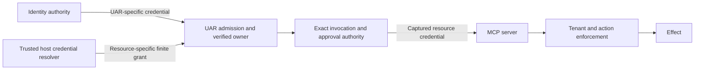

# Analysis: Bossfang–UAR authorization and execution ownership

Date: 2026-10-06  
Stage: Analyze; recommendations for review, not implementation authorization  
Mode: specified stack (Rust UAR/Bossfang, TypeScript The Boss, Node orchestration)  
Inputs: [assessment](assessment.md), [Assess handoff](handoffs/assess.handoff.json), [architectural review](/Users/gqadonis/.codex/worktrees/bossfang-uar-architecture/prometheus-skills-mini/docs/research/bossfang-uar-architecture-review-2026-10-06.md)

## Recommended architecture

**Use Bossfang as the job orchestrator and UAR as the sole execution harness for UAR-delegated attempts. Retain the existing run-scoped MCP transport and exact-invocation admission controls. Correct identity issuance and enforce a distinct remote deployment profile. Do not forward the inbound UAR JWT indiscriminately to MCP servers.**

This recommendation addresses F1–F7 and G7-A/G7-B from Assess. It does not declare them fixed. Every original acceptance scenario is mapped below. No source, dependency, service or product configuration was changed. Approving Analyze permits specification work only; it does not approve product changes or close an existing delivery gate.

For local desktop, preserve installation/launch provenance, the per-turn bridge credential and host claim-before-effect. For remote multi-user operation, require verified subject/tenant, attenuated delegation, resource-correct credentials and receiving-server enforcement. The installation principal is not a remote tenant identity. These distinctions and their inspected implementation are detailed in review §§3–6.

Three roles must remain explicit:

- **Model provider:** inference in, text/tool proposals out; no tool execution.
- **Execution harness:** one authoritative model/tool/approval/continuation loop for an identified attempt.
- **Job orchestrator:** schedules, dependencies, harness choice, attempt records and reconciliation.

A deliberate child delegation is allowed, but its parent observes one identified child operation. It must not interpret already-executed child tool events as proposals to execute again.

## Evidence, versions and research limits

The 59-file assessment digest set matched at Analyze entry. Source baselines remain UAR `a7cb972992d4f83db6585449ea81af0fe4a1c990`, Bossfang `16beef0fcf3053970a901990df4fedbdf86bd87d`, The Boss `e2ae2ce21245030293c0bea96ed02ae853b820a7`; tooling `6044ecdeb5c8c957646fef422d886a4568212888`. [Entry check](evidence/analyze-baseline.json). The original assessment and research ledger remain historical inputs, not rewritten approvals.

Tier 1 searched upstream repositories; Tier 2 resolved and queried Context7 for rmcp, jsonwebtoken and oauth2-rs; Tier 3 checked crate releases and OAuth client dependencies. Direct official protocol/harness pages supplemented those sources; no secondary comparison site was needed. [Research receipt](evidence/analyze-research.json). Research was bounded to 8 queries per tier and 20 minutes; this was specified-stack analysis, so no stack-discovery artifact is warranted.

| Candidate | Local or proposed baseline | Registry observation on 2026-10-06 | Decision implication |
|---|---|---|---|
| rmcp | UAR directly pins 3.1.2 | 3.5.1 published 2026-10-05; Apache-2.0; Rust 1.88 | Retain 3.1.2 for this design. A newer release is not evidence that F6 is fixed. |
| jsonwebtoken | UAR pins 11.0.0 with RustCrypto | 11.1.0 published 2026-09-16; MIT; Rust 1.88.0 | Use existing cryptography; application policy is the gap. |
| oauth2-rs | Not found as a direct UAR manifest dependency or named lockfile package | 5.0.0 published 2025-01-21; MIT OR Apache-2.0; Rust 1.65 | Conditional client-library candidate, not an approved addition. |
| MCP transport HTTP client | UAR pins reqwest_mcp 0.13.4; application client uses 0.12 | Existing source version authority, no upgrade proposed | Preserve the explicit type/transport boundary. |

Registry dates are maintenance signals, not a security audit, compatibility proof or recommendation to upgrade. Sources: [rmcp registry](https://crates.io/api/v1/crates/rmcp), [JWT registry](https://crates.io/api/v1/crates/jsonwebtoken), [OAuth registry](https://crates.io/api/v1/crates/oauth2), [UAR manifest](/Users/gqadonis/Projects/prometheus/universal-agent-runtime/Cargo.toml:353), [UAR pins](/Users/gqadonis/Projects/prometheus/universal-agent-runtime/versions.toml:44).

Protocol comparison remains pinned to **MCP 2025-11-25**, the reviewed rmcp default; a library declaring another date does not prove negotiation. The authorization framework addresses HTTP; stdio follows process/environment trust. Resource-specific audience validation and authorization-server discovery belong at their respective boundaries. OAuth 2.1 is referenced as a draft in that dated MCP text; RFC 8693 token exchange is a published optional mechanism, not a universal MCP requirement. [MCP authorization](https://modelcontextprotocol.io/specification/2025-11-25/basic/authorization), [RFC 8693](https://www.rfc-editor.org/rfc/rfc8693.html).

Context7 returned both a prose claim about automatic nbf checks and a defaults table with validate_nbf=false. Local code resolves the ambiguity: UAR explicitly passes jwt_validate_nbf, whose default is true. Thus no new “nbf is unchecked by default” defect is asserted. Configured issuer/audience are both validated and required; the gap is allowing their omission for remote deployments. [Verifier](/Users/gqadonis/Projects/prometheus/universal-agent-runtime/src/uar/security/verifier/mod.rs:107), [config](/Users/gqadonis/Projects/prometheus/universal-agent-runtime/src/config.rs:638). Pinned rmcp docs could not be fetched through the web tool; installed 3.1.2 source and the prior source ledger take precedence over Context7’s unversioned latest API examples.

## Alternatives and build-versus-adopt decisions

These are qualitative engineering judgments against the stated goal, not benchmark scores.

| Alternative | Loop authority | Change burden and limitation | Verdict |
|---|---|---|---|
| Existing UAR full-harness API, Bossfang adapter outside its LlmDriver loop | UAR for each delegated attempt | Consumer integration plus authority fixes; provider API already exists; restart recovery unsupported | **Recommended** |
| Bossfang loop plus a genuine inference-only endpoint | Bossfang | Coherent for model-only use; UAR tool execution must be impossible on this path | Supported alternative when the desired product is Bossfang execution; not the UAR-harness answer |
| Preserve current completion-shaped UAR execution driver | Both loops reachable | History, tool-event, usage and cancellation semantics remain mismatched | Reject for delegated execution |
| Build a new execution service/queue to replace C05 | New authority | Duplicates current admission/executor ownership and expands services | Reject for this phase |
| Adopt a new JWT or MCP library as the primary repair | Unchanged | Does not attenuate application roles, bind host provenance or assign a loop owner | Reject as the architectural solution |

The normal stop→EndTurn mapping remains disconfirming evidence against unconditional duplicate writes. F1 is a proven static contract mismatch; duplicate effects in failure cases still need reproduction.

The [machine candidate set](library-candidates.json) contains ten evaluated candidates. cand-001 adapts the existing full-harness boundary; cand-002 adopts current JWT primitives; cand-003 adopts the existing MCP integration unchanged; cand-004 references oauth2-rs pending a named receiver contract; cand-005 adopts exact host admission; cand-006 references true model-only execution as an alternative; cand-007 references Codex/Claude harness semantics; cand-008 rejects retaining the nested completion integration for delegated work; cand-009 adapts application identity policy; cand-010 references concrete existing storage surfaces while keeping remote resource storage a named unresolved capability. No package installation or fork is selected.

The remaining custom work is application authority and integration: a Bossfang delegation adapter, issuer/key policy, ownership/session binding where a reproducer confirms the gap, exact root approval migration, and receiver-specific credential lifecycle. It is not custom JWT cryptography or a second agent framework. New package adoption must be justified by a named receiver and an isolated compatibility check during the approved implementation boundary.

Official harness guidance supports the distinction: Codex exposes thread/turn/approval/interrupt lifecycle, and Claude’s Agent SDK supplies a model/tool loop. The comparison anchors are execution identity (thread/turn versus task/run), exact approval identity, and interrupt acknowledgement/terminal classification. The current local adapters remain the implementation evidence; this phase does not infer their behavior from branding or propose unrelated adapter rewrites. [Codex app-server](https://learn.chatgpt.com/docs/app-server), [Claude SDK](https://code.claude.com/docs/en/agent-sdk/overview).

## Proposed execution contract

```mermaid
sequenceDiagram
  participant J as Bossfang job authority
  participant A as Harness adapter
  participant U as UAR full-harness authority
  participant E as UAR executor
  participant H as Host or MCP effect boundary
  J->>A: Persist job attempt and selected harness
  A->>U: Capabilities; then identified admission
  U->>E: Reserve and execute one run
  E->>H: Prepare, approve, claim, execute
  H-->>E: Result or unknown outcome
  U-->>A: Task/run receipt and observation events
  A-->>J: Status, cursor, approval request, outcome
  Note over A,U: Reconnect observes the same attempt
  Note over J,E: No replay of observed internal tool events
```

UAR already reserves admission by owner/workspace/admission ID and request digest, returns a frozen retry receipt, and reports retention/recovery limits. Its router includes capabilities, admission reconciliation, status, stream, exact approval ID, cancel, detach and unsupported steer. Reuse these, not a new parallel task store inside the harness adapter. [Authority](/Users/gqadonis/Projects/prometheus/universal-agent-runtime/src/uar/api/full_harness.rs:86), [routes](/Users/gqadonis/Projects/prometheus/universal-agent-runtime/src/uar/api/full_harness/handlers.rs:35).

| Responsibility | Proposed authority | Contract to specify |
|---|---|---|
| Job scheduling, dependency graph, attempt policy | Bossfang | Durable product attempt identity; no automatic retry of an uncertain effect |
| Admission and authoritative execution | UAR C05 + RunManager | Same owner/workspace/admission and exact payload → same receipt within advertised retention/epoch |
| Observation and transcript presentation | Bossfang adapter/product | Persist task/run IDs and cursor; events are observations, not tool proposals |
| Intra-attempt model/tool continuation | UAR | One effective tool catalog, execution budget and policy |
| Human decision routing | Product UI → UAR pending invocation | Approval ID, task revision, owner and exact invocation; reject stale/absent identity |
| Effect authorization | UAR preparation plus host/resource enforcement | Preserve claim-before-effect and resource-side authorization |
| Cancel | Bossfang requests; UAR acknowledges and classifies | Request, acknowledgement, terminal and cleanup-uncertain are distinct |
| Restart/retention failure | Capability-aware adapter and job authority | Explicit unsupported/unknown state, no silent replay |
| Product history versus execution checkpoint | Bossfang versus UAR | Product transcript is not an executable recovery journal |

**Admission persistence.** Bossfang should persist an admission ID and the expected runtime epoch before first submission, then the returned task/run identity. Compare capability epoch on reconnect. Current request digest covers the full submitted body and workspace: changing credential material while resending the same admission is not an exact retry. Keep transient secrets outside the durable attempt record; retain credential references/revisions in a secure owner-scoped resolver. Reconcile first after a lost response. If the original payload cannot safely be reconstructed or the epoch/retention changed, surface uncertainty instead of submitting a fresh attempt. [Digest](/Users/gqadonis/Projects/prometheus/universal-agent-runtime/src/uar/api/full_harness/handlers.rs:417).

Changed-payload acceptance: submit a harmless fixture with admission A, then reuse A under the same owner/workspace/runtime epoch with one semantic field changed. Require HTTP 409 with admission_digest_conflict and no second run or effect. Exact repetition must return the frozen receipt; the lost-response case must reconcile A rather than generate a new admission. This derives from reserve()’s explicit conflict branch and remains a future integrated scenario.

**Recovery choice.** Recommend a first supported profile that truthfully rejects requirements for durable restart recovery and retains an operator-reconcilable unknown outcome. Do not mark an uncertain attempt successful, failed-with-no-effects, or retry-safe. Durable recovery would require a separate agreed checkpoint covering admission storage, credential reauthorization and effect reconciliation; persisting an event cursor alone is insufficient. This recommendation is pending the operator’s recovery preference. Current provider support is explicitly process-ephemeral. [Descriptor](/Users/gqadonis/Projects/prometheus/universal-agent-runtime/src/uar/api/full_harness.rs:76).

**Compatibility.** Add explicit harness capability selection before routing jobs to it; retain native UAR routes for existing clients during migration. Do not automatically fall back to the current completion driver when required harness semantics are missing. New remote/root approval clients should require exact identity at cutover; any time-limited legacy local compatibility must be separately named and cannot weaken the host claim. The installed client inventory and removal window remain a Spec input, not an invented date.

## Proposed authorization contract



| Boundary | Local desktop recommendation | Remote multi-user recommendation |
|---|---|---|
| Inbound UAR identity | Typed launch provenance and installation context | Configured issuer/audience/algorithm, expiry/nbf policy and verified tenant |
| API-key issuance/revoke | Preserve owner and restricted roles | Attenuate requested roles; prohibit reserved host authority; preserve tenant; owner/admin revoke |
| Host grant authority | Existing authenticated launch path | Explicit service/host authority separate from delegated user; no trust inferred from self-mintable roles |
| Outbound HTTP MCP | Bridge credential or resource credential | Resource-specific token, verified grant owner/destination/scope/expiry |
| Stdio | Allowlisted captured environment and process supervision | Tenant-separated OS privilege boundary if offered; reject required sandbox semantics when unavailable |
| Receiving MCP authorization | Explicit trusted-local mode only | Validate actual token and subject/actor/tenant/action independently of UAR assertions |
| Approval | Exact invocation plus local effect claim | Same binding plus remote principal authorization; approval is not a login token |

JWT policy should reuse jsonwebtoken: fixed algorithms, required issuer/audience for the remote profile, verified subject, current expiry and nbf policy. Preserve the current inherited 60-second clock leeway in acceptance unless deliberately changed. The pinned jsonwebtoken 11.0.0 field is u64 seconds and its constructor sets leeway: 60, not zero; UAR does not override it. [Pinned default](/Users/gqadonis/.cargo/registry/src/index.crates.io-1949cf8c6b5b557f/jsonwebtoken-11.0.0/src/validation.rs:126). Implement a bounded JWKS freshness policy in the existing verifier, with maximum age, refresh behavior, concurrency/rate limits and fail-closed behavior after the hard freshness deadline. Removal/same-kid rotation must be tested against that bound. No particular TTL is mandated by the cited standards; Spec must select an operational value and explain its revocation window. [JWT BCP](https://www.rfc-editor.org/rfc/rfc8725.html), [existing verifier](/Users/gqadonis/Projects/prometheus/universal-agent-runtime/src/uar/security/verifier/mod.rs:273).

The current full-harness workspace helper only requires a nonempty header. Owner-plus-workspace separates records, but that header alone is not proof of tenant/workspace membership. Specify how the verified principal is authorized for a workspace wherever the workspace selects protected resources; do not let a caller-supplied workspace replace tenant verification. This is an identity-contract clarification from inspected code, not a reproduced cross-tenant exploit. [Helper](/Users/gqadonis/Projects/prometheus/universal-agent-runtime/src/uar/api/full_harness/handlers.rs:388).

### Resource credentials and deployment inventory

The host-side resolver should own resource credential acquisition, refresh/revocation and secure storage. UAR consumes an immutable finite grant for its run; the resource server validates the token. For desktop that host is The Boss or another explicitly authenticated launcher. For remote execution it must be an authorized existing host/backend component, with actor and delegated subject recorded separately. This is a responsibility, not authorization to add a credential-broker daemon.

| Receiver class established by source | Credential model | Certification status |
|---|---|---|
| The Boss loopback bridge | Per-turn bearer + exact admission | One prior bridge fixture pass; installed/end-to-end still pending |
| Bossfang POST /mcp | Operator/service credentials or configured user/OIDC auth; agent context is separately constrained | Static only; no-auth root mode is a local deployment assumption |
| UAR /mcp/uar | Verified UAR caller plus HTTP transport session | Static; F6 principal/session matrix pending |
| Registered remote MCP destinations | Host-supplied grant and receiver-specific token | No named production issuer/resource contract supplied |
| Stdio tools | Process environment/OS identity | Supervision exists; sandbox capability not available |

Do not derive an inventory of production resources from sample configuration. The operator has been asked for non-secret receiver/IdP names; absent an answer, **remote production certification remains blocked on this input**. Specification can define the common boundary and explicit unresolved receiver records without claiming deployment readiness.

Prefer a token already issued for the intended resource through that server’s supported flow. Use OAuth authorization-code/PKCE or refresh where the actual server/client profile supports it. Use RFC 8693 only when the chosen authorization server supports the required subject/actor delegation and audience restriction. Static service tokens are an explicit service-identity mode, not user impersonation. Opaque tokens need receiver-side supported validation/introspection; they should not be decoded as JWTs.

oauth2-rs offers standard client flows, refresh, introspection/revocation and a pluggable HTTP client. It does not by itself establish MCP discovery, tenant policy, secure token storage or a deployed exchange service. If a Rust host-side OAuth client is selected later, use the existing application reqwest 0.12 boundary (Cargo.toml:353), which matches oauth2-rs 5.0.0’s optional ^0.12 dependency. Keep reqwest_mcp 0.13.4 solely at the existing MCP transport boundary; no third version or upgrade is proposed. No storage/client module is assigned before the receiver and hosting component are selected. Native RFC 8693 support was not established by the fetched examples. Candidate remains reference/conditional, with no dependency change. [OAuth client docs](https://docs.rs/oauth2/5.0.0/oauth2/).

Storage-class alternatives considered (architectural categories, not vendor certification): (1) desktop OS-backed encrypted storage is a local reuse candidate, supported by the inspected The Boss integration store, but is not selected as a remote per-tenant vault; (2) an owner/tenant-scoped encrypted store inside an already authorized backend is the default remote design candidate, conditional on explicit key custody, rotation, schema and access policy; (3) an existing external vault or KMS-backed adapter could be used only if the operator names that infrastructure and its contract—no new vault/KMS daemon or dependency is selected. cand-010 and REMOTE-RESOURCE-SECRET-STORE preserve this choice; remote credential persistence remains blocked until its acceptance is specified.

Bossfang’s receiving-side identity classification is explicitly application work: authentication middleware and the /mcp route must distinguish configured local operator/service authority from a delegated user/actor, preserve the authenticated principal through agent-context checks, and make the classification observable in a non-secret attribution record. The optional agent-ID header must not transform a service credential into a user credential. Plan must link a Bossfang-scoped change to this machine-contract build requirement and test both legitimate modes plus forged actor/tenant/agent-context rejection. Source boundaries: [middleware](/Users/gqadonis/Projects/references/librefang/crates/librefang-api/src/middleware.rs:556), [MCP context](/Users/gqadonis/Projects/references/librefang/crates/librefang-api/src/routes/network.rs:1425). This specifies an observable classification, not a currently implemented field or a reproduced bypass.

Current UAR grant renewal requires a new run boundary. Do not silently rotate into a different owner’s credential on a live connection. Expiry should stop new effects; any new attempt after renewal must first reconcile the previous attempt’s effects. Supporting mid-run renewal would be a separate versioned authority transition, not an incidental refresh callback.

### Sensitive data and exact approval

Keep login/provider/resource credentials out of prompts, transcript events, retry diagnostics and ordinary logs. Persist references and non-secret provenance. Concrete current storage surfaces are UAR’s provider-key [encryption](/Users/gqadonis/Projects/prometheus/universal-agent-runtime/src/uar/security/credentials/encryption.rs:32) and [scoped resolver](/Users/gqadonis/Projects/prometheus/universal-agent-runtime/src/uar/security/credentials/resolver.rs:51), plus The Boss’s encrypted [integration secret store](/Users/gqadonis/Projects/prometheus/the-boss/src/main/services/prometheus/integrationConfig.ts:111). These are provider/integration credential stores, not proof of a complete multi-tenant MCP refresh-token vault. cand-010 references their reuse boundaries; REMOTE-RESOURCE-SECRET-STORE explicitly blocks remote credential persistence until Spec selects an authorized host storage adapter, key custody, tenant scoping and rotation/deletion behavior. Do not put arbitrary MCP refresh tokens into the existing provider-key schema or enable plaintext fallback. Preserve redacted representations and request-header capture. Tool outputs are an untrusted data path and can legitimately contain sensitive text: filtering credentials does not imply general data-loss prevention.

G7-B acceptance should use synthetic canaries in header/env/provider/error inputs and inspect logs, persisted events and model-bound messages separately. If a tool deliberately returns a canary, classify the output boundary explicitly and apply the approved projection/redaction policy; do not falsely attribute it to automatic request-header leakage. Root approval migration must retain exact IDs through product UI, UAR pending invocation and host claim. No session ID, tool name or run ID alone substitutes for approval of a particular effect.

## F6 reproduction design and coverage handoff

F6’s selected target is the production UAR /mcp/uar router and its **legacy rmcp 3.1.2 session manager**, behind production JWT middleware. Use an isolated in-process Rust integration harness (loopback port 0 only where SSE requires it), in-memory runtime stores and no real provider or shared service. Mint two test JWTs using the existing JWT wrapper/tenant-verifier fixture pattern, with distinct subject/tenant, fixed test issuer/audience, ordinary roles and short valid expiry. Do not inject UserContext directly in the primary auth scenario. Assess did not select a fixture: its F6 section says “that fixture is not yet chosen.” This analysis resolves that open choice; it does not override an approved fixture. The existing generic test_config disables JWT and therefore cannot be reused unchanged. This is a proposed fixture composition, not an already passing test. [Router](/Users/gqadonis/Projects/prometheus/universal-agent-runtime/src/uar/mcp_server.rs:829), [JWT fixture](/Users/gqadonis/Projects/prometheus/universal-agent-runtime/src/uar/security/verifier/mod.rs:464), [test config](/Users/gqadonis/Projects/prometheus/universal-agent-runtime/tests/common/test_server.rs:14).

Initialize A; capture its session; independently initialize B. Exercise B’s POST continuation, GET/replay with A’s event cursor, and DELETE using A’s session. Require no A data, no effect and no A lifecycle mutation, plus successful A control operations afterward. Missing/expired auth must fail before session routing. F6 closes without a fix only if this same authenticated two-principal matrix passes: valid B JWT requests using A’s valid session receive the specified denial (403 or non-disclosing 404), no A result/event is returned, A remains usable, and no effect/session deletion occurs. Record the production UAR transport integration layer that denied the operation and its code location; JWT authentication alone, a generic 500, invalid protocol input or static inspection is not closure evidence. **Planning prerequisite F6-REPRODUCTION:** cand-003 authorizes retaining current rmcp only. Plan must keep any session-binding remediation blocked until the production-router matrix produces a recorded failure (or close the gap with enforcing-layer evidence). This is separate from the unconditional F7 approval migration. If confirmed, bind all session operations to verified owner in the UAR transport integration; the SDK session ID API alone does not establish application identity.

| Assessment scenario | Analysis disposition / future observable criterion |
|---|---|
| Wrong issuer/audience; expired/future UAR JWT | Remote profile before admission; test absent required claims and documented leeway too |
| Removed/same-kid JWKS | Bound cache freshness and rejection after configured deadline |
| Insufficient grant/MCP scope | Separate host-grant rejection and actual receiver rejection; no effects |
| Wrong-audience/expired resource credential | Real receiver or its production validator rejects independently of UAR token |
| Cross-tenant/forged tenant/workspace | Verified principal governs resource/run/binding/cancel; model/header values cannot grant membership |
| Reserved-role issuance | Ordinary key issuer cannot manufacture host provenance; intended host succeeds |
| Credential reuse/renewal | Owner/run isolation, expired lease rejection; no silent credential crossover |
| Approval mismatch/absence/replay | Existing bridge controls retained; exact root stale-decision matrix added |
| Delegated execution | Bossfang bypasses inner loop for harness attempts; one UAR effect and no event replay |
| Cancellation | Exact task/run, acknowledgement and cleanup/unknown classification |
| Interrupted stream/reconnect | Same execution/cursor; observer disconnect does not resubmit/cancel |
| Lost submission/retry | Same admission/epoch and payload; conflict on changed payload; reconcile missing response |
| Restart recovery | Capability-gated; no automatic replay after epoch/retention loss; durable option remains explicit |
| MCP session crossover | Two-JWT production-router matrix above |
| Stdio env/termination | Safe fixture proves env allowlist and shutdown; sandbox unsupported is explicit |
| Key revoke/tenant preservation | Owner/admin decision and retained verified tenant in supported credential paths |
| Credential output/log/prompt | Canary tracing of each boundary, including tool-result projection |
| Bossfang receiving service identity | Local operator mode versus delegated remote user/actor must be observable |

No new product tests ran in Analyze. The prior bridge scenario retains only its original fixture scope. Integrated verification belongs after completed implementation, in isolated repository worktrees with separate data and build roots.

## Existing work, ownership and migration

UAR C05 production tasks are checked complete but reserve the final integration gate for their parent. Bossfang C05’s initiative groups remain unchecked and are explicitly not dispatchable product tasks. Its design already requires one executor, additive capability, separate product history and provider-before-consumer migration. Reuse that scope; do not create a competing C05 authority. [UAR tasks](/Users/gqadonis/Projects/prometheus/universal-agent-runtime/openspec/changes/afc-c05-full-run-delegation/tasks.md), [Bossfang design](/Users/gqadonis/Projects/references/librefang/docs/plans/agent-fabric-convergence/openspec/changes/afc-c05-bossfang-full-run-delegation/design.md), [Bossfang tasks](/Users/gqadonis/Projects/references/librefang/docs/plans/agent-fabric-convergence/openspec/changes/afc-c05-bossfang-full-run-delegation/tasks.md).

The convergence dependency document reports D-UAR-P1 accepted against an earlier immutable closeout. That is evidence of that historical checkpoint, not acceptance of this source revision or F1–F7. It explicitly calls ownership a planning reservation, not a transfer agreement. [Dependencies](/Users/gqadonis/Projects/references/librefang/docs/plans/agent-fabric-convergence/dependencies.md).

| Surface | Proposed implementing repository / existing owner boundary | Before assigning writes |
|---|---|---|
| Bossfang job→harness adapter | librefang C05 consumer scope | Link C05.1–3, agree exact checkpoint and runtime/task files; no librefang-cli expansion |
| UAR key/JWT/host/session/root approval | UAR security/runtime/API owners | Reconcile current changes, reserve affected modules, retain C05 shared executor |
| UAR full-harness provider | Existing UAR C05 | Adopt immutable provider checkpoint; only observed contract gaps get a delta |
| The Boss approvals/observation | Existing native UAR/host bridge integration | Preserve active shipping gate ownership; C05 migration only where required by agreed product contract |
| Actual remote receivers | Named resource owners, still unspecified | Identify issuer/audience/tenant and enforcement contract before claiming remote completion |

No other task was messaged and no file ownership was transferred. Spec should link repository-scoped changes to existing C05 IDs and explicit dependency checkpoints. Plan cannot authorize overlapping product writers without that resolution. New source worktrees must be created before Execute; matching branches alone do not isolate shared data, build caches or KBD identities.

## Decisions requested at this handover

1. **Recommended:** full-harness delegation for UAR-executed jobs. Retain true model-only use only as an explicitly separate mode if needed.
2. **Recommended first profile:** explicit unsupported restart recovery and operator-reconcilable unknown outcome. Automatic durable recovery is a larger capability and is not currently implemented.
3. **Remote input still needed:** named MCP receivers, IdP and tenant/actor contracts. No generic fixture can certify an unspecified deployment.
4. **Specification follow-up:** inventory legacy root-approval clients and agree a compatibility window; new remote contracts require exact invocation identity.
5. **Ownership follow-up:** reconcile existing C05 checkpoints/file claims before execution assignments.

These are recommendations/open inputs, not consent inferred from this analysis. The user’s approval of Assess authorized only Analyze. The next action is to stop for approval of **Spec**. No stage has been skipped; Plan, Execute and Reflect remain unentered.

## Verification and review

Artifact validation: the candidate contract passed its upstream draft-2020-12 schema with Ajv, no packet field was truncated, and analysis links were checked. Nine external analysis links are reachable; the OAuth documentation’s HEAD 500 was followed by GET 200. Source digests remained unchanged. [Artifact checks](evidence/analyze-artifact-checks.json), [link checks](evidence/analyze-link-check.json), [source check](evidence/analyze-source-final.json).

Two completed independent review rounds used fresh-context MiniMax-M3 requests. One earlier request failed with a response-header timeout and was not counted. The latest completed review returned **BLOCK: 1 critical, 3 warnings, 1 suggestion**. Its findings are preserved unchanged; the corrections below were made afterward and are **author-checked, not independently re-reviewed**. The exact producer model identity is unavailable, so canonical cross-model distinction remains unverified. No clean independent PASS is claimed. [Latest findings](review/analyze/findings.json).

The draft sycophancy screen returned 0.017857 with only a low length flag; the latest reviewer screen returned 0.0. These are language screens, not factual certification. Build/deployment health remains unknown. No product tests or services were run/changed. Node-only orchestration and existing service constraints remain. Lifecycle hooks are invoked, but the inherited hook-shape limitation remains; local handoffs are authoritative and no automatic memory writeback is claimed.

### Unresolved review findings and final dispositions

The [kbd-analyze skill](/Users/gqadonis/.codex/worktrees/bossfang-uar-architecture/prometheus-skills-mini/skills/kbd-analyze/SKILL.md) specifies: “CRITICAL findings → revise and re-vet (max 2 rounds, then accept with an ‘Unresolved review findings’ section appended).” Both review rounds completed; this bounded handoff does not certify the final corrections independently.

| Latest finding | Final disposition | Remaining handover limit |
|---|---|---|
| Critical: Bossfang receiver classification lacks a machine assignment | Added explicit Bossfang middleware/MCP build_required entry with service/delegated attribution and negative acceptance | Independent clearance of this final addition is pending; Spec must preserve it |
| Warning: F6 fixture allegedly overrides Assess | Reconciled with Assess’s explicit “not yet chosen”; this is resolution of an open question | Fixture is proposed, not executed |
| Warning: resource storage categories omitted | Enumerated local OS-backed storage, existing-backend encrypted store and conditional existing vault/KMS adapter; no vendor adoption | REMOTE-RESOURCE-SECRET-STORE remains blocked on owner/custody/tenant contract |
| Warning: F6 enforcing-layer closure vague | Requires the same passing real-router two-principal matrix, identified denial layer, A controls and no effects; static/auth-only evidence is insufficient | F6-REPRODUCTION remains a prerequisite to any binding remediation |
| Suggestion: changed-payload conflict test underspecified | Added exact same-admission modified-field scenario with 409/admission_digest_conflict and no second run/effect | Future integrated verification, not a passing test |

Round 1’s assertion that jsonwebtoken defaults to zero leeway was rejected against the pinned constructor at validation.rs:126; the source sets 60 seconds. Reviewer assertions are checked against source rather than adopted automatically.

**Analyze handover:** the analysis is complete with the review limitation above. Stop for human review before Spec. No architecture/product release is certified, and no implementation gate is closed.
