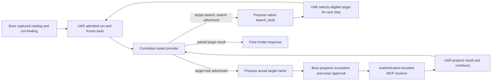

# Analyze — desktop MCP projection acceptance

Date: 2026-10-07 (America/Chicago). Stage: Analyze only. Parent: bossfang-uar-authorization-and-execution, Execute, plan5. Child canonical revision191 on entry; Assess was completed and its Analyze handover explicitly approved. No product edits, tests, builds, dependency installation or runtime diagnostic occurred in this stage.

## Decision

**Adapt the controlled provider and fixture, and specify the missing native-tool host lifecycle contract; add no library.** UAR remains the authoritative agent execution harness. The provider returns model responses, including discovery proposals and subsequent target proposals. Boss owns the captured catalog, credentials, host preparation and exact approval IPC. The fixture receiver owns the actual authenticated MCP call.

The confirmed source defect is an eager-only provider plus indiscriminate classification of every tool result as completed target execution. The observed runtime12 failure is a completed stream with zero prepared invocations and zero MCP effects. Its retained evidence does not identify the initial advertisement or proposal branch; **the exact cause of runtime12 is still unproven**. These are separate conclusions. [Assessment](assessment.md), [failed observation](../../evidence/execute/boss-secret-projection-runtime-12-observation.json).

The provider correction is justified by its independently confirmed discovery gap. Further tracing found a production host lifecycle mismatch for native search: the host requires claimed before finish, whereas local native execution does not use the MCP receiver claim. This adds a necessary contract correction to Spec scope. Neither source finding proves runtime12 took that route; acceptance must distinguish them from any different failure.

## Baseline and evidence levels

| Repository | Inspected HEAD | Existing inventory24 files |
|---|---|---:|
| UAR | 8bff32deb870f6363e94687a2e22492f91a34dfd | 114 |
| The Boss | e2ae2ce21245030293c0bea96ed02ae853b820a7 | 32 |
| Bossfang | bac04cb6b2c144520e28234ad77f00d4cf0f5b23 | 70 |

All216 inventory files matched their retained hashes during Analyze entry. These are existing uncommitted implementation surfaces, not 216 child changes. [Inventory24](../../evidence/execute/source-inventory-mcp-approval-fixture-delivery-24.json), [Assess source receipt](evidence/source-receipt.json). A final static scope receipt records the end-of-stage comparison; excluded D0 paths are never opened.

- **Reproduced previously:** runtime12 exited1 at its first positive MCP assertion; its20-frame stream had no RUN_ERROR, and preparations/effects/matching model tool inputs were0. This child has not rerun it.
- **Static finding:** provider branches at133–156 neither discover a deferred target nor distinguish discovery output from target output. [Provider source](/Users/gqadonis/.claude/worktrees/bauar-boss/scripts/gates/bauar-secret-projection.ts:133).
- **Untested hypothesis:** runtime12 took the missing-target branch because its target was deferred. Neither a matching captured run snapshot nor a completed stream proves this.
- **Proposed acceptance:** deterministic eager and deferred profiles plus finite branch counters, through the existing real desktop flow. No passing result is claimed here.

## Flow and responsibility boundary

| Component | Role | Must not acquire |
|---|---|---|
| Controlled HTTP provider | Model provider: inspect received tools/history and propose one response | Tool execution, admission, approval decisions, an autonomous runner |
| UAR | Agent execution harness: exposure, search, continuation, execution dispatch | Application credential custody or a second Boss loop |
| Boss host | Session/catalog owner and approval/credential boundary | Treat discovery as execution or grant fixture-only authorization |
| Fixture MCP server | Actual resource receiver | Count filler requests as target effects |
| KBD | Development job/stage orchestrator | Runtime agent-loop ownership or release certification |

Search selection changes the next step's advertised descriptors; it does not authorize invocation of a missing/Hidden/policy-excluded tool in the current batch. The provider must use the actual advertised function name, not construct or inject a provider tool name. [UAR exposure contract](evidence/uar-exposure-source-contract.json).

## Candidate evaluation and version resolution

The stack is already specified: the current TypeScript acceptance provider and fixture, pinned MCP SDK, and existing Rust UAR. The required candidate contract is produced. A stack-recommendation.md is only required in stack-discovery mode; this existing-stack review has no stack contest.

| Candidate | Verdict | Reason |
|---|---|---|
| cand-001: existing provider plus native discovery | Adapt | Meets the local contract without a second loop |
| cand-002: existing MCP SDK1.27.1 | Reference; retain pin | Existing fixture already implements tools/list and tools/call |
| cand-003: official OpenAI Node SDK | Reference only | Message contract is useful; installing an SDK or autonomous runner is unnecessary |
| cand-004: force eager exposure/weaken assertions | Reject | Removes deferred discovery coverage and can hide the failure |

The repository package declaration and reference-only original Boss installation at /Users/gqadonis/Projects/prometheus/the-boss/node_modules/@modelcontextprotocol/sdk both identify **@modelcontextprotocol/sdk1.27.1**. An initial exploratory assumption of1.9.0 was incorrect and is withdrawn; no dependency decision used it. npm metadata confirms1.27.1, MIT, and publication2026-02-24. The isolated Boss node_modules directory is absent. Restore its existing locked dependency installation in Execute before any required compiler/runtime gate; do not use the original checkout's installation as source-bound acceptance. [Registry receipt](evidence/analyze/registry-mcp-sdk.json).

Context7 found the official SDK but returned newer split-package imports. Those examples are not instructions to migrate this fixture. Inspected1.27.1 reference source dispatches by request.params.name and lists tool descriptors. Its declared protocol support includes2025-11-25,2025-06-18,2025-03-26,2024-11-05 and2024-10-07; its default negotiated revision is2025-03-26. **No actual runtime12 negotiated revision is inferred from this list.** [Inspected1.27.1 reference constants](/Users/gqadonis/Projects/prometheus/the-boss/node_modules/@modelcontextprotocol/sdk/dist/esm/types.js:2). [Exact-version SDK source](https://github.com/modelcontextprotocol/typescript-sdk/blob/v1.27.1/src/server/mcp.ts), [research receipts](evidence/analyze/context7-results.json).

Context7's two OpenAI queries established assistant tool_calls but did not return sufficient Chat tool-result correlation evidence. The official Chat example supplies role:tool with tool_call_id matching the proposal ID, retains the assistant proposal in history, and sends another model request. This is API guidance, not a normative requirement on UAR's custom search semantics. Responses API call_id examples and current autonomous tool runners are excluded. [Official function-calling guide](https://developers.openai.com/api/docs/guides/function-calling). Local source tracing independently confirms UAR retains the assistant call ID and matching tool reply ID through its typed Liter message serialization; its OpenAI-compatible transform is a no-op. [UAR history](/Users/gqadonis/.claude/worktrees/bauar-uar/src/llm/orchestrator.rs:2355), [typed conversion](/Users/gqadonis/.claude/worktrees/bauar-uar/src/llm/liter_driver.rs:962), [source contract](evidence/analyze/team-source-contract.json). This is static wire feasibility, not a new captured desktop request.

## Smallest correction and decisive acceptance

**Scope reconciliation:** goals.md permits a production-path correction, but scope.json currently lists only fixture/artifact write roots and goals.md asks to establish cause before correction. This recommendation therefore requires the explicit [scope amendment proposal](scope-amendment-proposal.md) at the Spec handover. No scope/goal authority or product roots have been silently changed. It proposes accepting the static contract findings while retaining the unknown historical cause, adding bounded native lifecycle ownership, and requiring fresh changed development payloads without any release/package bypass.

### Native host lifecycle mismatch — necessary production contract work

Every visible call enters host preparation, including native search. Native search executes locally after admission. The Boss finish handler only transitions from claimed, while its admission /claim endpoint performs pure revalidation and the transition to claimed currently occurs only in mounted MCP claimToolCall. Therefore a normally admitted local native search cannot follow the same successful host terminal path by the inspected source chain. This is a static cross-component contract contradiction, not a new runtime reproduction. [Host prepare](/Users/gqadonis/.claude/worktrees/bauar-boss/src/main/ai/runtime/uar/UarHostToolAdmission.ts:208), [MCP claim](/Users/gqadonis/.claude/worktrees/bauar-boss/src/main/ai/runtime/uar/UarHostToolAdmission.ts:111), [host finish](/Users/gqadonis/.claude/worktrees/bauar-boss/src/main/ai/runtime/uar/UarHostToolAdmission.ts:323).

Spec must define a native execution claim bound to the same prepared invocation, run/owner/epochs, immutable tool identity and arguments, policy, lease/budget and actual exact approval. The claim must be persisted before native dispatch; terminal success/failure must require that claim. Do not allow generic authorized-to-finished or prepared-to-finished shortcuts. Managed MCP must retain its separate receiver-side claim immediately before the actual effect. The current PreparedToolInvocation does not expose a trusted ToolSource; the fallback mountedServerId builtin is ambiguous with a server name. Recommend a strict UAR-resolved execution kind bound into invocation authority and receipt equality, plus a distinct consuming native claim after existing revalidation and before execute_native. Keep MCP claim revalidation nonconsuming; its receiver remains the consuming authority. Spec must define the wire/caller cutover and failed-claim cleanup. Do not infer execution kind from model-supplied names. Acceptance must cover valid approved native completion, wrong-kind MCP requests, edited invocation/arguments, replay, exact-approval refusal, cancellation before dispatch and claim/terminal persistence failure; refusal must preserve zero native dispatch and zero receiver effects where applicable. Interrupted already-claimed execution must retain unknown/reconciliation semantics rather than retry an effect. These scenarios trace to the actual host admission and execution boundary. [Team source contract](evidence/analyze/team-source-contract.json).

Effective Ask also requires an approval for the native read-only search, despite its descriptor NotRequired default. Deferred success therefore needs discovery approval as well as target approval. Existing Boss prepare admits a bound invocation without acquiring a resource credential, and UAR executes search locally; no application provider key or MCP resource credential should be added for this native operation. UAR reports TERMINAL_RESULT_PERSISTENCE_FAILED before adding the search reply to model history when host finish fails. [Terminal/history path](/Users/gqadonis/.claude/worktrees/bauar-uar/src/llm/orchestrator.rs:2783). The source contract receipt records these distinctions. If native claim cannot be represented without broader contract work, record that scope explicitly and re-plan before implementation; do not evade it with an eager-only acceptance.

### Correlated provider progression

Derive progression from each received request's actual assistant proposals and paired tool results. Use distinct controlled call IDs for discovery and target. Only a result paired to the target proposal feeds the existing model-input redaction observation and allows final completion. A discovery reply advances to a new model step; it cannot count as an MCP effect or projected credential echo.

If the actual target is advertised, propose that name. Otherwise, if the actual native search control is advertised, propose a uniquely matching query for the intended target. After the paired search result, require the target in the next received tools set before proposing it. Missing target, unmatched history or discovery that does not produce the target must produce a fixed fixture failure category, not ordinary successful completion or unbounded retries. These checks trace to the observed fixture gap and actual tool-execution boundary.

Keep proposal IDs separate from exact approval IDs; the host must still answer only the approvalId issued for the prepared invocation. Preserve existing original-argument, credential-projection, replay and single-effect assertions. [Existing exact-approval caller](/Users/gqadonis/.claude/worktrees/bauar-boss/scripts/gates/bauar-secret-projection-turn.ts:1).

### Deterministic catalog profiles

Use a fixture-owned catalog agent through the existing application catalog API with mcp_servers.selected restricted to the actual fixture server and tool_approval ask. Passing only mcps:[server.id] to the existing all-MCP generated agent does not establish exclusive eligibility. The existing application integration already exercises selected-server save_agent and prepare_run. [Catalog scenario](/Users/gqadonis/.claude/worktrees/bauar-boss/tests/e2e/gates/uarExperienceGate.test.ts:290). Precise path/line verification is recorded in the source contract receipt.

- **Eager profile:** the selected fixture server advertises only read_projection. The initial provider request must advertise it, search proposals must be0, and the existing prepared/approved target must cause exactly1 actual receiver effect.
- **Deferred profile:** the same selected server advertises32 distinct eligible descriptors that sort before read_projection, plus the target. Shared server prefix removes generated server-ID ordering as a determinant. Filler names/descriptions must not match the unique target query. The first provider request must omit the target and advertise search; exactly1 paired discovery result must precede a subsequent request advertising the target and exactly1 target proposal/effect.
- Filler handlers must refuse invocation before target effect accounting. The current generic tools/call handler does not distinguish request.params.name, so adding descriptors alone would corrupt the effect oracle. Keep target-only behavior as the default for other callers of the shared fixture. [MCP fixture](/Users/gqadonis/.claude/worktrees/bauar-boss/scripts/gates/bauar-secret-projection-mcp.ts:24).
- Use separate actual server/catalog configuration per profile, not an in-run list mutation. Keep the cap32, result limit8, Hidden behavior and next-step promotion unchanged. [Eager partition](/Users/gqadonis/.claude/worktrees/bauar-uar/src/mcp/exposure.rs:9), [selection](/Users/gqadonis/.claude/worktrees/bauar-uar/src/mcp/exposure.rs:139).

Selected-server filtering is statically confirmed before eager partition. Native search also passes host preparation: deferred acceptance must separately count exactly1 target preparation/effect and1 discovery preparation, rather than retain exactly1 total preparation. This is an explicit scenario expansion, not relaxation of the eager oracle. With Ask retained, require2 distinct exact approval decisions and2 preparations total, separately proving1 search and1 target. Both search and target drive orchestrator prepare_and_admit at474–484, then the common Ask gate at495 and Boss /prepare208–241. Count admission records by their bound tool identity, separately from approvals, MCP claims and terminal calls. [Preparation flow](/Users/gqadonis/.claude/worktrees/bauar-uar/src/llm/orchestrator.rs:474). No total count is relaxed without identity-classified evidence. A separate native claim/finish mismatch is described above. Source evidence is in the Analyze contract receipt; runtime behavior remains untested.

### Observation and failure discrimination

Record only finite booleans/counts: first target advertised, search advertised/proposed/completed, target advertised after search/proposed/completed, unmatched-history category, preparation/approval decision/effect counts, run-catalog binding, and original assertion results. Do not persist request/response bodies, credentials, canaries, user data, arbitrary function arguments or exception messages.

This cannot retroactively reconstruct runtime12. It supplies a new source-bound falsifier: if a target is advertised/proposed but preparation remains0, stop attributing failure to eager-only discovery and localize that new observed boundary. Do not weaken the existing assertions, increase timeouts or silently widen this child into production changes.

### Completed-delivery verification

Complete fixture behavior, catalog profiles, failure reporting and original assertions before verification. Spec/Plan must name the owned provider/fixture, UAR admission/lifecycle and Boss host admission files and the complete delivery boundary. Then restore only locked existing dependencies, run the required Boss compiler gate once with pinned Node24.14.1, bind changed scripts to a fresh inventory, and rerun the failed real desktop projection gate with the retained actual development bundle/sidecar only if their unchanged-source binding still holds. Rebuild affected product payloads only if production source changes under an separately reviewed plan; never relabel an older bundle.

The full retained gate still covers MCP success/isError/error and existing sink/event interruption/reconnect/cancellation branches. New eager/deferred controls must run through actual captured admission, host preparation, exact approval, mounted receiver and projected model continuation. Avoid duplicate passing parent matrices. A passing fixture compiler or provider-only mock is not desktop acceptance. Because the native lifecycle correction changes product behavior, Plan must include its actual native admission/approval/claim/finish integration and a freshly built affected desktop payload, plus the unchanged MCP rejection/claim-before-effect oracle. The older bundle cannot certify the changed host contract.

## Contradictions, limitations and handover

Assess Q1 asks whether deferred exposure caused runtime12. The historical finite receipt cannot answer it, and Analyze does not open a partial runtime gate under A9. The resolved decision is to correct the independently confirmed supported-contract gap and make the completed gate decisive; the historical cause remains explicitly open. No new runtime probe is performed in Analyze.

The existing fixture already answers actual approvals and awaits actual session closure; those parent corrections are retained, not reimplemented. Analyze changes no automatic approvals, ownership or credential storage. Proposed native lifecycle work preserves those boundaries and is gated by Spec/Plan approval. No external receiver/IdP defaults are added, consistent with the operator's choice.

Research used the skill's ordered pipeline: Tier1 three attempts/two successful GitHub searches; Tier2 six Context7 calls; Tier3 one exact-version registry read; Tier4 three official source/document operations because Context7 was insufficient. No tier exceeded8. Research stopped within20minutes; no popularity/coverage percentage or maintenance score is inferred. [Candidate contract](library-candidates.json), [GitHub receipt](evidence/analyze/github-research.json).

Node adapters dispatched analyze:before once; the three registered shell commands were unsupported skips, not successful memory gates. Actual Node recall refreshed prior-context.md. Its five entries are lifecycle summaries for UAR observability, a legal-page checklist and mvp; none supplies a relevant discovery lesson, and it has no Knowledge gaps heading. No learn-goal action is inferred. There is no evolver bridge. superpowers is unavailable; sycophancy-correction skill is absent, while the existing reviewer-findings executable is evaluated separately. OpenSpec refresh actually verified1.14.1 without authored changes; its receipt is in evidence/analyze/start.json.

Independent Analyze artifact review and schema/source/link checks are recorded before canonical completion. The candidate JSON passed a Node traversal of the schema keywords actually used; a general Draft2020-12 validation engine is unavailable in this isolated mini. That adaptation is structural validation, not a claim that a full schema engine ran. [Artifact check](evidence/analyze/artifact-check.json). They are artifact validation, not product acceptance or cumulative product certification. Exact gateway producer identity is unavailable; cross-model comparison must remain unverified-producer-unknown even when using the configured MiniMax critic.

Parent remains Execute with0/4 formal changes complete. D0 remains excluded after automatic approval review rejected the cross-owner diagnostic for potential cybersecurity risk; no retry or workaround is performed. Global UAR formatting is unwaived, packaging/installed-platform acceptance and cumulative product review remain separate blockers. This child grants no release, publication, service change or gate closure.

**Next: Spec, pending explicit handover**, as required by the user's instruction to stop after every stage. Spec must turn this recommendation into reviewable requirements; Plan must define implementation ownership and the single completed-delivery gate before Execute.

## Final Analyze review disposition

MiniMax-M3 fresh-context artifact review round2: PASS,0 CRITICAL,2 WARNING,0 SUGGESTION. The host finish citation was unified to line323 after review (citation-only correction); the wire version2/native-claim proposal remains a warning carried to Spec for refinement or rejection. The two-round limit is respected. Reviewer-findings screen actually PASS, score0. Formal producer comparison remains unverified-producer-unknown. Structural candidate validation and all27 pre-disposition local links passed; no general Draft2020-12 engine or product gate is claimed. The source inventory still matches216/216 files.

Analyze complete;4 candidates,3 build requirements. Native execution contract and controlled-provider correction are recommendations pending the explicit scope-amendment handover. Product code/builds/tests remain unchanged. Parent Execute and release gates remain incomplete. STOP before Spec per the operator stage-stop instruction.
