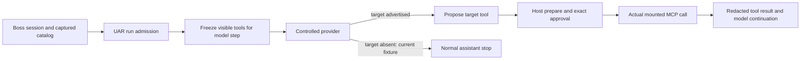
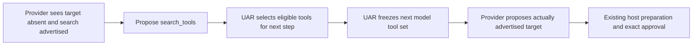

# Assessment — desktop-mcp-projection-acceptance

Project: bossfang-uar-architecture (isolated prometheus-skills-mini workstream)  
Date: 2026-10-07 UTC (2026-10-06 America/Chicago)  
Stage: Assess; no product changes, builds or runtime tests performed in this child.  
Parent: bossfang-uar-authorization-and-execution, Execute, plan 5.  
Baseline: parent revision 185 before child entry; child creation revision 188.

## Verdict and selection

**The desktop MCP projection gate is the most actionable current acceptance blocker.** Runtime 12 fails at its first positive MCP assertion with zero prepared invocations and zero MCP calls while its inspected run snapshot matches and its stream completes without RUN_ERROR. This prevents evidence for the desktop tool-result credential projection and later event scenarios. It is an observed failing acceptance path, not a demonstrated remote authorization vulnerability. [E1](../../evidence/execute/boss-secret-projection-runtime-12-observation.json), [E2](../../evidence/execute/final-gates/boss-secret-projection-runtime-12.json).

The controlled provider has a **statically confirmed eager-only discovery gap**. When no initial advertised tool ends in read_projection, it returns a normal assistant stop instead of using UAR's advertised search_tools control. It also treats any role:tool message as if target execution has completed, so adding only a search proposal would still stop after the discovery result. These two branches are inspected in [provider fixture](/Users/gqadonis/.claude/worktrees/bauar-boss/scripts/gates/bauar-secret-projection.ts:136). **Deferred exposure as the cause of runtime 12 remains a hypothesis**: the retained receipt does not record whether the target/search control was advertised or which proposal branch ran. Do not equate a matching run snapshot with a prepared invocation.

Fixing this child will not remove every parent release blocker. D0 remains excluded after automatic approval review rejected that diagnostic; global UAR formatting is unwaived, packaging has source/prerequisite restrictions, and independent cumulative product review is outstanding. This child grants no parent implementation/certification completion.

## Goals and implementation status

| Area | Status | Evidence and gap |
|---|---|---|
| Reproducible observed symptom | DONE (historical reproduction) | Runtime12 exit1 at positive MCP assertions; zero preparations/calls; completed stream. Not rerun in Assess. |
| Distinguish fixture discovery from product failure | PARTIAL | Static fixture gap established; failed-run advertisement/proposal branch unobserved. |
| Exact approval and actual execution | PARTIAL | Fixture positive modes already answer the actual approvalId through IPC; runtime11's wait was separately localized and corrected. Runtime12 did not reach preparation. |
| Provider continuation after discovery | MISSING in controlled fixture | Native search result needs a subsequent provider request and a newly advertised target name; current fixture considers any tool result sufficient to finish. |
| Complete desktop projection acceptance | NOT MET | Success/isError/error and subsequent event/sink assertions have not all completed in the retained gate. |
| Child reflection/parent handoff | NOT MET | Later gated stages; no child implementation or acceptance claim. |

## Current flow and ownership

Candidate discovery continuation — absent from current controlled fixture; contingent on Analyze:

| Responsibility | Authoritative owner | Child boundary |
|---|---|---|
| Model response/proposed tool choice | Controlled provider fixture | Behave as a model provider, including discovery continuation; never execute tools. |
| Agent loop, per-step exposure, search selection and continuation | UAR orchestrator | Keep one agent execution harness; discovery takes effect next step. |
| Session/catalog, credentials and approval IPC | Boss host | Preserve immutable run binding and exact approvals. |
| Resource tool execution and authentication | Actual fixture MCP server | Preserve actual incoming authenticated request and original arguments. |
| Stage orchestration and evidence | KBD parent/child | Canonical typed state, human stage handovers, source-bound receipts. |

A provider is not an agent execution harness. The fixture must return model proposals through the existing loop rather than call MCP or alter admission. KBD is the work orchestrator, not a second runtime agent loop.

## Findings, impact and confidence

### F1 — The controlled provider assumes eager exposure

**Evidence:** Boss scripts/gates/bauar-secret-projection.ts:133–144 checks initial tools for read_projection and emits a stop if absent. It never proposes search_tools. UAR src/mcp/exposure.rs:9,79–128 caps eager MCP tools at32, defers other eligible tools by ordered provider name, and leaves Hidden omitted. UAR src/llm/orchestrator.rs:1754–1786 adds search_tools when deferred tools exist and freezes the visible map for execution. Independent read-only UAR team inspection provided precise references/hashes in [source contract receipt](evidence/uar-exposure-source-contract.json).

**Impact:** A valid configured target outside the eager set can produce a successful-looking assistant stop with no tool side effect, failing projection acceptance before its security assertions are reached. This is not evidence that credentials were wrong or that approvals were bypassed.

**Confidence:** High in static fixture incompleteness; medium in its applicability to failed runtime12. Initial target visibility/proposal selection has not been observed in that run.

**Correction candidate, contingent on Analyze Q1 establishing applicability to runtime12:** Have the controlled provider propose the actually advertised search_tools control when its target is deferred, then select the actual target name in the next model request. Do not change production exposure caps, reorder providers, inject the target into the model tool set or bypass admission.

### F2 — Discovery output would be mistaken for completed target execution

**Evidence:** The same fixture at134–147 branches solely on whether any role:tool message exists. UAR src/uar/runtime/native_skills/search_tools.rs:47–55,83–92 returns status selected_for_next_step and descriptors; exposure.rs:139–192 matches only deferred eligible descriptors and selects up to8. Selection is not target execution.

**Impact:** A one-line addition of search_tools proposal would still let the provider finish before the target is invoked. Existing redaction observations could then inspect discovery output instead of the credential-echoing MCP result.

**Confidence:** High in static branch mismatch; no child runtime reproduction claimed.

**Correction candidate if Analyze confirms discovery continuation is needed:** Distinguish the search call/result from the target call/result by the fixture's actual call history. Record only safe stage booleans/counts; neither model bodies nor credentials enter diagnostic receipts. Avoid an independent execution/retry loop in the fixture.

### F3 — The failed receipt localizes the symptom, not the discovery cause

**Evidence:** E1 records matching run snapshot, catalog revision, zero prepared invocations, zero MCP effects, zero matching model tool inputs and20 stream frames with no error. It does not capture advertised target/search flags or target proposal count.

**Impact:** Fixing production based on this receipt alone would overstate the cause and could weaken a working authorization boundary.

**Confidence:** High.

**Evidence gap for Analyze, separate from the fixture correction:** First examine available provider-fixture observations. If insufficient, evaluate a bounded, provider-local boolean/count record for advertisement/proposal branches at the applicable completed delivery boundary. Any new fields need explicit acceptance and source binding; they are not already authorized production capture infrastructure. Reuse existing exact-approval/effect counters, preserve original assertions as the oracle, and leave source24/history immutable.

### F4 — The whole gate and parent release are still incomplete

**Evidence:** E2 is exit1, with failure at the first positive MCP mode; success receipts for the whole projection gate are absent. Parent source-specific evidence groups cover different boundaries and prior sources. Parent04 task9 remains in progress, task10 pending.

**Impact:** Neither earlier passing primary cases nor passing compiler checks prove this desktop flow or installed release. Unreachable later assertions cannot be counted as executed.

**Confidence:** High.

**Smallest correction candidate:** Complete the selected correction before one failed-gate rerun. Retain each original positive/negative assertion and source/payload binding. Record platform/package limitations separately rather than waive them from child success.

## Cross-tool progress and baseline

The parent already has production identity/authority/harness/secret-boundary implementation in isolated UAR, Boss and Bossfang worktrees. Parent formal changes remain incomplete: 01 6/7;02 2/8;03 8/9;04 8/10 before child creation. This child adds no duplicate implementation change or task completion. Runtime12 followed the approved exact-approval fixture correction and the prior TypeScript tsc check, but still failed the positive execution path.

[E3: source inventory24](../../evidence/execute/source-inventory-mcp-approval-fixture-delivery-24.json) binds the failed attempt's sources. [E4: bundle09](../../evidence/execute/boss-connected-instance-build-09-manifest.json) identifies the actual development desktop bundle and staged sidecar; it is not a signed release package. The child source receipt records current relevant file hashes and repository heads without printing user data or inspecting excluded D0 files.

Source contract review: existing uar_execution team member, read-only; no Rust changes/builds. Fixture review: lead read-only. Product source ownership and independent product reviewers remain dormant until a completed implementation boundary.

## Spec alignment

[Parent04 spec](../../../../../openspec/changes/bauar-04-resource-credential-lifecycle/specs/mcp-resource-authority/spec.md) requires actual application-supplied MCP configuration, finite owner/run credentials, independent receiver validation, known credential echo projection, preserved secret custody and source-specific deployment claims. The eager-only fixture cannot verify these requirements when it never proposes its target. The smallest candidate is an acceptance-provider correction under those requirements; it does not require a new remote server, IdP, credential store or runtime policy.

The parent projection scope includes registration/history, HTTP/throw faults, mounted MCP success/isError/error, ordinary persistence/model/trace sinks and event split/partial/reconnect/interruption/cancel/snapshot/error/approval branches. Keep that existing complete gate as the final outcome boundary. Analyze must decide how to make both eager and deferred discovery acceptance decisive without duplicating already-passing parent matrices.

## Build health and coverage

- [Boss typecheck16](../../evidence/execute/final-gates/boss-typecheck-node-16.json): TypeScript tsc --noEmit -p tsconfig.node.json --composite false, invoked by pinned Node24.14.1, exit0 at the prior fixture delivery; not child acceptance.
- Existing development bundle09: built at its retained source boundary; no rebuild in Assess.
- Whole projection runtime12: FAIL at first positive MCP mode.
- Child product verification: NOT RUN; no code changed.
- Coverage: PARTIAL; no numeric coverage percentage is inferred from case counts.
- Installed/signed package, Windows/Linux and unnamed remote deployment: NOT VERIFIED by this child.

No broad tests or builds were run during this stage. A9 implementation-first verification applies to Execute; historical evidence is attributed to its actual source rather than relabeled current.

## Prior context, routing and workflow adaptations

Actual Node memory recall wrote [prior-context.md](prior-context.md) in this nested child directory. Its five recalled entries concern unknown/checklist-single-legal-page and provide lifecycle event summaries only; none is a relevant MCP or authorization lesson, so none is promoted as technical evidence. The recalled line “2× reflect events recalled” establishes event counts only. The file has no Knowledge gaps heading or entries, so no learn-goal action is inferred. Open questions below are local engineering questions, not recalled knowledge gaps.

Relevant repository gotcha: “The orchestrator's assess hooks are not child-phase-aware.” The child explicitly passes its nested directory to stageGate and the full nested phase path to the Node recall adapter. Also: “/kbd-new-phase wrote the files but did not register the phase canonically.” Typed phase create/activate/transition and matching generated child progress/waypoint prevent that mismatch.

OpenSpec preflight actually refreshed1.14.1 with latestVerified:true, authoredPathsChanged:[] before child entry; the receipt is linked in [creation receipt](evidence/creation-receipt.json). Generated integration refresh is not authored spec validation.

Node-only adaptation: dispatch installed child:before and assess:before once with the existing Node dispatcher. Registered shell commands are unsupported skips (2 child hooks;3 Assess hooks), not passed memory/writeback gates. Actual Node recall was run separately. Typed canonical stages/projections replace shell lifecycle writes; no helper production code was modified. The child-position/count arguments are1/1 as required by the invoked skill rather than the Node driver's depth/max-depth arguments.

Model preflight was actually read from its fresh24h cache and reports ok with2 configured models. The hosting family is GPT-6; exact gateway producer identity is unavailable, so any reviewer collision check must disclose that limit. Independent artifact review receives only the packet, not generation history. [Process evidence](evidence/process-context.json) records the canonical parent counts, actual cached preflight and refresh receipt; no freshness or compiler result is inferred. Expected superpowers skill was not found in installed skills/plugin paths; no missing skill capability is claimed. sycophancy-correction is absent from the available skill catalog; the existing executable screen, if resolvable, must record its real result.

Constraints are inherited; no threshold, dependency, version pin, service, product code or shipping state was altered. Existing Boss DCO instruction conflicts with governing mini A15 (never Signed-off-by); no product commit is made here.

## Open questions for Analyze

1. Can the next source-bound real-path observation establish target-deferred/search-advertised/fixture-stop as the cause, or does a different catalog/exposure problem occur before host preparation?
2. What minimal controlled-provider call-history handling ensures search output cannot be confused with target tool completion?
3. How will the real desktop acceptance exercise eager and deferred visibility deterministically while retaining existing authority, exact approval and single-effect assertions?
4. Which source checks/builds remain required if correction stays within scripts/gates only, and how should the retained bundle/payload be paired without claiming new package certification?

## Handover boundary

Assess creates a reviewed gap report only. It does not authorize Analyze/Spec/Plan/Execute/Reflect handovers silently or mark the parent release unblocked. The user explicitly required stopping after each stage; await Analyze handover after this assessment is finalized. No source/runtime cause claim should be promoted beyond the evidence levels above.

ASSESSMENT COMPLETE (artifact review disposition appended before canonical completion).

## Final review disposition

MiniMax-M3, fresh-context artifact review, round2: PASS,0 CRITICAL/0 WARNING/0 SUGGESTION, with explicit checked_classes. Round1 citation defect and warnings are retained with their correction disposition. Existing Node reviewer-findings screen: PASS, score0. Canonical producer identity comparison remains unverified-producer-unknown; this is artifact review only, not cumulative product certification. All11 local assessment links resolve; all216 source-inventory files match their retained hashes.

Next stage: Analyze, awaiting explicit operator handover per the earlier stage-stop instruction. No code fix or child runtime acceptance has occurred.
