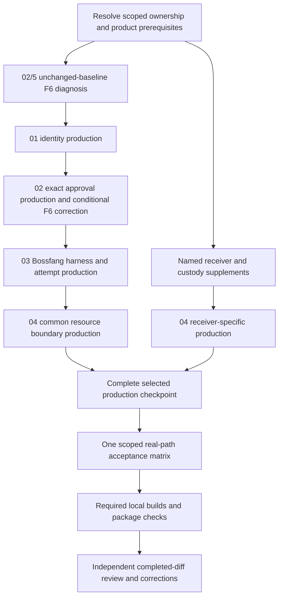

# Implementation plan: Bossfang–UAR authorization and execution

Date: 2026-10-06  
Stage: Plan complete — awaiting explicit approval for Execute.  
Canonical project: 7041aa63-d951-4b19-a59c-b963d65b3b83  
Phase path: bossfang-uar-authorization-and-execution

## Decision and limits

Implement the approved division of responsibility: **Bossfang owns jobs and attempts; UAR owns the model/tool/approval loop of each delegated execution; the host owns resource-credential acquisition and custody; each receiving MCP server enforces its own authority.** A model provider returns inference and tool proposals. It does not execute the agent loop on this route.

Four coordinating OpenSpec changes retain all 32 requirements, 59 scenarios and 34 unchecked tasks. This plan adds ordering, exact backend identities, proposed repository child bindings, task-specific model routes and verification gates. It does not change their checkbox titles or claim product work is done. [Specification](specification.md), [analysis](analysis.md), [assessment](assessment.md), [candidate decisions](library-candidates.json), [architecture review](/Users/gqadonis/.codex/worktrees/bossfang-uar-architecture/prometheus-skills-mini/docs/research/bossfang-uar-architecture-review-2026-10-06.md).

**This is a conditional plan, not a dispatch-ready claim.** Accepted source ownership, installed approval-client compatibility, recovery policy, real remote receivers and secret custody remain inputs. Repository child bindings below are reservations: their concrete worktree/child runtime identity and unresolved file extensions must be filled before the corresponding product task. Creating plausible child directories in the planning tree would not establish repository ownership. Unresolved tasks remain pending/blocked, not skipped or silently removed.

The uncomfortable constraint is that the complete local-and-remote phase cannot be certified from the currently supplied inputs. A common-contract implementation may progress when its own ownership clears, but cannot stand in for real receiver or custody acceptance. Approving Plan does not answer those product choices.

## Baseline and collision control

The reviewed source baselines are UAR a7cb972992d4f83db6585449ea81af0fe4a1c990, Bossfang 16beef0fcf3053970a901990df4fedbdf86bd87d and The Boss e2ae2ce21245030293c0bea96ed02ae853b820a7. [Plan baseline](evidence/plan-baseline.json) records current HEADs, existing dirty paths, worktrees and the 59 original source digests. These are observations, not accepted implementation checkpoints.

Existing UAR C05 source and the separate afc-c05-uar worktree are not interchangeable revisions. Before 03 writes, the lead reconciles the accepted provider API revision with its C05 owner and records consumer file claims. Do not silently cherry-pick another active worktree. Existing Bossfang C05.1–3 remain the consumer initiative; this phase refines and supplies its evidence rather than replacing its ledger. No original C05 or shipping checkmark is changed here.

All KBD operations for this phase use /Users/gqadonis/.codex/worktrees/bossfang-uar-architecture/prometheus-skills-mini/workstreams/bossfang-uar-architecture. Its UUID differs from the shipping project. Source worktrees are created only after Execute approval and use isolated build roots. Respect each repository's worktree rules; UAR specifies ~/.claude/worktrees. Do not copy arbitrary dirty source, secrets, generated payloads or original KBD identity. No merge, push, deployment, service changes or production migration is authorized by this plan.

## Dependency graph and delivery order

Change-level dependencies mean **production readiness**, not completion of each earlier change's evidence task. Otherwise 01 acceptance waiting for 04 and 04 waiting for 01 acceptance would deadlock. Defer every V1/V2 task while production proceeds across siblings. A coordinating change is not archived during this crossing. The driver records implementation, evidence and certification separately; only the tested scenario subset can be accepted.

P0 resolves metadata/input prerequisites without product implementation. D0 is the explicitly authorized diagnostic on an unchanged isolated baseline; no product mutation may precede it in that baseline. P1→P2→P3→P4 are serialized production batches. P4R is blocked until receiver/custody supplements are accepted, and joins the same completed delivery. V1 executes the combined scenario matrix once; its sections feed multiple task receipts. V2 runs applicable local checks/build/package validation once. Independent diff review follows deterministic QA. A failure causes correction and rerun of only affected failed evidence, widening only if the correction changes scope.

No elapsed-time/hourly gate is introduced. No unit-only, mock-only, partial-code or old-binary result closes acceptance. Fixture model responses are allowed only to make the real production loop deterministic; actual admission, execution, persistence, approval and effect paths remain in the run.

## Ordered changes and repository children

| Order | Coordinating change | Reuse annotation | Reserved child change(s) | Production scope |
|---|---|---|---|---|
| 01 | [bauar-01-identity-boundaries](/Users/gqadonis/.codex/worktrees/bossfang-uar-architecture/prometheus-skills-mini/workstreams/bossfang-uar-architecture/openspec/changes/bauar-01-identity-boundaries/tasks.md) | library: cand-002, cand-009 | uar-bauar-identity-boundaries | uar |
| 02 | [bauar-02-execution-authorization](/Users/gqadonis/.codex/worktrees/bossfang-uar-architecture/prometheus-skills-mini/workstreams/bossfang-uar-architecture/openspec/changes/bauar-02-execution-authorization/tasks.md) | library: cand-003, cand-005 | uar-bauar-execution-authorization + boss-bauar-approval-client | uar+boss |
| 03 | [bauar-03-harness-delegation](/Users/gqadonis/.codex/worktrees/bossfang-uar-architecture/prometheus-skills-mini/workstreams/bossfang-uar-architecture/openspec/changes/bauar-03-harness-delegation/tasks.md) | library: cand-001; cand-006/007 reference; cand-008 reject | bossfang-bauar-harness-delegation | bossfang |
| 04 | [bauar-04-resource-credential-lifecycle](/Users/gqadonis/.codex/worktrees/bossfang-uar-architecture/prometheus-skills-mini/workstreams/bossfang-uar-architecture/openspec/changes/bauar-04-resource-credential-lifecycle/tasks.md) | library: cand-003, cand-005; cand-004/010 conditional reference | uar-bauar-resource-boundary + bossfang-bauar-mcp-identity + boss-bauar-secret-projection + receiver supplement | uar+bossfang+boss |

[Repository bindings](repository-bindings.json) is the concrete proposed path/owner inventory. Existing paths and deliberately new paths are distinguished; unresolved extensions and the remote receiver are explicitly blocked. It is not a blanket directory grant. At Execute bootstrap, record an ownership receipt for each child: parent full task key, child root/UUID/change/task IDs, accepted SHA, exact existing/new paths, assigned role, build root and shared-file handoff. Materialize the reviewed requirements into repository-local OpenSpec deltas before applying production. No direct product apply from this coordinating planning root.

Shared-file serialization is mandatory: UAR host modules transfer from 01 to 04; UAR routes/actor/manager stay with 02; The Boss bridge transfers from 02 to 04; Bossfang memory/task/dispatch paths remain with one writer across 03's slices; routes/network.rs transfers from 03 delegated task views to 04 MCP attribution. New feature modules receive substantive additions; oversized existing files receive surgical wiring, not unrelated refactoring. Missing exports, migrations, type definitions or sink paths require an explicit child binding extension, not guessed writes.

The Boss preserves boss-core roles (runtime, security, verifier). Bossfang preserves bossfang-stewards roles (feature steward, schema engineer, merge reviewer); kernel/API ownership extends only through the named claim record because its manifest defaults do not cover all these paths. This planning turn launches no implementation workers. Before product work, load the selected roles, agent-team-models, relevant Rust/async/MCP skills and Compass/source fallback required by that repository. UI skills are unnecessary unless a subsequent reviewed child actually changes visible UI.

## Per-task execution contracts

Keys below abbreviate the phase only for readability. The authoritative key is phase path + full change ID + numeric backend task ID. The numeric ID comes from kbd-apply list; displayed ordinals stay in the unmodified task title. Each row is a bounded work packet; a child split must map back to this key and preserve every exit criterion.

| Change / backend ID | Batch | Exact claim set(s) | Predecessor or blocker | Additional binding / observable exit |
|---|---|---|---|---|
| 01/1 | P0 | U-ID | SOURCE-OWNERSHIP | Storage/backend and current-spec inventory; accepted base and migration ownership receipt. |
| 01/2 | P1 | U-ID | 01/1 | Strict local/remote principal profile, verified tenant/workspace membership, no remote anonymous identity. |
| 01/3 | P1 | U-ID | 01/2 | Require verified UserContext at create; allowed user, disallowed reader and reserved host-session/admin fixtures separately; preserve tenant on both key paths and version metadata. |
| 01/4 | P1 | U-ID | 01/3 | Require verified UserContext at list/revoke, remove anonymous fallback, resolve stored owner/tenant, non-disclosing denials; bounded exchange TTL and documented issued-JWT revocation limit. |
| 01/5 | P1 | U-HOST | 01/3 | Typed host provenance with positive authenticated-host and negative forged-role/destination prerequisites. |
| 01/6 | P1 | U-ID | 01/2 | Monotonic last-successful JWKS freshness, atomic key replacement, one in-flight refresh, hard deadline. |
| 01/7 | V1 | U-TEST | ALL-PRODUCTION | Gate AUTH: real router/verifier/backends; cite shared receipt, no second broad run. |
| 02/1 | P0 | B-APPROVAL,U-APPROVAL | ROOT-APPROVAL-COMPATIBILITY | Inventory owned and installed/external callers; record cutover or explicit local exception, no inferred window. |
| 02/2 | P2 | U-APPROVAL | 01/2–6;02/1 | Require exact root pending identity across events/manager/actor/thread; retain owner and C05 revision. |
| 02/3 | P2 | B-APPROVAL,U-TEST | 02/2;ROOT-APPROVAL-COMPATIBILITY | Migrate controller/admin forwarding and positive helpers to event identity; preserve negative-test purpose and old-event rejection. |
| 02/4 | P2 | B-CLAIM | 02/2–3 | Preserve claim-before-effect; change only evidenced deltas. Author concurrent claim/lost response cases. |
| 02/5 | D0 | U-F6 | SOURCE-OWNERSHIP; private fixtures | Before any production mutations, run original production router two-JWT session matrix. Diagnostic only; no JWT-disabled fixture. |
| 02/6 | P2 | U-F6 | 02/5 | Correct only reproduced session-owner crossover; otherwise enforcing code-branch + valid A/B trace closes no-change branch. |
| 02/7 | V1 | U-TEST,B-CLAIM | ALL-PRODUCTION | Gate APPROVAL/F6: exact decision, cancel races, legitimate pending state survives denials, one claim/effect. |
| 02/8 | V2 | U-TEST,B-BUILD | V1 | Consume single scoped build/package receipt; preserve parent delivery gates. |
| 03/1 | P0 | F-HARNESS,F-STORAGE | C05-OWNERSHIP;RECOVERY-PROFILE-DECISION | Accepted provider baseline and C05.1–3 consumer claims; choose release recovery profile; durable choice requires reviewed provider supplement. |
| 03/2 | P3 | F-STORAGE | 03/1;01/2–6;02/2–6 | Add versioned attempt storage and atomic cursor/product projection; owner/workspace/admission persisted before network. Verify every selected backend. |
| 03/3 | P3 | F-HARNESS | 03/2 | Explicit selection before streaming and non-streaming loops; preserve native mode, no completion-driver fallback. |
| 03/4 | P3 | F-HARNESS | 03/3 | Map actual supported envelope and required policy/budgets; reject unsupported before admit; exact retry/reconcile with frozen credential revision. |
| 03/5 | P3 | F-HARNESS,F-STORAGE | 03/4;02/2–4 | Numeric SSE cursor atomic with product event; replay dedup/gap reconciliation; exact approval forwarding; never dispatch observed tools. |
| 03/6 | P3 | F-RETRY | 03/5;RECOVERY-PROFILE-DECISION | Guard explicit task_retry, stale sweep, pending-task wake via reconcile_pending_task_wakes, cron and restart resumption with attempt/outcome; cancel acknowledgement differs from actual terminal/unknown cleanup. |
| 03/7 | P3 | F-HARNESS,F-STORAGE | 03/6 | Product history/usage projection plus both C05.3 A2A lookup/cancel views bind to the same owner/attempt receipt and forward cancel to the exact UAR execution; local state is cancel-requested until the owning UAR terminal outcome is observed, never local mutation as termination proof; no executable transcript replay. |
| 03/8 | V1 | F-TEST | ALL-PRODUCTION | Gate HARNESS: both dispatch paths through real UAR executor and safe effect; admission loss/409, events, cancel/restart and native comparison. |
| 03/9 | V2 | F-TEST | V1 | One local required build/check receipt with exact provider/consumer revisions; parent gates untouched. |
| 04/1 | P4 | U-HOST | 01/2–6;02/2–6;03/2–7 | Retain immutable owner/run/destination/scope/lease/revision contracts; no connection identity swap or failed-effect replay. |
| 04/2 | P4 | F-MCP | 01/2–6;03/2–7 | Bossfang service/delegated/trusted-local attribution; independently verified tenant/actor/agent access, remote-no-auth rejected. |
| 04/3 | P4 | U-HOST | 04/1 | Captured allowlist environment, supervised cleanup, unavailable required sandbox rejection; uncertain cleanup cannot cause retry. |
| 04/4 | P4 | U-PROJECTION,B-PROJECTION | 04/1–3 | Known run-held credential canaries through errors/events/persistence/model inputs/tool echoes; redact before ordinary sinks, bounded scope. |
| 04/5 | P0 | REMOTE | REMOTE-RECEIVER-INVENTORY | User supplies actual receiver/IdP/nonsecret resource contract and owner; selected implementation inspected, supplement reviewed. |
| 04/6 | P0 | REMOTE | REMOTE-RESOURCE-SECRET-STORE | Existing custodian/storage/custody/rotation/deletion policy selected and reviewed; no daemon/plaintext fallback. |
| 04/7 | P4R | REMOTE | 04/5–6; reviewed supplement;01–03 production | Host acquisition/refresh/revoke in selected existing component; choose existing client or justified cand-004; immutable grants only. |
| 04/8 | P4R | REMOTE | 04/5–6; reviewed supplement;04/7 | Actual receiving-server validator/authorization correction only where owned/needed; resource JWT or active authenticated introspection. |
| 04/9 | V1 | U-TEST,F-TEST,B-PROJECTION,REMOTE | ALL-PRODUCTION | Gate RESOURCE: separate local/remote real validators; actual token denials, custody, renewal, canaries, stdio and inbound attribution. |
| 04/10 | V2 | U-TEST,F-TEST,B-BUILD,REMOTE | V1 | Required platform/build receipts once, independent diff review after deterministic QA; blocked remote evidence keeps phase incomplete. |

A task containing both production and scenario authoring ends its code slice after the full contract is authored; runtime acceptance waits for V1. Do not mark its coordinating checkbox complete merely because a worker returned a patch. When the backend cannot express code/evidence separately, keep the task pending until its exit evidence exists and use execution.md to record authored-but-unverified progress; never invent a pass.

## Concrete persistence and retry contract for 03

The proposed additive record is HarnessAttempt v1, owned by Bossfang product storage: schema_version; job_id; attempt_id; verified owner and workspace; harness kind; admission_id; expected runtime_epoch; required capabilities; non-secret envelope/policy mapping; credential references with revisions; optional provider task_id/run_id/frozen receipt; last applied numeric SSE event ID; attempt revision; classified outcome; cancel acknowledgement and cleanup state; timestamps. Never store raw credentials or a serialized request containing them. Treat any provider receipt field containing secrets as non-persistable.

Unique product identity is (owner, workspace, job_id, attempt_id). Provider admission remains (owner, workspace, admission_id) guarded by epoch. Persist identity before first network submission. Apply each accepted event and its cursor/product projection atomically under expected attempt revision; duplicate or out-of-order event IDs cannot reapply effects or product updates. This is a proposed schema contract, not an assertion that a current table exists. At 03/1–2 select the supported backend(s), migration number and exact schema paths, and prove the transaction exists for each advertised backend. Existing SQLite substrate and Surreal task surface both require an explicit disposition; no production database is migrated during this phase's planning.

Retry coverage is based on inspected source:
- explicit retry: librefang-api routes/task_queue.rs:183 → kernel handles/task_queue.rs:190 → memory substrate.rs:1278;
- stale requeue: kernel/accessors.rs:843 → task_reset_stuck, including SQLite pending/failed transitions at substrate.rs:1381;
- scheduled dispatch: kernel/cron_tick.rs:348 → send_message_full;
- direct and streaming execution: kernel/agent_execution.rs and kernel/messaging.rs from the Spec source ledger.

These paths must consult the same delegated attempt classification. Unknown admission/effect, changed epoch, retention loss or cleanup uncertainty cannot become pending/new execution through a generic task reset. A legitimate explicit new attempt after a known terminal outcome receives a new attempt/admission identity and records its authorization; reconnect/reconcile retains the existing identity. Native non-UAR retry semantics remain unchanged. Additional inspected paths are pending-task wakes (kernel/accessors.rs:831 → triggers_and_workflow.rs:783,799,959), UAR-facing JSON-RPC task views (librefang-api routes/uar.rs:400,456,474) and network task views (routes/network.rs:483,546,573). The two A2A routes use different current task stores; the JSON-RPC cancel branch changes its local state. This is static evidence, not a reproduced cancellation failure. For selected delegated jobs, bind both views to the same owner/attempt receipt and forward cancel to the exact UAR execution; never claim local status mutation proves remote termination. Preserve native task behavior. Include pending-wake and both A2A lookup/cancel routes in LIFECYCLE acceptance. [Call-site receipt](evidence/plan-additional-calls.json). At 03/1 revalidate this inventory at the accepted C05 checkpoint, including any new boot/resumption edges; no whole-repository reachability proof is claimed.

Current C05 restart recovery and steer are unsupported. With the recommended first-release profile, restart yields unsupported/unknown plus operator reconciliation. If durable recovery is selected, stop dependent work, add a reviewed provider persistence/reauthorization/effect-reconciliation supplement and update this plan before dispatch. Transcript/cursor persistence alone never supplies durable execution recovery.

## Acceptance matrix and evidence owner

| Gate section | Owning task(s) | Required observable result |
|---|---|---|
| AUTH | 01/7 | Remote wrong issuer/audience, absent claims, expiry/nbf beyond documented 60s leeway rejected before admission; intended local launch succeeds. Removed/same-kid keys rejected by bounded monotonic JWKS age; outage never refreshes success time. |
| KEY | 01/7 | Verified create/list/revoke; separate allowed user/disallowed reader/reserved-role fixtures; owner/tenant preserved in direct and exchange paths; foreign list/revoke non-disclosing; key lifetime limits exchanged JWT; existing JWT revocation window documented. |
| APPROVAL | 02/7 | Missing/stale/foreign/replayed/cancelled decision denied; exact legitimate pending decision remains usable; edited payload/policy/destination/lease invalidates authority; one claim before one effect; lost effect response remains unknown. |
| F6 | 02/5 diagnostic; 02/7 final | Valid ordinary A/B JWTs against production /mcp/uar; POST/GET/replay/DELETE crossover rejected with 403/non-disclosing404 and no A data/effect/deletion, A/B positive controls pass. Identify concrete session-owner enforcing branch; generic malformed-protocol/JWT failure is not closure. |
| HARNESS | 03/8 | Both kernel entries delegate outside Bossfang's model loop; one real UAR execution and effect; effective input/history/agent/tool/limit policy shown; unsupported requirement rejects before admission. Native provider retains its existing loop. |
| LIFECYCLE | 03/8 | Lost admission reconciles, exact repeat freezes receipt, same-namespace changed body yields 409 admission_digest_conflict; credential revision not silently changed; reconnect/dedup/gap handling creates no run; cancel/terminal/cleanup remain distinct; explicit retry, stale sweep, pending-task wake (accessors.rs → reconcile_pending_task_wakes), cron and restart never resubmit uncertain effects. Both routes/uar.rs JSON-RPC and routes/network.rs task lookup/cancel must bind owner/attempt, forward cancel to that UAR execution, and remain cancel-requested until the owning harness supplies terminal evidence; local-store mutation cannot prove remote termination. |
| RESOURCE | 04/9 | Real named receiver JWT/introspection validation independently rejects wrong audience/expiry/scope/tenant; user/service/actor mode shown, forged agent context denied; two owners/runs/revisions do not reuse credentials; expiry/renewal/revoke proven against actual selected contract. |
| SECRET/STDIO | 04/9 | Distinct synthetic header/env/provider/error/tool-echo canaries absent from ordinary logs, persisted events and model capture; allowlisted child environment and supervised termination; required unsupported sandbox denied; unavailable encryption refuses storage. |
| DELIVERY | 02/8,03/9,04/10 | One exact source/payload/build/platform receipt per completed boundary; local desktop and remote multi-user results separate; final independent review; no original shipping/C05 gate closed. |

Detailed behaviors are normative in the four existing spec.md files; this matrix indexes all 59 scenarios rather than replacing them. Gate receipts must enumerate individual scenarios and statuses (pass/fail/blocked/not-run), source SHA plus dirty diff digest, deployment profile, actual validator and storage backend, token class, isolated data namespace, sanitized request/result/effect count and limitations. Negative scenarios need matching authorized positive controls. Never persist tokens/private keys in the report.

Proposed future integration targets in repository-bindings.json do not exist yet and are explicitly new artifacts. Author them with production, wire them to real routers/executors, and record their exact invocation after the child manifest chooses feature flags. Do not invent a command and claim it ran. Existing The Boss scripts/gates/uar-exact-tool-admission.ts is a useful narrower bridge proof, not the combined HARNESS/RESOURCE gate. Current package scripts provide typecheck, test:lint and build; plain lint is auto-fixing and must not be used as a read-only check. Local packaging must validate the exact UAR payload built at this boundary, never relabel a cached old binary.

At child bootstrap enumerate repository-required local checks from its current instructions/manifests. Respect pinned dependencies, single-writer targets and Node-only tooling. Do not launch shared services, migrate shared databases or add a daemon. If private namespaces against the existing two services cannot isolate a scenario, block that evidence and seek a concrete approved environment. Local ephemeral test processes are not a new resident service. GitHub Actions is not the product test runner.

## Rollout and rollback

Publish no rollout during this stage. The later implementation order is provider identity/approval capability, migrated owned clients, then explicit full-harness consumer selection. Existing in-flight completion-driver work is not reclassified as a full-harness admission. Legacy keys without required metadata follow the reviewed reissue policy, and installed/external approval callers need the cutover decision before strict change dispatch.

Rollback disables new affected admissions and preserves receipts, pending decisions and unknown-outcome records. It never restores insecure remote validation, run-only approval fallback, plaintext custody, cross-owner pooling or automatic replay. Additive schema rollback retains records for reconciliation; destructive migration or deletion requires separate authorization.

## Unresolved prerequisites and stop conditions

| ID | Resolver / required receipt | Dispatch blocked |
|---|---|---|
| SOURCE-OWNERSHIP | Lead: accepted exact product baselines, dirty-diff assessment, concrete child write claims/worktree identity and schema/sink/caller inventories | Any product write not covered by the accepted binding |
| C05-OWNERSHIP | Existing provider/consumer owners: provider SHA, C05.1–3 task mapping, shared-file claims and parent gate owner | 03 product writes and overlapping provider changes |
| ROOT-APPROVAL-COMPATIBILITY | Product owner + installed/external caller inventory and strict cutover or explicitly narrow local exception | 02 migration/cutover production |
| F6-REPRODUCTION | UAR diagnostic receipt for valid A/B production-router matrix | Session binding correction only; no-change closure still requires evidence |
| RECOVERY-PROFILE-DECISION | User selects truthful unsupported/unknown release or reviewed durable supplement | 03 release/recovery-dependent dispatch (03/1 remains incomplete) |
| REMOTE-RECEIVER-INVENTORY | User/receiver owner names actual non-secret receiver and authorization contract | 04/7–8 and remote acceptance |
| REMOTE-RESOURCE-SECRET-STORE | User/host owner identifies existing custodian and reviewed storage/custody supplement | Remote persistence/lifecycle implementation and acceptance |

The first executable work after explicit Execute approval is P0: revalidate and materialize safe repository child bindings; it is not a blind /kbd-apply all. Resolve D0 on its unchanged baseline before production. Ownership/schema discovery is engineering work; no need to ask the user to choose a Rust filename. Only actual product scope or external ownership decisions require operator input. If choices remain missing, finish eligible scoped work and retain blockers. No completion of Execute/Reflect or full phase is allowed while required evidence remains absent.

## Model and route evidence

Observed 2026-10-06: installed codex-cli 0.160.1; current Codex desktop tool schema exposes gpt-6-astra and gpt-6.1-sol with high reasoning, plus other models. Machine configuration selects gpt-6-astra/high; this does not prove this running session's canonical producer identity. The Boss hard-role policy independently selects gpt-6-astra/high. Bossfang's team is authored for Claude opus; preserve its role instructions and explicitly map the proposed Codex execution to gpt-6-astra/high. No model/provider configuration changes are made.

R1: OpenAI gpt-6-astra/high via native Codex is the provisional quality-first implementation recommendation: multi-module authority, asynchronous lifecycle and migration uncertainty need sustained reasoning and source tools. Evidence is configured local access, exposed controls and project role policy, not a comparative implementation benchmark. R2: gpt-6.1-sol/high is an exposed native alternative, but this phase has no comparative implementation result that establishes superiority; a switch requires an explicit recorded assignment revision. No cost/latency ranking is invented.

R3: MiniMax-M3 at the existing Liter gateway is an independent artifact/diff-review inference route, with completed same-day Spec review evidence. It is not a tool-enabled code worker and cannot run acceptance tests. The gateway's judge role currently names gpt-6.1-sol; the plan uses the configured critic MiniMax-M3 explicitly to reduce same-family overlap. Exact producer identity remains unknown; cross-model distinction is unverified, not a proved guarantee. Recheck actual availability and model identity at dispatch.

Implementation launch contract L1: after approval and resolved prerequisites, the KBD driver may execute in the current native tool-enabled session only if its actual selected model is established; otherwise use the exposed collaboration.spawn_agent with fork_turns=none, model=gpt-6-astra, reasoning_effort=high, task_name and an explicit scope message. Include accepted worktree cwd, exact paths, no-other-writer/revert rule, parent task key, role/skill paths, required tools and evidence destination. Do not set an unexposed custom agent_type; carry team role instructions in the scope. Workers return evidence; only the KBD driver owns begin/end-task and canonical completion. No workers launch during Plan.

Review launch L2: fresh-context packet-only POST to the existing Liter /v1/chat/completions, MiniMax-M3, with reviewer mandate and complete artifact/diff packet. No generation history, secrets or tool-execution claims. Gateway reasoning control is unknown; omit unsupported settings. Missing route yields pending review, not a substituted pass. Test tasks use L1; independent critique of their complete evidence uses L2.

## Task model assignments

One row per exact backend task. All rows are proposed, not launched. R1/R2/L1/L2 are fully defined above and form part of each row; evidence is dated 2026-10-06. Required tooling is source/git/OpenSpec/KBD for P0, Rust or TypeScript/native filesystem tools for production, isolated integration/build tools for V1/V2. No visual modality is required. Context is the accepted child spec + named source graph, not the entire workspace.

| Phase path | Change ID | Backend task ID | Requirements | Provider/model | Reasoning effort | Rationale and dated evidence | Harness and route | Worker launch and handoff | Native alternative | Availability and verification | Prerequisites |
|---|---|---|---|---|---|---|---|---|---|---|---|
| bossfang-uar-authorization-and-execution | bauar-01-identity-boundaries | 1 | P0: U-ID; Storage/backend and current-spec inventory | OpenAI/gpt-6-astra | high | R1; 2026-10-06 policy/catalog evidence; no implementation benchmark | Codex desktop native; CLI 0.160.1 observed, desktop version unverified | L1; accepted child cwd and this scoped key; driver owns state | R2: gpt-6.1-sol/high, explicit revision required | Exposed/configured; worker execution not yet verified | Execute approval; SOURCE-OWNERSHIP |
| bossfang-uar-authorization-and-execution | bauar-01-identity-boundaries | 2 | P1: U-ID; Strict local/remote principal profile, verified tenant/workspace membership, no remote anonymous identity. | OpenAI/gpt-6-astra | high | R1; 2026-10-06 policy/catalog evidence; no implementation benchmark | Codex desktop native; CLI 0.160.1 observed, desktop version unverified | L1; accepted child cwd and this scoped key; driver owns state | R2: gpt-6.1-sol/high, explicit revision required | Exposed/configured; worker execution not yet verified | Execute approval; 01/1 |
| bossfang-uar-authorization-and-execution | bauar-01-identity-boundaries | 3 | P1: U-ID; Require verified UserContext at create | OpenAI/gpt-6-astra | high | R1; 2026-10-06 policy/catalog evidence; no implementation benchmark | Codex desktop native; CLI 0.160.1 observed, desktop version unverified | L1; accepted child cwd and this scoped key; driver owns state | R2: gpt-6.1-sol/high, explicit revision required | Exposed/configured; worker execution not yet verified | Execute approval; 01/2 |
| bossfang-uar-authorization-and-execution | bauar-01-identity-boundaries | 4 | P1: U-ID; Require verified UserContext at list/revoke, remove anonymous fallback, resolve stored owner/tenant, non-disclosing denials | OpenAI/gpt-6-astra | high | R1; 2026-10-06 policy/catalog evidence; no implementation benchmark | Codex desktop native; CLI 0.160.1 observed, desktop version unverified | L1; accepted child cwd and this scoped key; driver owns state | R2: gpt-6.1-sol/high, explicit revision required | Exposed/configured; worker execution not yet verified | Execute approval; 01/3 |
| bossfang-uar-authorization-and-execution | bauar-01-identity-boundaries | 5 | P1: U-HOST; Typed host provenance with positive authenticated-host and negative forged-role/destination prerequisites. | OpenAI/gpt-6-astra | high | R1; 2026-10-06 policy/catalog evidence; no implementation benchmark | Codex desktop native; CLI 0.160.1 observed, desktop version unverified | L1; accepted child cwd and this scoped key; driver owns state | R2: gpt-6.1-sol/high, explicit revision required | Exposed/configured; worker execution not yet verified | Execute approval; 01/3 |
| bossfang-uar-authorization-and-execution | bauar-01-identity-boundaries | 6 | P1: U-ID; Monotonic last-successful JWKS freshness, atomic key replacement, one in-flight refresh, hard deadline. | OpenAI/gpt-6-astra | high | R1; 2026-10-06 policy/catalog evidence; no implementation benchmark | Codex desktop native; CLI 0.160.1 observed, desktop version unverified | L1; accepted child cwd and this scoped key; driver owns state | R2: gpt-6.1-sol/high, explicit revision required | Exposed/configured; worker execution not yet verified | Execute approval; 01/2 |
| bossfang-uar-authorization-and-execution | bauar-01-identity-boundaries | 7 | V1: U-TEST; Gate AUTH: real router/verifier/backends | OpenAI/gpt-6-astra | high | R1; 2026-10-06 policy/catalog evidence; no implementation benchmark | Codex desktop native; CLI 0.160.1 observed, desktop version unverified | L1; accepted child cwd and this scoped key; driver owns state | R2: gpt-6.1-sol/high, explicit revision required | Exposed/configured; worker execution not yet verified | Execute approval; ALL-PRODUCTION |
| bossfang-uar-authorization-and-execution | bauar-02-execution-authorization | 1 | P0: B-APPROVAL,U-APPROVAL; Inventory owned and installed/external callers | OpenAI/gpt-6-astra | high | R1; 2026-10-06 policy/catalog evidence; no implementation benchmark | Codex desktop native; CLI 0.160.1 observed, desktop version unverified | L1; accepted child cwd and this scoped key; driver owns state | R2: gpt-6.1-sol/high, explicit revision required | Exposed/configured; worker execution not yet verified | Execute approval; ROOT-APPROVAL-COMPATIBILITY |
| bossfang-uar-authorization-and-execution | bauar-02-execution-authorization | 2 | P2: U-APPROVAL; Require exact root pending identity across events/manager/actor/thread | OpenAI/gpt-6-astra | high | R1; 2026-10-06 policy/catalog evidence; no implementation benchmark | Codex desktop native; CLI 0.160.1 observed, desktop version unverified | L1; accepted child cwd and this scoped key; driver owns state | R2: gpt-6.1-sol/high, explicit revision required | Exposed/configured; worker execution not yet verified | Execute approval; 01/2–6;02/1 |
| bossfang-uar-authorization-and-execution | bauar-02-execution-authorization | 3 | P2: B-APPROVAL,U-TEST; Migrate controller/admin forwarding and positive helpers to event identity | OpenAI/gpt-6-astra | high | R1; 2026-10-06 policy/catalog evidence; no implementation benchmark | Codex desktop native; CLI 0.160.1 observed, desktop version unverified | L1; accepted child cwd and this scoped key; driver owns state | R2: gpt-6.1-sol/high, explicit revision required | Exposed/configured; worker execution not yet verified | Execute approval; 02/2;ROOT-APPROVAL-COMPATIBILITY |
| bossfang-uar-authorization-and-execution | bauar-02-execution-authorization | 4 | P2: B-CLAIM; Preserve claim-before-effect | OpenAI/gpt-6-astra | high | R1; 2026-10-06 policy/catalog evidence; no implementation benchmark | Codex desktop native; CLI 0.160.1 observed, desktop version unverified | L1; accepted child cwd and this scoped key; driver owns state | R2: gpt-6.1-sol/high, explicit revision required | Exposed/configured; worker execution not yet verified | Execute approval; 02/2–3 |
| bossfang-uar-authorization-and-execution | bauar-02-execution-authorization | 5 | D0: U-F6; Before any production mutations, run original production router two-JWT session matrix. Diagnostic only | OpenAI/gpt-6-astra | high | R1; 2026-10-06 policy/catalog evidence; no implementation benchmark | Codex desktop native; CLI 0.160.1 observed, desktop version unverified | L1; accepted child cwd and this scoped key; driver owns state | R2: gpt-6.1-sol/high, explicit revision required | Exposed/configured; worker execution not yet verified | Execute approval; SOURCE-OWNERSHIP; private fixtures |
| bossfang-uar-authorization-and-execution | bauar-02-execution-authorization | 6 | P2: U-F6; Correct only reproduced session-owner crossover | OpenAI/gpt-6-astra | high | R1; 2026-10-06 policy/catalog evidence; no implementation benchmark | Codex desktop native; CLI 0.160.1 observed, desktop version unverified | L1; accepted child cwd and this scoped key; driver owns state | R2: gpt-6.1-sol/high, explicit revision required | Exposed/configured; worker execution not yet verified | Execute approval; 02/5 |
| bossfang-uar-authorization-and-execution | bauar-02-execution-authorization | 7 | V1: U-TEST,B-CLAIM; Gate APPROVAL/F6: exact decision, cancel races, legitimate pending state survives denials, one claim/effect. | OpenAI/gpt-6-astra | high | R1; 2026-10-06 policy/catalog evidence; no implementation benchmark | Codex desktop native; CLI 0.160.1 observed, desktop version unverified | L1; accepted child cwd and this scoped key; driver owns state | R2: gpt-6.1-sol/high, explicit revision required | Exposed/configured; worker execution not yet verified | Execute approval; ALL-PRODUCTION |
| bossfang-uar-authorization-and-execution | bauar-02-execution-authorization | 8 | V2: U-TEST,B-BUILD; Consume single scoped build/package receipt | OpenAI/gpt-6-astra | high | R1; 2026-10-06 policy/catalog evidence; no implementation benchmark | Codex desktop native; CLI 0.160.1 observed, desktop version unverified | L1; accepted child cwd and this scoped key; driver owns state | R2: gpt-6.1-sol/high, explicit revision required | Exposed/configured; worker execution not yet verified | Execute approval; V1 |
| bossfang-uar-authorization-and-execution | bauar-03-harness-delegation | 1 | P0: F-HARNESS,F-STORAGE; Accepted provider baseline and C05.1–3 consumer claims | OpenAI/gpt-6-astra | high | R1; 2026-10-06 policy/catalog evidence; no implementation benchmark | Codex desktop native; CLI 0.160.1 observed, desktop version unverified | L1; accepted child cwd and this scoped key; driver owns state | R2: gpt-6.1-sol/high, explicit revision required | Exposed/configured; worker execution not yet verified | Execute approval; C05-OWNERSHIP;RECOVERY-PROFILE-DECISION |
| bossfang-uar-authorization-and-execution | bauar-03-harness-delegation | 2 | P3: F-STORAGE; Add versioned attempt storage and atomic cursor/product projection | OpenAI/gpt-6-astra | high | R1; 2026-10-06 policy/catalog evidence; no implementation benchmark | Codex desktop native; CLI 0.160.1 observed, desktop version unverified | L1; accepted child cwd and this scoped key; driver owns state | R2: gpt-6.1-sol/high, explicit revision required | Exposed/configured; worker execution not yet verified | Execute approval; 03/1;01/2–6;02/2–6 |
| bossfang-uar-authorization-and-execution | bauar-03-harness-delegation | 3 | P3: F-HARNESS; Explicit selection before streaming and non-streaming loops | OpenAI/gpt-6-astra | high | R1; 2026-10-06 policy/catalog evidence; no implementation benchmark | Codex desktop native; CLI 0.160.1 observed, desktop version unverified | L1; accepted child cwd and this scoped key; driver owns state | R2: gpt-6.1-sol/high, explicit revision required | Exposed/configured; worker execution not yet verified | Execute approval; 03/2 |
| bossfang-uar-authorization-and-execution | bauar-03-harness-delegation | 4 | P3: F-HARNESS; Map actual supported envelope and required policy/budgets | OpenAI/gpt-6-astra | high | R1; 2026-10-06 policy/catalog evidence; no implementation benchmark | Codex desktop native; CLI 0.160.1 observed, desktop version unverified | L1; accepted child cwd and this scoped key; driver owns state | R2: gpt-6.1-sol/high, explicit revision required | Exposed/configured; worker execution not yet verified | Execute approval; 03/3 |
| bossfang-uar-authorization-and-execution | bauar-03-harness-delegation | 5 | P3: F-HARNESS,F-STORAGE; Numeric SSE cursor atomic with product event | OpenAI/gpt-6-astra | high | R1; 2026-10-06 policy/catalog evidence; no implementation benchmark | Codex desktop native; CLI 0.160.1 observed, desktop version unverified | L1; accepted child cwd and this scoped key; driver owns state | R2: gpt-6.1-sol/high, explicit revision required | Exposed/configured; worker execution not yet verified | Execute approval; 03/4;02/2–4 |
| bossfang-uar-authorization-and-execution | bauar-03-harness-delegation | 6 | P3: F-RETRY; Guard explicit task_retry, stale sweep, pending-task wake via reconcile_pending_task_wakes, cron and restart resumption with attempt/outcome | OpenAI/gpt-6-astra | high | R1; 2026-10-06 policy/catalog evidence; no implementation benchmark | Codex desktop native; CLI 0.160.1 observed, desktop version unverified | L1; accepted child cwd and this scoped key; driver owns state | R2: gpt-6.1-sol/high, explicit revision required | Exposed/configured; worker execution not yet verified | Execute approval; 03/5;RECOVERY-PROFILE-DECISION |
| bossfang-uar-authorization-and-execution | bauar-03-harness-delegation | 7 | P3: F-HARNESS,F-STORAGE; Product history/usage projection plus both C05.3 A2A lookup/cancel views bind to the same owner/attempt receipt and forward cancel to the exact UAR execution | OpenAI/gpt-6-astra | high | R1; 2026-10-06 policy/catalog evidence; no implementation benchmark | Codex desktop native; CLI 0.160.1 observed, desktop version unverified | L1; accepted child cwd and this scoped key; driver owns state | R2: gpt-6.1-sol/high, explicit revision required | Exposed/configured; worker execution not yet verified | Execute approval; 03/6 |
| bossfang-uar-authorization-and-execution | bauar-03-harness-delegation | 8 | V1: F-TEST; Gate HARNESS: both dispatch paths through real UAR executor and safe effect | OpenAI/gpt-6-astra | high | R1; 2026-10-06 policy/catalog evidence; no implementation benchmark | Codex desktop native; CLI 0.160.1 observed, desktop version unverified | L1; accepted child cwd and this scoped key; driver owns state | R2: gpt-6.1-sol/high, explicit revision required | Exposed/configured; worker execution not yet verified | Execute approval; ALL-PRODUCTION |
| bossfang-uar-authorization-and-execution | bauar-03-harness-delegation | 9 | V2: F-TEST; One local required build/check receipt with exact provider/consumer revisions | OpenAI/gpt-6-astra | high | R1; 2026-10-06 policy/catalog evidence; no implementation benchmark | Codex desktop native; CLI 0.160.1 observed, desktop version unverified | L1; accepted child cwd and this scoped key; driver owns state | R2: gpt-6.1-sol/high, explicit revision required | Exposed/configured; worker execution not yet verified | Execute approval; V1 |
| bossfang-uar-authorization-and-execution | bauar-04-resource-credential-lifecycle | 1 | P4: U-HOST; Retain immutable owner/run/destination/scope/lease/revision contracts | OpenAI/gpt-6-astra | high | R1; 2026-10-06 policy/catalog evidence; no implementation benchmark | Codex desktop native; CLI 0.160.1 observed, desktop version unverified | L1; accepted child cwd and this scoped key; driver owns state | R2: gpt-6.1-sol/high, explicit revision required | Exposed/configured; worker execution not yet verified | Execute approval; 01/2–6;02/2–6;03/2–7 |
| bossfang-uar-authorization-and-execution | bauar-04-resource-credential-lifecycle | 2 | P4: F-MCP; Bossfang service/delegated/trusted-local attribution | OpenAI/gpt-6-astra | high | R1; 2026-10-06 policy/catalog evidence; no implementation benchmark | Codex desktop native; CLI 0.160.1 observed, desktop version unverified | L1; accepted child cwd and this scoped key; driver owns state | R2: gpt-6.1-sol/high, explicit revision required | Exposed/configured; worker execution not yet verified | Execute approval; 01/2–6;03/2–7 |
| bossfang-uar-authorization-and-execution | bauar-04-resource-credential-lifecycle | 3 | P4: U-HOST; Captured allowlist environment, supervised cleanup, unavailable required sandbox rejection | OpenAI/gpt-6-astra | high | R1; 2026-10-06 policy/catalog evidence; no implementation benchmark | Codex desktop native; CLI 0.160.1 observed, desktop version unverified | L1; accepted child cwd and this scoped key; driver owns state | R2: gpt-6.1-sol/high, explicit revision required | Exposed/configured; worker execution not yet verified | Execute approval; 04/1 |
| bossfang-uar-authorization-and-execution | bauar-04-resource-credential-lifecycle | 4 | P4: U-PROJECTION,B-PROJECTION; Known run-held credential canaries through errors/events/persistence/model inputs/tool echoes | OpenAI/gpt-6-astra | high | R1; 2026-10-06 policy/catalog evidence; no implementation benchmark | Codex desktop native; CLI 0.160.1 observed, desktop version unverified | L1; accepted child cwd and this scoped key; driver owns state | R2: gpt-6.1-sol/high, explicit revision required | Exposed/configured; worker execution not yet verified | Execute approval; 04/1–3 |
| bossfang-uar-authorization-and-execution | bauar-04-resource-credential-lifecycle | 5 | P0: REMOTE; User supplies actual receiver/IdP/nonsecret resource contract and owner | OpenAI/gpt-6-astra | high | R1; 2026-10-06 policy/catalog evidence; no implementation benchmark | Codex desktop native; CLI 0.160.1 observed, desktop version unverified | L1; accepted child cwd and this scoped key; driver owns state | R2: gpt-6.1-sol/high, explicit revision required | Exposed/configured; worker execution not yet verified | Execute approval; REMOTE-RECEIVER-INVENTORY |
| bossfang-uar-authorization-and-execution | bauar-04-resource-credential-lifecycle | 6 | P0: REMOTE; Existing custodian/storage/custody/rotation/deletion policy selected and reviewed | OpenAI/gpt-6-astra | high | R1; 2026-10-06 policy/catalog evidence; no implementation benchmark | Codex desktop native; CLI 0.160.1 observed, desktop version unverified | L1; accepted child cwd and this scoped key; driver owns state | R2: gpt-6.1-sol/high, explicit revision required | Exposed/configured; worker execution not yet verified | Execute approval; REMOTE-RESOURCE-SECRET-STORE |
| bossfang-uar-authorization-and-execution | bauar-04-resource-credential-lifecycle | 7 | P4R: REMOTE; Host acquisition/refresh/revoke in selected existing component | OpenAI/gpt-6-astra | high | R1; 2026-10-06 policy/catalog evidence; no implementation benchmark | Codex desktop native; CLI 0.160.1 observed, desktop version unverified | L1; accepted child cwd and this scoped key; driver owns state | R2: gpt-6.1-sol/high, explicit revision required | Exposed/configured; worker execution not yet verified | Execute approval; 04/5–6; reviewed supplement;01–03 production |
| bossfang-uar-authorization-and-execution | bauar-04-resource-credential-lifecycle | 8 | P4R: REMOTE; Actual receiving-server validator/authorization correction only where owned/needed | OpenAI/gpt-6-astra | high | R1; 2026-10-06 policy/catalog evidence; no implementation benchmark | Codex desktop native; CLI 0.160.1 observed, desktop version unverified | L1; accepted child cwd and this scoped key; driver owns state | R2: gpt-6.1-sol/high, explicit revision required | Exposed/configured; worker execution not yet verified | Execute approval; 04/5–6; reviewed supplement;04/7 |
| bossfang-uar-authorization-and-execution | bauar-04-resource-credential-lifecycle | 9 | V1: U-TEST,F-TEST,B-PROJECTION,REMOTE; Gate RESOURCE: separate local/remote real validators | OpenAI/gpt-6-astra | high | R1; 2026-10-06 policy/catalog evidence; no implementation benchmark | Codex desktop native; CLI 0.160.1 observed, desktop version unverified | L1; accepted child cwd and this scoped key; driver owns state | R2: gpt-6.1-sol/high, explicit revision required | Exposed/configured; worker execution not yet verified | Execute approval; ALL-PRODUCTION |
| bossfang-uar-authorization-and-execution | bauar-04-resource-credential-lifecycle | 10 | V2: U-TEST,F-TEST,B-BUILD,REMOTE; Required platform/build receipts once, independent diff review after deterministic QA | OpenAI/gpt-6-astra | high | R1; 2026-10-06 policy/catalog evidence; no implementation benchmark | Codex desktop native; CLI 0.160.1 observed, desktop version unverified | L1; accepted child cwd and this scoped key; driver owns state | R2: gpt-6.1-sol/high, explicit revision required | Exposed/configured; worker execution not yet verified | Execute approval; V1 |

Final independent plan/diff review is a stage/delivery gate, not a synthetic implementation checkbox: R3/L2, MiniMax-M3, reasoning setting unknown. The integration worker cannot certify its own output. Use actual receipts for model identity, route, scope and output; model labels are not security isolation.

## Verification and stage handover

Before completion: strict-validate four unchanged behavior deltas; reconcile numeric backend IDs/titles with all 34 assignment rows and canonical registrations; verify local artifact links and path classifications; check original shipping revision/path and product source digests; independently review this plan plus all specification siblings and carried warning. Screen both plan and reviewer output for unsupported claims. Record unavailable gates and any unresolved findings. This is artifact verification only; no product compilation, integration or deployment is performed in Plan.

Spec warning is explicitly implemented in 01/3–4 contracts: mandatory verified UserContext in create/list/revoke, removal of anonymous fallback, stored owner/tenant checks and non-disclosing negatives. The fixture-splitting suggestion is adopted in 01/3 and KEY acceptance. Existing spec bodies and task titles are retained.

The KBD Node hook dispatcher is invoked before/after this stage; zero matched commands means automatic memory writeback remains unverified. Managed OpenSpec latest-stable refresh selected 1.14.1 with authoredPathsChanged empty. Upstream shell-based review tooling is adapted to Node. No skill/config/dependency changes are part of the product plan.

After review and registration, write the Plan handoff, mark only Plan complete, pause the isolated phase, and ask for Execute approval. All implementation/evidence tasks remain unchecked. Reflect remains a later explicit handover, not an automatic follow-on.

## Plan-stage results

Plan is complete as a conditional coordinating plan; Execute requires explicit handover approval. Four changes and 34 tasks are registered as pending; no implementation task began or completed. Strict OpenSpec validation passed all four under Node 24 LTS; the changed 03 refinement also validated after correction. Numeric task IDs/titles reconcile with the canonical ledger. [Task reconciliation](evidence/plan-task-reconciliation.json), [validation](evidence/plan-strict-validation-final.json), [model-route evidence](evidence/plan-model-routes.json).

Independent review: whole-plan PASS; a subsequent call-site revision review found one critical task-mapping omission, two warnings and one suggestion; the first correction confirmation returned PASS with no findings. All dispositions and exact packets are retained. [Final findings](review/plan/findings.json), [corrections](review/plan/correction-disposition.md), [review receipt](review/plan/final-disposition.json). Exact producer identity remains unavailable, so cross-model separation is unverified. The language screens raised only low length flags; no mandatory correction was reported. One vendor response failed normalization and was rejected rather than accepted as a review.

The shell initially selected Node 26 for orchestration. The already-installed Node 24 LTS was selected for final artifact checks and subsequent review transport; no runtime was installed or configured. [Adaptation receipt](evidence/plan-runtime-adaptation.json). No product code, configuration, dependency or service changes, product builds, acceptance runs, publication or parent-gate closure occurred. Repository child worktrees and unresolved ownership/receiver/custody/recovery inputs remain prerequisites, not completed implementation. The original shipping KBD remains outside this workstream. Local documentation-only check-in satisfies A-17; it authorizes no Execute work.
