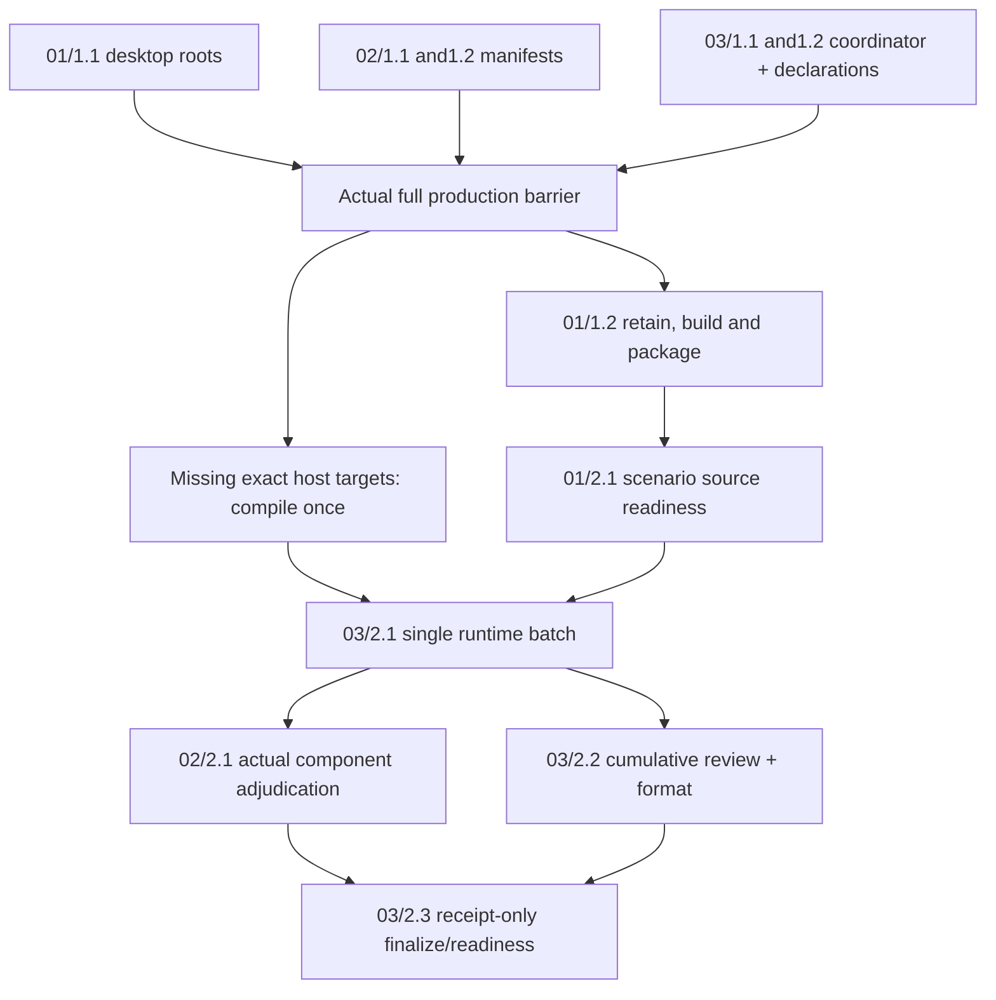

# BAUAR Local Release Acceptance Implementation Plan

> For agentic workers: implement only after the human approves this Plan handover. Preserve the requested agent team. Load kbd-apply for canonical task boundaries and the relevant execution skill. The existing OpenSpec checkboxes are the only backend task list; this document adds no synthetic tasks.

**Goal:** establish source-bound acceptance of the current UAR in an unsigned local macOS ARM64 Boss package, the selected Bossfang delegated jobs, and finite supporting regression, then report the exact remaining release limitations.

**Architecture:** The Boss application owns configured MCP credentials, desktop admission and managed sidecar lifecycle. UAR owns one delegated model/tool/approval/continuation loop; Bossfang owns job attempts, submission intent and outcome reconciliation. A phase-local Node coordinator launches existing real-path gates under private roots and aggregates receipts; it owns no product agent loop or delivery ledger.

**Tech stack:** Node22.20.0 orchestration; already-installed Node24.11.1, pnpm12.3.4, Playwright1.62.1, Electron44.2.0, electron-builder26.15.6; existing Rust/Cargo locked targets and private embedded persistence. No new dependency, daemon or version change.

**Spec:** [reviewed Spec](spec.md), [review disposition](spec-review-disposition.md), and the three linked changes below. Date2026-10-09. Project bossfang-uar-architecture; OpenSpec1.14.1, latest registry refresh verified this stage. This is Plan, not Execute or a runtime result.

## Global constraints and decisions

- Selected delivery: unsigned local darwin-arm64 only. Operator remains release authority. Signing/notarization, installed operation, Intel/Windows are deferred/unverified; production remote receiver/IdP/custody is excluded; publication/merge/release/cache promotion and shipping/C05 are unauthorized. These scopes do not block the selected local target.
- MCP credentials come from application/server configuration; empty shipped defaults remain. No caller JWT forwarding theory or authentication redesign.
- Strict exact approval IDs and owned caller cutover; approvals/effects remain bound to the same execution. Restart unsupported/unknown requires reconciliation, never automatic replay or a durable-recovery claim.
- F6 stays cancelled. Never read/search/hash/diff/test its two excluded files; no wildcard UAR status/diff/source traversal. Select exact eligible paths first. No archived history rewrite.
- Keep all candidates, refs, caches, old packages, archives and rollback inputs. Stop only owned children; no live-profile mutation, installed-cache modification or service takeover.
- Complete ALL production tasks before builds, executable scenario authoring, runtime checks or product review. No unit/mock/per-edit gate or per-task reviewer; artifact validation now is not product evidence. One writer per target/build directory; serialize dependency mutation.
- Node argument arrays, shell:false, no ambient credential inheritance or coordinator HOME/CODEX_HOME mutation. Modules ≤500 lines and separated by capability. No forbidden shell/Python scripts, authored symlinks or executable-bit reliance.
- Existing locked/pinned packaging operations are authorized in the isolated candidate, with unchanged hooks/versions. No general installation/update/download authorization is inferred; missing required locked inputs are BLOCKED.
- Source completion, build/package completion, scenario source readiness, actual runtime acceptance, independent review and release authority remain separate. Old waived certification cannot satisfy the new local gate.
- Current planner is GPT-6, exact deployed variant/connection unavailable. Template Claude/Qwen registry is explicitly unverified; it does not override the user's Codex invocation. Expected sycophancy-correction SKILL.md is absent; its MCP is available. Superpowers writing-plans is available at the installed plugin and used; its TDD/per-task reviews conflict with A-9 and are replaced by the complete-delivery gate.

## Review focus

All five classes already have Spec cases; do not manufacture additional unobserved product requirements.

1. Private root must bind before logger/boot-config and bypass packaged appData/branded/portable/boot-map and dev-suffix selection. D01 observes actual roots and a conflicting PRIVATE boot-map; no live default-profile launch.
2. Foreign/consumed/edited/missing approval IDs must not consume legitimate approval authority or perform an effect. D02/D03 count actual receiver effects and approvals.
3. Lost acknowledgements, interrupted streams and epoch restart retain original admission/run/cursor with no resubmission. H02/D04 observe actual identities and counters, not only exit0.
4. Supporting test-probes binary cannot certify packaged server-full selection. D01 proves bundle selection; H03/H04 record profile and nonzero executed counts separately.
5. Missing/stale source/review/scenario receipts and zero tests cannot become PASS. E01–E03 pair disposable negative controls with typed exit2 and a receipt-only finalization.

## Inputs, ownership and reusable changes

| Order | Existing change | Value / scope / complexity | Reuse and dependencies |
| --- | --- | --- | --- |
| 01 | [bauar-acc-01-private-packaged-desktop](../../../openspec/changes/bauar-acc-01-private-packaged-desktop/proposal.md) | HIGH; optional early Boss root, packaged gate and exact effects; M1–4h source/scenario work, build time separate | library:cand-001,cand-002,cand-007 ADAPT. build_required private-launch-roots. 1.1 independent; packaging follows full production; scenarios follow package. |
| 02 | [bauar-acc-02-current-harness-regression](../../../openspec/changes/bauar-acc-02-current-harness-regression/proposal.md) | HIGH; bind/reuse existing job and eligible regression paths; S<1h inventory/adjudication, runtime/compilation separate | library:cand-003,cand-004 ADAPT. skip_specs:true preserved: verification.md is populated, no invented delta. Preparation independent, adjudication follows runtime. |
| 03 | [bauar-acc-03-local-acceptance-evidence](../../../openspec/changes/bauar-acc-03-local-acceptance-evidence/proposal.md) | HIGH; coordinator/private processes/receipts/readiness; M1–4h production, conditional build cost separate | library:cand-005 ADOPT. build_required current-bundled-startup and eligible-regression-review. Production independent; runtime/review/finalize follow graph. |

Do not run /opsx:new or recreate these changes: Spec already authored/strict-validated all three and eleven unchanged task titles/Spec labels. cand-006 Spectron remains REJECTED. Analyze's research budget is closed; no landscape restart.

Grounding: [prior-context](prior-context.md) says “keep locked dependency topology intact; resolve application child runtime requirements before builds” and separate implementation, build/package, acceptance and publication. It says the skill-pack4/4 results “test the skill commands, not BAUAR runtime behavior.” Therefore preserve working dependencies/UAR release output, rebuild only changed Boss, require new bundle runtime receipts, and do not restart skill-pack repair. Legacy hooks cannot refresh recalled context: this Plan uses the explicit retained file and claims no external memory recall.

[Source/tool inventory](evidence/plan/source-tool-inventory.json) records Node24.11.1 and Cargo1.99.0-nightly observed, eight inspected source hashes and **no Bossfang candidate target directory**. [Cumulative source scope](evidence/plan/cumulative-source-scope.json) carries241 finite inherited BAUAR paths from the actual intake, not a new whole-repo scan. [Planned command contract](evidence/plan/command-contract.json) holds literal argv/cwd/targets/budgets; unresolved executable values are explicitly declared compilation outputs, never fake paths. All runtime commands below are planned/unrun.

## Execution rounds and authoritative barrier



Round1: three disjoint implementers (desktop, harness inventory, evidence coordinator) plus lead, within four native slots. Reviewers/verifiers dormant. Lead records barrier only after actual01/1.1,02/1.1–1.2,03/1.1–1.2 source completion and validates declarations, not runtime behavior.

Round2: desktop owner retains/builds/packages. Missing exact Bossfang host compilation is performed by the lead at the completed-production boundary, with distinct target directory, no concurrent dependency mutation. No unchanged release UAR rebuild. Never build while an owner is still implementing its production surface.

Round3: desktop owner authors/adapts executable scenarios after package; scenario source readiness01/2.1 means source mapped to D01–D04, not a PASS claim. Phase fixtures are external to app.asar; if only test-source changes after packaging, record package-production HEAD/digests and scenario HEAD/digests separately. If production bytes change, finish correction then repackage before affected acceptance.

Round4: evidence owner runs integration once over complete components. Fix an observed defect in a bounded amended owned scope; finish coherent corrections before rerunning only failed/invalidated components. Do not repeatedly run passing scopes or replay a product job to recover evidence.

Round5: harness owner adjudicates and fresh product reviewer/format owner work from actual receipts. Finalize only afterward, then Execute handoff and STOP before Reflect. Runtime/format/review are mandatory for selected local readiness unless a new explicit operator disposition changes that gate; no new waiver is assumed.

## Task identity mapping

Spec labels in task headings/dependency diagrams (for example01/1.1) are stable human labels. The observed real kbd-apply list emits sequential backend IDs, not those labels. Canonical registration and Task model assignments below use the emitted IDs exactly: changes01/02 labels1.1,1.2,2.1 map to1,2,3; change03 labels1.1,1.2,2.1,2.2,2.3 map to1,2,3,4,5. Full key is phase path+change ID+backend ID. Resolve through the existing resolveRuntimeTaskId helper and normalized title/unique sequence when needed; never duplicate canonical records under Spec labels. [Actual emitted mapping](evidence/plan/task-identity-map.json) retains complete titles; original checkbox titles remain unchanged.

## Task model assignments

Capability evidence dated2026-10-09: this Codex tool schema exposes tool-enabled fresh-agent model and reasoning overrides, four active slots. gpt-6-astra is described as frontier reasoning; gpt-6.1-sol as workhorse. Suitability below is a reasoned selection based on tools/context and observed role outputs, not benchmark/rate proof. Unknown prices prevent any cost-ceiling claim; same-owner continuity avoids needless launch/context cost. REST preflight cache names judge OpenAI/gpt-6.1-sol, connection openai-proxy-8181, and critic MiniMax-M3/minimax-direct; Spec artifact inference succeeded. Worker and product review routes are not exercised by Plan.

| Phase path | Change ID | Backend task ID | Requirements | Provider/model | Reasoning effort | Rationale and dated evidence | Harness and route | Worker launch and handoff | Native alternative | Availability and verification | Prerequisites |
|---|---|---|---|---|---|---|---|---|---|---|---|
| /Users/gqadonis/.codex/worktrees/bossfang-uar-architecture/prometheus-skills-mini/workstreams/bossfang-uar-architecture/.kbd-orchestrator/phases/phase-bauar-release-acceptance | bauar-acc-01-private-packaged-desktop | 1 | Spec label 1.1; Early Node/Electron imports, filesystem roots and default branch compatibility; narrow security boundary | OpenAI/gpt-6-astra | high | 2026-10-09: Native exposed frontier reasoning/tools; startup ordering requires synthesis; no comparative benchmark; capability evidence [source/tool inventory](evidence/plan/source-tool-inventory.json) and exposed harness schema | Codex desktop native collaboration.spawn_agent; installed app version unavailable | role desktop; fork_turns none, explicit model/effort; Boss; constants/preboot README only; scoped result to lead | same selected native model | Tool-exposed dispatch schema, NOT newly launched/verified worker; exact provider connection/version/prices unknown | Full production barrier not passed; Execute handover required |
| /Users/gqadonis/.codex/worktrees/bossfang-uar-architecture/prometheus-skills-mini/workstreams/bossfang-uar-architecture/.kbd-orchestrator/phases/phase-bauar-release-acceptance | bauar-acc-01-private-packaged-desktop | 2 | Spec label 1.2; Retention, exact locked build, source/package binding; subprocess/build writer | OpenAI/gpt-6-astra | high | 2026-10-09: Same desktop owner retains bootstrap context; avoid additional dispatch latency; capability evidence [source/tool inventory](evidence/plan/source-tool-inventory.json) and exposed harness schema | Codex desktop native collaboration.spawn_agent; installed app version unavailable | role desktop; fork_turns none, explicit model/effort; Boss build/package and phase build receipts only; scoped result to lead | same selected native model | Tool-exposed dispatch schema, NOT newly launched/verified worker; exact provider connection/version/prices unknown | All five production tasks complete |
| /Users/gqadonis/.codex/worktrees/bossfang-uar-architecture/prometheus-skills-mini/workstreams/bossfang-uar-architecture/.kbd-orchestrator/phases/phase-bauar-release-acceptance | bauar-acc-01-private-packaged-desktop | 3 | Spec label 2.1; Real Electron/IPC/HTTP scenarios, approval identity, effects and safe captures | OpenAI/gpt-6-astra | high | 2026-10-09: Existing fixture adaptation spans transport and persistence; continuity with root owner; capability evidence [source/tool inventory](evidence/plan/source-tool-inventory.json) and exposed harness schema | Codex desktop native collaboration.spawn_agent; installed app version unavailable | role desktop; fork_turns none, explicit model/effort; Boss named gate/helper/config paths only; scoped result to lead | same selected native model | Tool-exposed dispatch schema, NOT newly launched/verified worker; exact provider connection/version/prices unknown | Production barrier and source-bound package complete; no early tests |
| /Users/gqadonis/.codex/worktrees/bossfang-uar-architecture/prometheus-skills-mini/workstreams/bossfang-uar-architecture/.kbd-orchestrator/phases/phase-bauar-release-acceptance | bauar-acc-02-current-harness-regression | 1 | Spec label 1.1; Finite source/feature/argv inventory and binary provenance; JSON and file inspection | OpenAI/gpt-6.1-sol | medium | 2026-10-09: Exposed workhorse supports bounded inventory; lower effort for mechanical source binding; prices unknown; capability evidence [source/tool inventory](evidence/plan/source-tool-inventory.json) and exposed harness schema | Codex desktop native collaboration.spawn_agent; installed app version unavailable | role harness; fork_turns none, explicit model/effort; Phase harness-inputs.json only; scoped result to lead | same selected native model | Tool-exposed dispatch schema, NOT newly launched/verified worker; exact provider connection/version/prices unknown | No host binary in current candidate; declare later exact target compilation |
| /Users/gqadonis/.codex/worktrees/bossfang-uar-architecture/prometheus-skills-mini/workstreams/bossfang-uar-architecture/.kbd-orchestrator/phases/phase-bauar-release-acceptance | bauar-acc-02-current-harness-regression | 2 | Spec label 1.2; Map existing cases to H01–H04, count expectations and exclusions | OpenAI/gpt-6.1-sol | high | 2026-10-09: Non-trivial contract mapping merits higher effort; no new product code; capability evidence [source/tool inventory](evidence/plan/source-tool-inventory.json) and exposed harness schema | Codex desktop native collaboration.spawn_agent; installed app version unavailable | role harness; fork_turns none, explicit model/effort; Phase harness-scenarios.md only; scoped result to lead | same selected native model | Tool-exposed dispatch schema, NOT newly launched/verified worker; exact provider connection/version/prices unknown | Read existing gate/eligible targets, never F6; no early execution |
| /Users/gqadonis/.codex/worktrees/bossfang-uar-architecture/prometheus-skills-mini/workstreams/bossfang-uar-architecture/.kbd-orchestrator/phases/phase-bauar-release-acceptance | bauar-acc-02-current-harness-regression | 3 | Spec label 2.1; Evaluate actual effects/negatives/restart/cleanup, no guessed PASS | OpenAI/gpt-6.1-sol | high | 2026-10-09: Same source-inventory owner adjudicates explicit receipts; producer of evidence summary, not independent reviewer; capability evidence [source/tool inventory](evidence/plan/source-tool-inventory.json) and exposed harness schema | Codex desktop native collaboration.spawn_agent; installed app version unavailable | role harness; fork_turns none, explicit model/effort; Phase component adjudication receipt only; scoped result to lead | same selected native model | Tool-exposed dispatch schema, NOT newly launched/verified worker; exact provider connection/version/prices unknown | 03/2.1 runtime receipts present and passing selected scope |
| /Users/gqadonis/.codex/worktrees/bossfang-uar-architecture/prometheus-skills-mini/workstreams/bossfang-uar-architecture/.kbd-orchestrator/phases/phase-bauar-release-acceptance | bauar-acc-03-local-acceptance-evidence | 1 | Spec label 1.1; Typed input/receipt schemas, private processes, failure/exit semantics | OpenAI/gpt-6-astra | high | 2026-10-09: Frontier route supports cross-component orchestration; correctness over speculative cost saving; capability evidence [source/tool inventory](evidence/plan/source-tool-inventory.json) and exposed harness schema | Codex desktop native collaboration.spawn_agent; installed app version unavailable | role evidence; fork_turns none, explicit model/effort; Phase acceptance entry/lib/schemas only; scoped result to lead | same selected native model | Tool-exposed dispatch schema, NOT newly launched/verified worker; exact provider connection/version/prices unknown | Execute approval; manifest interfaces below; no new dependencies/services |
| /Users/gqadonis/.codex/worktrees/bossfang-uar-architecture/prometheus-skills-mini/workstreams/bossfang-uar-architecture/.kbd-orchestrator/phases/phase-bauar-release-acceptance | bauar-acc-03-local-acceptance-evidence | 2 | Spec label 1.2; Source freeze, actual barrier, cumulative finite review/format scope | OpenAI/gpt-6-astra | high | 2026-10-09: Coordinator owner needs context across source/package/profile contracts; capability evidence [source/tool inventory](evidence/plan/source-tool-inventory.json) and exposed harness schema | Codex desktop native collaboration.spawn_agent; installed app version unavailable | role evidence; fork_turns none, explicit model/effort; Phase candidate-inputs/review-paths/production manifest only; scoped result to lead | same selected native model | Tool-exposed dispatch schema, NOT newly launched/verified worker; exact provider connection/version/prices unknown | 01/1.1 +02/1.1–1.2 +03/1.1 delivered; freeze package phase then reseal after build/scenario source |
| /Users/gqadonis/.codex/worktrees/bossfang-uar-architecture/prometheus-skills-mini/workstreams/bossfang-uar-architecture/.kbd-orchestrator/phases/phase-bauar-release-acceptance | bauar-acc-03-local-acceptance-evidence | 3 | Spec label 2.1; Single runtime batch, real private peers/cleanup, failed-component reruns | OpenAI/gpt-6-astra | high | 2026-10-09: Execution coordinator observes subprocess evidence without competing KBD ledger; capability evidence [source/tool inventory](evidence/plan/source-tool-inventory.json) and exposed harness schema | Codex desktop native collaboration.spawn_agent; installed app version unavailable | role evidence; fork_turns none, explicit model/effort; Phase actual runtime receipts/process ledger only; scoped result to lead | same selected native model | Tool-exposed dispatch schema, NOT newly launched/verified worker; exact provider connection/version/prices unknown | Production/package/scenario readiness; exact host binaries resolved |
| /Users/gqadonis/.codex/worktrees/bossfang-uar-architecture/prometheus-skills-mini/workstreams/bossfang-uar-architecture/.kbd-orchestrator/phases/phase-bauar-release-acceptance | bauar-acc-03-local-acceptance-evidence | 4 | Spec label 2.2; Fresh-context cumulative product review, independent identity, scoped formatting | OpenAI/gpt-6.1-sol via configured openai-proxy-8181 | unsupported/unknown REST effort | 2026-10-09: Configured judge identity and prior successful artifact dispatch; NOT prior product PASS or verified independent producer; capability evidence [source/tool inventory](evidence/plan/source-tool-inventory.json) and exposed harness schema | existing REST dispatch; liter-llm inference only | Fresh mandate+packet via Node dispatch, no session chat; findings to review/execute; lead owns boundary | native OpenAI/gpt-6.1-sol fresh-context read-only reviewer; identity policy rechecked | Configured identity, actual Spec artifact inference previously observed; product review/independence UNVERIFIED | All runtime evidence present; actual producer identities must be checked; use configured MiniMax-M3 critic alternative explicitly if collision or family policy requires; absent independence remains pending |
| /Users/gqadonis/.codex/worktrees/bossfang-uar-architecture/prometheus-skills-mini/workstreams/bossfang-uar-architecture/.kbd-orchestrator/phases/phase-bauar-release-acceptance | bauar-acc-03-local-acceptance-evidence | 5 | Spec label 2.3; Receipt-only finalize, truthful readiness and release dispositions | OpenAI/gpt-6-astra | high | 2026-10-09: Coordinator owner preserves source/receipt contract; no passed runtime reruns; capability evidence [source/tool inventory](evidence/plan/source-tool-inventory.json) and exposed harness schema | Codex desktop native collaboration.spawn_agent; installed app version unavailable | role evidence; fork_turns none, explicit model/effort; Phase release-readiness.md/final receipt/handoff only; scoped result to lead | same selected native model | Tool-exposed dispatch schema, NOT newly launched/verified worker; exact provider connection/version/prices unknown | 02/2.1 and03/2.2 satisfied; no inherited waiver |

Native dispatch contract: collaboration.spawn_agent with agent_type worker, fork_turns none, selected model/reasoning from the scoped row. Prompt names full phase/change/backend task key, exact working directory, owned paths, input Spec/Plan and skill paths, no F6/source-wide scans, stage barrier, tools and evidence return path. Tell every worker: “You are not alone in the codebase. Preserve others' edits and do not revert them.” The driver owns kbd-apply begin/end and canonical completion; workers return file manifests/receipts and never register a competing ledger. Recheck route at dispatch and record actual model identity in execution.md. An unavailable selection requires an explicit recorded alternative, not silent substitution.

Existing two-agent artifact under the parent worktree is an immutable UAR authoring **example**, not an active acceptance team. Existing prior UAR/Boss task contracts are reference evidence. Preserve previously requested specialist responsibilities through the native team; no new UAR/Bossfang team deployment, service activation, persisted example rewrite or worker launch during Plan. Harness integration != worker inference: liter-llm supplies review responses, never workspace execution.

Review independence: unknown producing session identity makes this Plan's artifact review unverified-producer-unknown. Product review must bind actual worker/source identities; a same-model collision or stricter different-family requirement uses the configured MiniMax-M3 route explicitly, or records review pending. If lead performs meaningful source edits with unknown identity, do not claim a verified-distinct review. An explicit new operator disposition may waive independence, but is not an executed PASS.

## Tasks, files, interfaces and completion

Paths below are relative to the named owner root. B=/Users/gqadonis/.codex/worktrees/bossfang-uar-architecture/prometheus-skills-mini/workstreams/bossfang-uar-architecture/.kbd-orchestrator/phases/phase-bauar-release-acceptance; Boss=/Users/gqadonis/.claude/worktrees/bauar-release-boss; Bossfang=/Users/gqadonis/.claude/worktrees/bauar-release-bossfang; UAR=/Users/gqadonis/.claude/worktrees/bauar-release-uar. Proposed files/interfaces are requirements to implement later, not APIs that already exist.

### 01/1.1 — early private startup root

**Owner:** desktop; cwd Boss. Modify only src/main/core/paths/constants.ts, src/main/core/preboot/userDataLocation.ts and its existing README.md.

1. In constants.ts read optional THE_BOSS_PROFILE_ROOT once and export PRIVATE_PROFILE_PATHS: Readonly<{root:string;config:string;userData:string;sessionData:string;logs:string;temp:string}> | undefined. Existing absolute writable/searchable directory required; canonicalize via filesystem realpath. Empty/relative/missing/file/inaccessible selection throws fixed non-secret error before application-owned writes. Use only Node built-ins/Electron, no business helper/import/main.ts change.
2. If selected, establish R/config→CHERRY_HOME, R/config/boot-config.json, R/user-data, R/session-data, R/logs and R/temp before logger/boot-config singletons. setAppLogsPath before LOGS_DIR snapshot; existing registry determines UAR R/user-data/Data/Agents/.uar and app.temp product suffix. Preserve ordinary absent branches; no new appData override.
3. In resolveUserDataLocation return on PRIVATE_PROFILE_PATHS before dev/boot-map/portable/appData fallback and legacy directory inspection. Private map/dev suffix cannot redirect selection. Document precise optional root and unsupported universal OS/keychain sandbox claim.
4. Deliver source manifest and absent-branch compatibility explanation; **do not author/run tests or build**. Acceptance D01 belongs to03/2.1; actual default-profile runtime remains untested.

### 02/1.1 — finite harness inputs

**Owner:** harness; cwd workstream. Create only B/acceptance/harness-inputs.json. Consume current source-intake/tool receipts.

Declare schemaVersion1, phase, Bossfang/UAR HEADs, gate source digests, API/kernel target/features, planned compilation receipt paths, final resolved executable/hash fields, bundled server-full binary identity, exact argv/runtime and private target/store roots. State current hosts missing; never select highest/newest matching filename. Existing targets are librefang-api/bauar_harness_host and librefang-kernel/bauar_harness_delegation.

**Interface:** production declaration may say resolution pending with exact command/target; runtime-sealed input must contain one actual compiler-artifact executable per exact package/test target and actual SHA256. Completion is the delivered truthful declaration, not compilation or source-bound-host PASS.

### 02/1.2 — finite harness scenario inventory

**Owner:** harness; cwd workstream. Create only B/acceptance/harness-scenarios.md.

Map H01–H04 to existing gates/targets, corresponding normal/stream/cancel/interruption/restart/negative cases and actual observable fields. Gate executes13 primary cases +5 native kernel cases; inventory names all18 and checks exactly executedCases18, kernel5, unknown model request classes0, peer failures0 and original admission/effect counters. UAR five selected targets must EACH execute >0 tests; zero/cfg-only success is incomplete.

H03 is configured synthetic JWT/JWKS/key/tenant/resource authority; H04 actual stdio/secret/cursor boundary. Neither certifies external production IdP/custody or caller JWT forwarding. No executable test authoring or product source edit. If a required assertion is absent, mark it BLOCKED for a concrete bounded amendment; do not claim the existing gate covers it by title alone.

### 03/1.1 — coherent acceptance coordinator

**Owner:** evidence; cwd workstream. Create B/acceptance/local-release-acceptance.mjs (thin parse/print/exit), lib/inputs.mjs, processes.mjs, receipts.mjs, stages.mjs, config.schema.json and receipt.schema.json. Formal JSON schemas draft2020-12,v1; keep ≤500lines/module. Reuse Node/platform patterns, not new dependency installation.

**Interfaces:** inputs.loadConfig(path,{phase,stage})→validated config; processes.runOwned({program,args,cwd,env,budgetMs,outputPolicy})→{exitCode,signal,startedAt,endedAt,observations,cleanup}; receipts.writeReceipt(path,value)→atomic persisted typed record; receipts.readComponent(path,expectedBinding)→verified receipt; stages.runIntegration(config) and stages.finalize(config)→{exitCode,receipt}. Errors map to fixed categories without body/key/canary logging.

Schemas require execution key, production declaration/barrier, frozen source/profile/path digests, actual package/host bindings at runtime seal, Node versions, scenario inventory, private output roots, budget and component receipt references. Receipt includes owner task key, source/config/package/profile hashes, sanitized argv/cwd/env class, timestamps, PASS|FAIL|BLOCKED|OUT_OF_SCOPE|CANCELLED, actual observations/counts, paired negative status, evidence paths and cleanup. No success derived solely from exit0.

Private child env is an allowlist: fixture-only credentials, unique per-attempt HOME/CODEX_HOME/XDG/TMP/queue/plugin/store roots; no inherited external sidecar override or real provider secrets. Compiler/build children retain only established tool/cache paths required by locked builds; runtime children do not inherit those credentials. Use fresh owned loopback port0 peers, embedded private Surreal persistence, explicit PID/resource ledger and owned 10s graceful cleanup followed by owned forced stop. Unknown descendant cleanup remains BLOCKED; never kill shared processes by broad name.

Coordinator supervision budgets are phase tooling only; preserve existing product timeout policy. Main routine finalization launches no app/test/build. Runtime integration stages consume declared component inputs and can reuse a PASS receipt only when exact source/profile/scenario/package binding is unchanged and that scope actually passed. A resumed run executes only missing/failed/invalidated components; an interrupted product execution is reconciled, never resubmitted to manufacture evidence.

### 03/1.2 — freeze production declarations and finite review scope

**Owner:** evidence; cwd workstream. Create B/acceptance/candidate-inputs.json and review-paths.json and immutable production-manifest receipt under evidence/execute. Read harness files, never edit them.

Avoid a dependency cycle: distinguish **production-recorded declaration** (known sources/tools/baseline package, planned new output path and required post-build binding fields) from **runtime-sealed binding**. This task completes the first. After01/1.2 and01/2.1, existing coordinator seals a new immutable version with actual new asar/marker/host/scenario hashes before any effect. Never fill future hashes with fake zeros or report the old asar as the new package. Config schema rejects unresolved bindings at integration admission. Changed runtime seal is an input record, not new production implementation or a test workaround.

Record actual five production task results before declaring barrier; do not advance merely because workers reported intent. Lead owns canonical transitions. Review scope is all241 inherited intake paths, Boss post-intake build/local-uar-source.json pin, named new production/scenario files and phase coordinator/schema sources. Keep three repo bases from evidence/plan/cumulative-source-scope.json and hash additions. Enumerate exact eligible paths before reading/diffing; filter F6 first. Retain Bossfang bac04 baseline and279 inherited commits as a separate uncertified baseline integration limitation.

Format scope: only newly changed production/scenario/phase source, not all inherited241 or global debt. Boss installed oxfmt --check selected files; Node files use the existing formatter only if available in their owner. Rust scoped read-only rustfmt with skip_children=true for literal eligible changed Rust files only. Never cargo fmt --all, global lint/format --write or module recursion into F6. An unavailable applicable checker/disposition is pending, not clean. There are no planned Rust product edits; don't add broad Rust formatting merely to populate a counter.

### 01/1.2 — retained package and finite missing-host compilation

**Owner:** desktop handles Boss; lead serializes missing hosts. Consume actual production barrier.

Retain old dist/mac-arm64/The Boss.app under B/evidence/execute/retained-before-private-root/The Boss.app before the package writer; use Node copy, preserve a receipt/digest and safe existing bundle structure, no source/cache pruning. Check available space for that specific retention operation; absence is BLOCKED. Reuse unchanged UAR source84ca0f/server-full, binary9f9187…adea and archive47a565…bcb. Record literal planned command contract before invocation.

Boss actual recipe, cwd Boss, Node24 bin first, THE_BOSS_UAR_ENABLED=1, THE_BOSS_UAR_LOCAL=1, THE_BOSS_LOCAL_UAR_SOURCE_DIR=UAR, CSC_IDENTITY_AUTO_DISCOVERY=false, CI absent:
1. Node24 scripts/prepare-local-uar-payload.cjs
2. Node24 pnpm.mjs run build
3. Node24 pnpm.mjs exec electron-builder --mac --arm64 --dir --publish never

Use unchanged hooks and established locked/pinned dependency operations. This is the prior successful unsigned directory recipe; **do not use build:mac:arm64 or validate-release-package.cjs CLI** as they require DMG/installation/signature paths outside selected scope. Existing hook refusal probe is inseparable packaging validation, not successful startup evidence. Exact package-production source/build input/asar/marker/UAR identities go into build/package receipts.

Missing hosts: after barrier, run the two exact --no-run Cargo argv in command-contract.json, single writer to Bossfang/.context/bauar-release-acceptance-target, jobs2, 16MiB RUST_MIN_STACK. --locked/no-default-features with uar-driver,surreal-backend (+test-util API). Capture compiler-artifact JSON and select executable by exact package/test target; store path/hash/source/features and successful build receipt. Do not compile workspace/all tests. Retain installed Cargo/Rust caches; missing locked inputs do not permit cargo update or a version change. UAR supporting regression uses its separate existing isolated candidate target, not a shared primary directory.

Completion: real Boss build/package exits0 and payload source/hash matches; required missing-host completion is a runtime prerequisite recorded separately, not a claim that host cases ran.

### 01/2.1 — executable scenario source readiness

**Owner:** desktop; cwd Boss. Create tests/e2e/gates/bauarPackagedAcceptance.test.ts and support/bauarPackagedLaunch.ts. Modify tests/e2e/gates/playwright.config.ts and exactly three helpers: scripts/gates/bauar-native-admission-controls.ts, bauar-native-desktop-cases.ts, bauar-secret-projection-lifecycle.ts. Other provider/approval fixtures are reused unchanged.

Proposed launchPackaged(config,profileRoot)→{app,page,mainDirectory,stop}; launch real app executable through installed Playwright Electron, inspect app.isPackaged and app.getAppPath in actual main process. mainDirectory=join(app.getAppPath(),"out","main") resolved inside Electron ASAR; require exactly one already-loaded Application chunk. Never substitute development out/main or external sidecar.

Append optional mainDirectory argument/options to installNativeControls, exerciseNativeDesktopCases, exerciseNativeStorageCases, exerciseNativeRestart and closeProjectionHistorySession as needed, forward through nested calls/storageRoot. Omitted-input development behavior remains join(process.cwd(),"out/main"); selected packaged gate supplies actual ASAR directory. No product service edits for test convenience.

Map all D01–D04 Spec rows into named real scenarios: invalid roots/private boot-map; bundle selection/authenticated readiness; strict approval matrix with actual effect counts; eager0discovery/1admission/1approval/1effect and deferred32fillers/1discovery/2admissions/2exact approvals/1target effect; existing claim/persistence/cancel/restart controls; split/error/partial/reconnect same execution/cursor; known secret echo/projection negatives. The root's branded appData fallback must be bypassed and private selected userData observed; do not inspect live default profile contents or reset global appData.

THE_BOSS_E2E_GATE=bauarPackagedAcceptance.test.ts selects safe capture conditional: trace/screenshot/video off; other gates unchanged. Gate uses THE_BOSS_ACCEPTANCE_CONFIG referring to source-bound phase config. Report only fixed case identifiers/categories/counts/digests, no raw error/body/canary attachments. Scenario source delivery ends this task; real assertions wait for03/2.1.

### 03/2.1 — one actual complete integration batch

**Owner:** evidence; cwd workstream. Exact entry (new file, currently unimplemented):
```text
/Users/gqadonis/.local/share/mise/installs/node/22.20.0/bin/node "/Users/gqadonis/.codex/worktrees/bossfang-uar-architecture/prometheus-skills-mini/workstreams/bossfang-uar-architecture/.kbd-orchestrator/phases/phase-bauar-release-acceptance/acceptance/local-release-acceptance.mjs" --config "/Users/gqadonis/.codex/worktrees/bossfang-uar-architecture/prometheus-skills-mini/workstreams/bossfang-uar-architecture/.kbd-orchestrator/phases/phase-bauar-release-acceptance/acceptance/candidate-inputs.json" --stage integration
```

Before effects, seal actual package/scenario/host bindings, validate barrier, runtimeversions and GUI availability; check finite live selected-profile metadata only without capturing secrets. Launch components using literal argv in command-contract.json:
- desktop: Node24 Playwright cli.js test --config Boss/tests/e2e/gates/playwright.config.ts with packaged gate/config env;45min outer budget, existing10min case timeout.
- harness: Node24 existing bauar-harness-gate.mjs actual-api-host actual-kernel-host actual-bundled-UAR UAR-source;30min outer budget, existing90s fixture waits, no new product retries.
- supporting UAR: Cargo test --locked --features "server-full,test-probes" and exactly the five named --test targets, -- --test-threads=1. Literal argv, no shell comma parsing. Existing isolated UAR/target, jobs2, one writer, up to180min compile+batch budget. Do not use --lib/--workspace/all-targets or F6. Test-probes results are supporting only; packaged server-full remains separate.
- E01 controls: call actual exported verifyPackagedUarPayload from unchanged Boss scripts/uar-payload-integrity.cjs, Node24 -e with argv [validator,controlledResources,"local"|"public"]. Healthy local candidate must pass; private copies with stale marker source, mutated payload or local marker/public option must refuse. No verifyAndProbe except existing packaging hook, no installed validator CLI/signature/DMG.

Archive corruption control uses unchanged inspectLocalUarRecord in a **minimal disposable validator fixture**, copied validator and two build pin/integration JSON inputs, fresh local Git checkpoint containing only fixture data and copied archive record under dist/boss-sidecar. Set the copied pin/record source to the fixture's actual HEAD (not production HEAD); first prove its unmodified archive passes inspect, then mutate copied archive only and require checksum refusal. Node24 -e argv [copied-local-uar-payload.cjs], THE_BOSS_LOCAL_UAR_SOURCE_DIR=fixtureRoot, CI absent. This exercises the actual validator without a direct broad UAR status/read or changing original pins. Record synthetic fixture identity separately; production source chain is the original source/archive/package hashes, not this fixture HEAD. No source Git checkout/reset, product path copy or F6 access. Unchanged originals rehashed at exact archive/marker paths after controls.

E02 coordinator filesystem/process negatives are authored only after production: controlled config copy with missing/changed manifest, malformed/missing receipt, zero executed cases, and a stopped child returning0 without required observations must return2. This is a real completed coordinator invocation/receipt-boundary gate, not a mock-only unit check. No recursive finalize-to-integration loop. Effects that may have occurred retain unknown; cleanup receipt must actually observe owned process exit.

Store d01–d04,h01–h04,e01–e02 receipts with source/package/profile/binding and original component logs redacted BEFORE disk write. Gate validates18harness cases and each UAR target nonzero, actual observations and paired controls. Exit0 selected runtime components complete;1 observed failure;2 missing/invalid/incomplete/cleanup uncertainty. OUT_OF_SCOPE/CANCELLED never count as mandatory PASS. No raw exception dump.

### 02/2.1 — actual harness/regression adjudication

**Owner:** harness; cwd workstream. Consume03/2.1 matching H01–H04 component receipts and actual gate output; write evidence/execute/harness-adjudication.json. Check18case mapping, source/feature identities, original task/run/epoch/admission and effect counters, paired controls and cleanup. Record unsupported/unknown restart as the REQUIRED truthful outcome, not a failure to promise recovery. Missing assertion/data remains BLOCKED; observed expectation violation FAIL. No gate rerun or product write by adjudicator.

### 03/2.2 — completed cumulative product review and formatting

**Owner:** lead assembles finite packets; configured fresh reviewer produces findings. Begin only after production/package/scenarios and actual integration evidence. Read exact cumulative-source-scope allowlist plus new owned source, old accepted bases→current production source/scenario versions; include additions as contents even untracked, paired strict caller/producer paths, specs, actual receipts and declared debt. No whole-repo diff, broad UAR traversal or F6.

Run readonly Boss Node24 pnpm.mjs exec oxfmt --check with explicit newly changed .ts/.md paths; for phase .mjs/.json use installed oxfmt executable at Boss with finite absolute list and preserve input digests. Record per-file source/checker identity, pass/fail and inherited debt; no format:check . or fix/write. If source formatting fixes required, finish coherent fixes, review new diff, invalidate only altered input components; do not re-exercise runtime for prose-only changes.

Build fresh-context product packets from actual allowlist/receipts, each field capped40k with truncation recorded. Partition by responsibility/file scope when needed; required coverage inventory includes every eligible path, additions and cross-component contracts so no material content is silently clipped. REST judge uses configured Node dispatch with known identity; selected native review alternative is explicit if gateway unavailable. Unknown producer connection/identity or collision remains independence unverified and local review pending until independently resolved or new operator waiver. Old artifact reviews are not product review; no review now certifies Execute.

Write review/execute findings, screening and source-bound coverage/format receipts. Critical observed product defect gets bounded correction, failed-gate-only rerun and fresh affected review; no skillsrepair or broad formatting diversion.

### 03/2.3 — receipt-only finalization and local readiness

**Owner:** evidence; cwd workstream. Read matching integration/negative/component/format/review receipts. Exact command:
```text
/Users/gqadonis/.local/share/mise/installs/node/22.20.0/bin/node "/Users/gqadonis/.codex/worktrees/bossfang-uar-architecture/prometheus-skills-mini/workstreams/bossfang-uar-architecture/.kbd-orchestrator/phases/phase-bauar-release-acceptance/acceptance/local-release-acceptance.mjs" --config "/Users/gqadonis/.codex/worktrees/bossfang-uar-architecture/prometheus-skills-mini/workstreams/bossfang-uar-architecture/.kbd-orchestrator/phases/phase-bauar-release-acceptance/acceptance/candidate-inputs.json" --stage finalize
```

Finalization performs no app launch, compilation or test; stale/missing mandatory input/review returns2; observed failure1; complete mandatory PASS0. Explicit new waiver is reported WAIVED with its evidence, never rewritten PASS or implicit runtime certification. release-readiness.md states package-production/scenario/config identity, actual D/H/E outcomes, limits/default-profile compatibility not runtime-certified, unsigned local verdict, signing/installed/platform/remote/publication dispositions and operator release authority. Keep failed evidence/older candidates and exact next handover. Lead completes canonical tasks/stage only on their actual boundaries; stop before separately approved Reflect.

## Validation, handover and scope debt

Inherited mini gate applicability: this standalone workstream has build_health_command/test_command/spec_validate_command=null in its project.json, no package.json, and no mini production module change. Copied constraints advertise npm run check/npm test/npm run spec:validate for skill-pack deliveries. They do not establish an applicable product acceptance command here. This phase runs the selected real coordinator/product boundaries and strict managed OpenSpec checks; mini-wide suite/distribution work remains in its separate completed skill-pack issues. This is scope resolution under the explicit phase Spec/A-9, not a newly invented QA waiver or claim that npm gates passed. If Execute changes a mini production module, amend the plan and select its appropriate completed-delivery gate before doing that work. No acceptance change archive occurs at Plan; local commit checkpoints reviewed planning documents only.

Plan-only checks: latest managed refresh; strict OpenSpec3changes; eleven backend-task↔assignment↔canonical identities; valid source/link/argv scopes; fresh artifact reviewer/screen; unchanged inspected product hashes and named product paths. No tests/builds/app launches or product edits during this stage. Typed runtime change/task registration regenerates projections; no direct progress/waypoint edits.

Carried Spec warning1 is assigned to01/1.1 +D01: private root bypasses appData fallback, default runtime explicitly untested. Warning2 preserves02 skip_specs:true. Broader platform execution and independent exact producer identity remain unverified. Legacy shell/Python plan hooks are skipped by Node adapter, no external memory writeback claimed. Whole inherited baseline/certification, remote production and signing/C05 stay separate.

Commit only reviewed phase/OpenSpec Plan intake artifacts locally with Assisted-by trailer under A-17; no push/product commit/major reset. Required changes remain three, tasks eleven, all pending after registration. Next command after human Plan review: **/kbd-execute phase-bauar-release-acceptance**. No remaining broader-release choice blocks preparation of this local delivery.

## Execute route amendment — evidence owner
Native fresh-agent launch returned agent thread limit reached. For evidence tasks backend1,2,3,5 reuse the completed native_acceptance_author through followup_task; inherited model/effort unavailable and no override is supported. This is an explicit continuity alternative based on demonstrated scoped source authoring, not a claim of gpt-6-astra selection. Ownership, requirements and phase gates remain unchanged. Review must retain unknown-producer independence limitation; prefer configured different-family critic, never silently report verified independence. See dispatch/evidence-route-alternative.json.

Harness backend2 (and later3 if reused) effort alternative: native followup retains gpt-6.1-sol/medium because followup API has no override and fresh threads are exhausted. Same-owner continuity and bounded source mapping support this selection; high planned effort remains unavailable on this route. Requirements/gates unchanged.

Observed inventory amendment: backend02/2 may correct its existing harness-inputs.json declaration to actual per-target binary/runtime selection, with prior digest retained. Existing changed-payload same-admission assertion is absent; record gap and identify bounded executable test amendment for after full production barrier. No authentication redesign or F6 access. See dispatch/harness-inventory-amendment.json.

Execution concurrency amendment: coordinator03/backend1 processes.mjs assigned to the completed desktop worker gpt-6-astra/high, same native continuation route, to shorten critical path. Evidence owner explicitly confirmed file unedited/reserved; retains all other coordinator modules. Canonical task and full production barrier unchanged. See dispatch/processes-brief.md.

Required H02 readiness amendment: after full production and Boss packaging, the harness owner will amend ONLY eligible tests/bauar_full_harness_cursor.rs with exact_admission_retry_preserves_original_run_and_rejects_changed_input, observing original admission/task/run/history, identical retry and changed-input409/digest conflict with no additional model calls. Same supporting target/features remain; no production or auth change. Runtime seal and finite review/format scope bind actual test-source digest separately from packaged production. See dispatch/h02-readiness-amendment.json.

Freeze correction: observed adapter contract gap is corrected in adapters.mjs under03/backend2 before production barrier: require exactfive kernel cases, mapall18, and modelRequestClasses total equals realModelCalls. Old backend1digests remain historical. Future phase acceptance/scenarios/evidence-controls.mjs (and package-controls.mjs when needed for existingE01fixture recipe) are declared executable scenario sources, authored onlyafterbarrier, actualhashes in runtime seal. See dispatch/coordinator-freeze-correction.json.

### Execute declaration amendment: component-specific reuse

The observed component binding included all sealed package and host files. Before the production declaration is frozen, scope package references to each component's literal packagePaths and host references to its sealed command arguments. Global input admission and rechecks remain intact. This implements the approved selective-reuse requirement; retain historical source hashes and append current corrected hashes. No scenario execution or additional feature is authorized by this correction.
