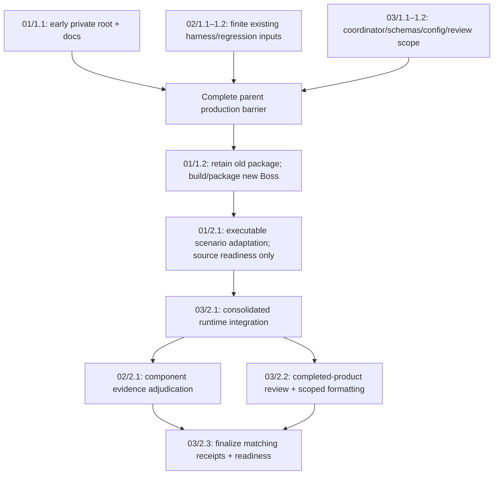

# Spec: phase-bauar-release-acceptance

Date: 2026-10-09. Boundary: Spec only. Analyze completed at canonical revision432; Spec entered at433. No product source edit, app launch, runtime test or build is part of this stage. These are reviewable requirements and proposed interfaces; they do not establish release readiness.

## Selected proposal

Deliver **unsigned local macOS ARM64 acceptance** of a newly source-bound Boss package after a minimal optional private startup-root change. Retain the existing bundled server-full UAR binary when unchanged; reuse the actual Bossfang harness and finite eligible UAR regression. Preserve exact approvals, application/server-configured MCP credentials, one UAR-owned delegated loop and unsupported/unknown restart reconciliation.

The user's Spec invocation authorizes drafting. Explicit Plan approval must ratify the optional root contract and local scope before implementation. Signed/notarized/installed releases, Intel/Windows, external remote receiver/IdP/custody and publication are deferred/excluded. Operator is release authority; no signing/platform person or approval is invented. Those unselected scopes do not block the selected local target.

## Changes and ownership

| Order | Change | Owned responsibility | Backend tasks |
| --- | --- | --- | --- |
| 01 | [Private packaged desktop](/Users/gqadonis/.codex/worktrees/bossfang-uar-architecture/prometheus-skills-mini/workstreams/bossfang-uar-architecture/openspec/changes/bauar-acc-01-private-packaged-desktop/proposal.md) | Boss early root binding, its preboot documentation, new packaged gate/launch helper, safe capture config and three existing acceptance-helper packaged-directory adaptations | 1.1,1.2,2.1 |
| 02 | [Current harness regression](/Users/gqadonis/.codex/worktrees/bossfang-uar-architecture/prometheus-skills-mini/workstreams/bossfang-uar-architecture/openspec/changes/bauar-acc-02-current-harness-regression/proposal.md) | Two phase harness manifest/scenario documents; existing product gates reused unchanged | 1.1,1.2,2.1 |
| 03 | [Local acceptance evidence](/Users/gqadonis/.codex/worktrees/bossfang-uar-architecture/prometheus-skills-mini/workstreams/bossfang-uar-architecture/openspec/changes/bauar-acc-03-local-acceptance-evidence/proposal.md) | Node coordinator/modules/schemas, immutable config/review allowlist, actual receipt aggregation, cumulative review and readiness report | 1.1,1.2,2.1,2.2,2.3 |

Eleven stable backend tasks are specified, all unchecked. Canonical registration/owner assignment belongs to Plan; canonical acceptance progress remains0/0 pending until that registration. Existing project-wide7/7 is previous implementation, not this phase's result. No direct generated-progress write.

OpenSpec spec-driven was selected at resolved isolated workstream root. Change02 intentionally sets skip_specs:true: it introduces no product behavior and must not invent a delta merely to validate. Changes01/03 introduce packaged-profile-isolation and local-acceptance-evidence. Existing platform-location-ownership is mini tooling, not Boss; local-uar-bundle-provenance remains the artifact-production contract. Existing authorization/admission/delegation contracts remain acceptance inputs, not a redesign.

Each change has proposal, design, immutable-ID tasks and fully populated verification. All siblings are reviewed together. Every behavior D01–D04/H01–H04/E01–E03 carries source identity, actual entry point, real collaborators, boundary, positive/negative observation, private roots, prerequisites, exact final local command and limitations.

## Task ordering and full delivery barrier

Whole-change order is responsibility order; execution follows these task dependencies. 01/2.1 does not claim acceptance and needs no later task to author its source. Integration returns0 only for its selected runtime components; finalize requires those receipts plus adjudication/review and does not rerun passed tests. Missing inputs/reviewer/evidence remain exit2; observed failures exit1. Only observed failures or changed inputs justify rerunning affected gates.

No production test authoring/execution/build gate or product review before the complete production barrier. OpenSpec's generic per-group test advice conflicts with repository A-9; follow A-9 and the KBD acceptance template. Scenario requirements are written now; executable cases later. Artifact/schema validation and artifact review now do not certify implementation.

## Proposed startup contract and architecture

THE_BOSS_PROFILE_ROOT is a new optional environment interface, not an existing switch. Resolve once before boot-config/logger consumers, keep constants' Node-builtins/Electron-only rule, and establish config/boot-config, userData/sessionData, logs, owned temp and UAR persistence beneath an existing absolute writable root. A supplied empty/relative/file/missing/inaccessible root fails before writes; absent leaves existing branches unchanged. Private root wins over its boot-map redirects and development suffix.

No new main.ts logic, product service, broad path-registry abstraction, runtime architecture or dependency upgrade. Three existing acceptance helpers currently assume process.cwd()/out/main; change01 minimally supplies the actual bundled main directory while preserving their development default. This is scenario adaptation after the production barrier.

A root is application path configuration, not a universal sandbox. Private children have explicit HOME/CODEX_HOME/XDG/TMP and queue/plugin/store roots; transient peers use dynamically allocated loopback ports and embedded private persistence. Controlled providers/receivers replace no executor or approval boundary. No shared daemon takeover; owned child cleanup only; retain caches/sources/candidates/rollback data. Default-profile absence is preserved and independently source-reviewed; default-profile runtime in this live OS account is untested and is not certified by selected private acceptance.

## Acceptance inventory and completion semantics

| IDs | Required observable |
| --- | --- |
| D01 | Real packaged startup, selected private paths, authenticated readiness, actual managed child from bundle; invalid/private-map controls |
| D02 | Strict exact approval client cases, foreign/consumed decisions, denial/edit/cancel/headless refusal; one permitted real effect |
| D03 | Eager/deferred discovery counts, distinct exact approvals, one target effect, claim/persistence/cancellation faults and no revived restart authority |
| D04 | Same-execution observation through split/partial/error/reconnect, actual outcomes and finite credential-safe projections |
| H01 | Identified manual Bossfang normal/streamed UAR delegation, policy/history mapping, native compatibility and unsupported selection rejection |
| H02 | Original admission/cursor identity after lost ack/partial result, real cancellation, unsupported/unknown epoch restart without resubmission/effect replay |
| H03 | Configured signed admission/tenant/key and run/resource/action/lease/revision credential boundaries; no external deployment claim |
| H04 | Actual stdio allowlisted environment/owned child, known-secret projections, retained cursor/gap behavior |
| E01 | Actual existing local packaging source/archive/public-mode validators reject mutated disposable copies |
| E02 | Complete source-bound scenario receipts, actual observations/negatives, private resources/owned cleanup, no zero-test/incomplete success |
| E03 | Finite cumulative product review and scoped read-only formatting, source-bound final local verdict and explicit wider release dispositions |

Proposed exact invocation/cwd/environment references live in every change's verification.md. Coordinator integration/finalize stages are new source to implement in Execute. Plan pins exact existing host executable locations, Cargo features, private roots and packaging-validator argv before execution. Supporting server-full,test-probes tests are not the package's server-full binary. Known canary checks are not general secret classification. Required review independence cannot be claimed with unknown model identities; an explicit new operator disposition may defer it without fabricating a pass.

## Grounding and prior lessons

[Prior context](/Users/gqadonis/.codex/worktrees/bossfang-uar-architecture/prometheus-skills-mini/workstreams/bossfang-uar-architecture/.kbd-orchestrator/phases/phase-bauar-release-acceptance/prior-context.md) requires “keep locked dependency topology intact; resolve application child runtime requirements before builds” and separate build/package/acceptance/publication. [Analyze](/Users/gqadonis/.codex/worktrees/bossfang-uar-architecture/prometheus-skills-mini/workstreams/bossfang-uar-architecture/.kbd-orchestrator/phases/phase-bauar-release-acceptance/analysis.md) and its candidate inventory recommend reuse; the skill-pack4/4 results are not product evidence.

Inspected current Boss constants, userDataLocation, main.ts, boot-config construction and path registry show the early path boundary; existing packaged helper mutates live boot-config and development gate supplies external UAR. Existing approval/native/secret-projection helpers show the reusable exact-effect assertions and hardcoded development main path. Existing Bossfang gate and UAR eligible targets establish scenario availability, not fresh passes. Product/source references and supporting limitations are in each design/verification and Analyze.

Inherited OpenSpec context requiring allF1–F7/remote certification conflicts with later operator instructions. F6 cancellation and remote exclusions win; their files are never inspected. MCP/server configuration remains credential authority; do not reopen caller-JWT forwarding theory or add defaults. Earlier local waivers are not a pass for these newly selected acceptance checks. Source candidates/build inputs retained, no shipping/C05 change.

## Quality gates and limitations

Managed OpenSpec1.14.1 registry preflight refreshed generated integrations with authored paths unchanged; subsequent commands use selected cache. Node ports invoke stage/hooks/review; legacy shell/Python hooks are explicitly skipped and external memory recall/writeback unclaimed. Inherited command wrappers stalled at stage entry; explicit Node22.20.0/argument-array calls and canonical PATH completed the bounded workflow without product operations.

Spec validation, review outcomes and no-product-change checks are recorded in evidence/spec and review/spec. Fresh-context artifact review is not implementation review. Exact producer variant/connection identity is unavailable, so distinct-model independence remains unverified. Native Windows/default-profile/signing/installed/remote behavior remains unverified. Stop before Plan for review.
