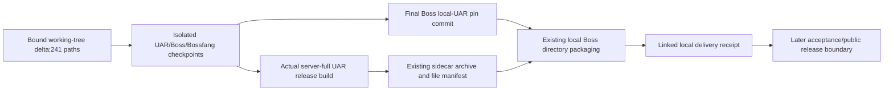

# Specification — phase-bauar-release-integration-2026-10-09

Date: 2026-10-09. Boundary: Spec only. The operator's `/kbd-spec` invocation approves moving from Analyze into these bounded contracts; implementation still requires the Plan/Execute handover.

## Selected changes

| Change | Capability | Implementation tasks | Dependency |
| --- | --- | ---: | --- |
| [bauar-int-01-scoped-source-intake](../../../openspec/changes/bauar-int-01-scoped-source-intake/proposal.md) | release-source-intake |5 | Approved isolated candidate roots from Plan |
| [bauar-int-02-local-current-uar-payload](../../../openspec/changes/bauar-int-02-local-current-uar-payload/proposal.md) | local-uar-bundle-provenance |6 | All three source intake checkpoints |

Both contain proposal, capability delta, design, unchecked tasks and populated production acceptance contracts. The phase also supplies versioned [source-intake receipt schema](contracts/source-intake.schema.json) and [local-delivery receipt schema](contracts/local-delivery.schema.json). No actual receipt instance or implementation success is fabricated.

## Responsibility and source flow

Bossfang retains job/attempt orchestration; UAR retains the authoritative delegated agent loop; model providers remain proposal/completion interfaces. The Boss owns its supervised sidecar packaging/application configuration and exact approval caller surface. MCP credentials continue to come from explicit application/server configuration and grants, with no restored runtime presets.

The selected candidate bases remain UAR a7cb972992d4f83db6585449ea81af0fe4a1c990, Boss 822ed9990bd7626bbf76b04eeae184739c0f0655 and Bossfang bac04cb6b2c144520e28234ad77f00d4cf0f5b23. Plan binds actual candidate roots/refs and owners before mutations. Bossfang's279 inherited baseline commits are disclosed rather than described as phase-only transfer.

## Delivery and acceptance

The first product delivery is an actual current-source native darwin-arm64 unsigned directory bundle. Reuse server-full UAR build/profile, its existing Node packager, and Boss's existing local source/archive/file validators and before/after hooks. Complete source/pin wiring before builds or any new test authoring. Preserve public manifests and authoritative dependencies; do not relabel p1.19 payloads or bypass hooks.

The existing `build:mac:arm64` tail invokes signed-DMG validation. The proposed directory delivery uses explicit existing preparation/build and electron-builder `--mac --arm64 --dir --publish never` instead. This is a packaging-boundary choice, not a validator change.

Acceptance definitions cover scoped input completeness/concurrency, baseline ancestry, compatible approvals/harness preservation, actual source/build/archive/bundle linkage, stale/corrupt payload refusal, bundled startup without an external override, public/CI refusal and honest status separation. Their proposed final Node runner is deliberately not authored at this stage. Runtime/negative controls, broad regression, cumulative independent review, global formatting and platform/signing acceptance stay deferred until the later completed-delivery acceptance boundary. Required missing prerequisites make that acceptance BLOCKED, never PASS, without reopening it as an implementation gate.

## Scope reconciliations

The workstream config's original all-findings/all-scenarios instruction is superseded where the human explicitly withdrew F6 or deferred checks. No configuration file is changed to hide that history. UAR `tests/bauar_session_owner.rs` and `src/uar/mcp_server.rs` remain excluded from direct inspection/hash/search/diff/test dispatch. No technical no-vulnerability verdict is inferred.

The goal's “without importing unrelated upstream history” means no implicit wholesale merge into old main/shared branches. The accepted local Bossfang baseline does inherit279 newer commits, explicitly attributed and unreviewed at this stage. That distinction is retained from Analyze.

The upstream OpenSpec per-task testing guidance conflicts with the repository's A9 and the operator's implementation-first instruction. All tasks therefore specify production artifacts as completion evidence; deferred executable scenarios are authored only after the coherent production boundary. Missing installed flat-skill references were read from the installed orchestrator; Node dispatch replaces shell/Python hook examples. Unsupported hooks do not prove memory writeback.

The PATH OpenSpec launcher was broken because it referenced a removed temporary mini-runner. The already-installed OpenSpec 1.14.0 JavaScript entry ran under Node 22; no launcher/package/install change was made. Superpowers remains unavailable; KBD/OpenSpec provide the planning workflow. Independent adversarial vet is operator-deferred, not PASS.

## Stage status

Product code, config, dependencies, services, source checkouts and primary refs were not changed by Spec. OpenSpec strict validation and local document/contract checks are planning-artifact validation only. The 11 implementation tasks remain unchecked and will be canonically bound/ordered by Plan; the phase is not implementation complete. Original shipping/C05 and publication remain outside this stage.

Next after operator review: `/kbd-plan phase-bauar-release-integration-2026-10-09`.
